---
## Front matter
lang: ru-RU
title: Лабораторная работа №1
subtitle: Простейший шаблон
author:
  - Касымова Эллина
institute:
  - Российский университет дружбы народов, Москва, Россия

## i18n babel
babel-lang: russian
babel-otherlangs: english

## Formatting pdf
toc: false
toc-title: Содержание
slide_level: 2
aspectratio: 169
section-titles: true
theme: metropolis
header-includes:
 - \metroset{progressbar=frametitle,sectionpage=progressbar,numbering=fraction}
 - '\makeatletter'
 - '\beamer@ignorenonframefalse'
 - '\makeatother'
---


## Докладчик

  * Касымова Эллина Руслановна
  * студентка группы НБИбд-01-22
  * Российский университет дружбы народов

## Актуальность

Лабораторная работа помогла нам изучить установку виртуальной машины и научила работать с ней.

## Объект и предмет исследования

- Презентация как текст
- Программное обеспечение для создания презентаций
- Входные и выходные форматы презентаций

## Цели и задачи

Целью данной работы является приобретение практических навыков установки операционной системы на виртуальную машину, настройки минимально необходимых для дальнейшей работы сервисов.

## Материалы и методы

- Процессор `pandoc` для входного формата Markdown
- Результирующие форматы
	- `pdf`
	- `html`
- Автоматизация процесса создания: `Makefile`

## Процессор `pandoc`

- Pandoc: преобразователь текстовых файлов
- Сайт: <https://pandoc.org/>
- Репозиторий: <https://github.com/jgm/pandoc>

## Формат `pdf`

- Использование LaTeX
- Пакет для презентации: [beamer](https://ctan.org/pkg/beamer)
- Тема оформления: `metropolis`

## Код для формата `pdf`

```yaml
slide_level: 2
aspectratio: 169
section-titles: true
theme: metropolis
```

## Формат `html`

- Используется фреймворк [reveal.js](https://revealjs.com/)
- Используется [тема](https://revealjs.com/themes/) `beige`

## Код для формата `html`

- Тема задаётся в файле `Makefile`

```make
REVEALJS_THEME = beige 
```

## Получающиеся форматы

- Полученный `pdf`-файл можно демонстрировать в любой программе просмотра `pdf`
- Полученный `html`-файл содержит в себе все ресурсы: изображения, css, скрипты


## Материалы и методы

- Представляйте данные качественно
- Количественно, только если крайне необходимо
- Излишние детали не нужны

## Содержание исследования

1)Загружаем Fedora на компьютер.

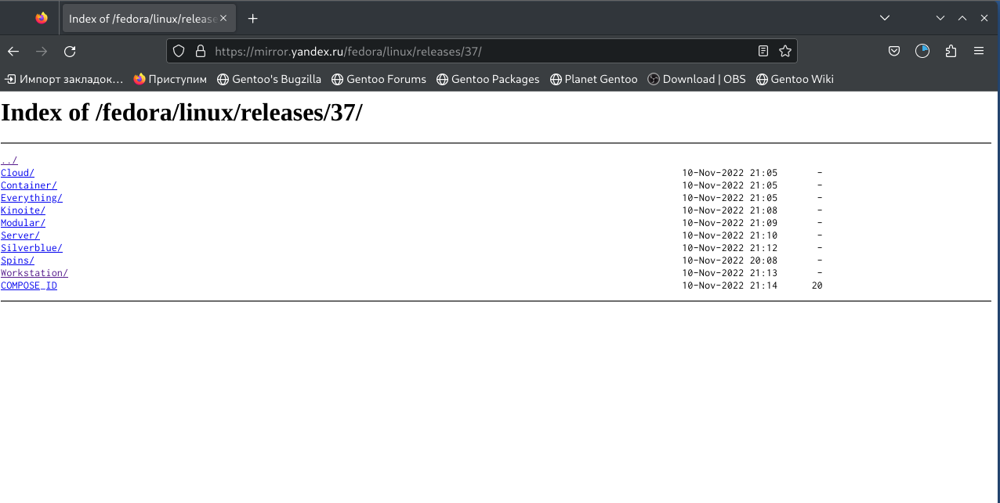{#fig:001 width=90%}

## 

2)Запускаем виртуальную машину через терминал, с помощью команды VirtualBox.


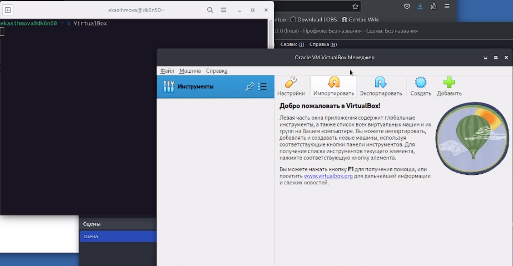{#fig:002 width=90%}

##

3)Настраиваем ее: вводим имя пользователя, папку /var/tmp/ekasihmova, выбираем Linux и Fedora(64-bit).


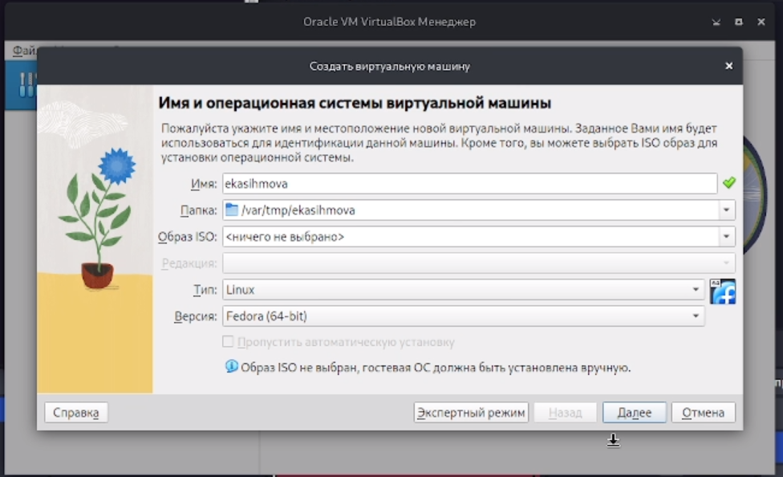{#fig:003 width=90%}

##

4)Увеличиваем размер ОЗУ и количество вртуальных процессоров.


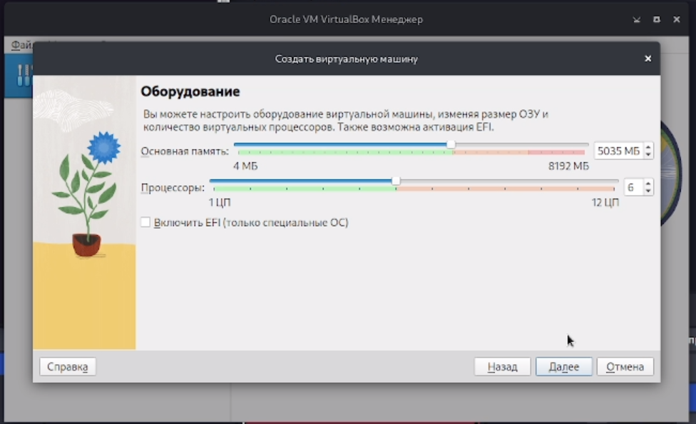{#fig:004 width=90%}

##

5)Мы создаем виртуальный жесткий диск и задаем ему размернорсть емкостью 60гб.


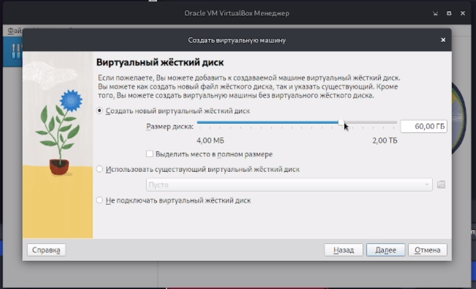{#fig:005 width=90%}

##

6) Выодится итог настройки. 


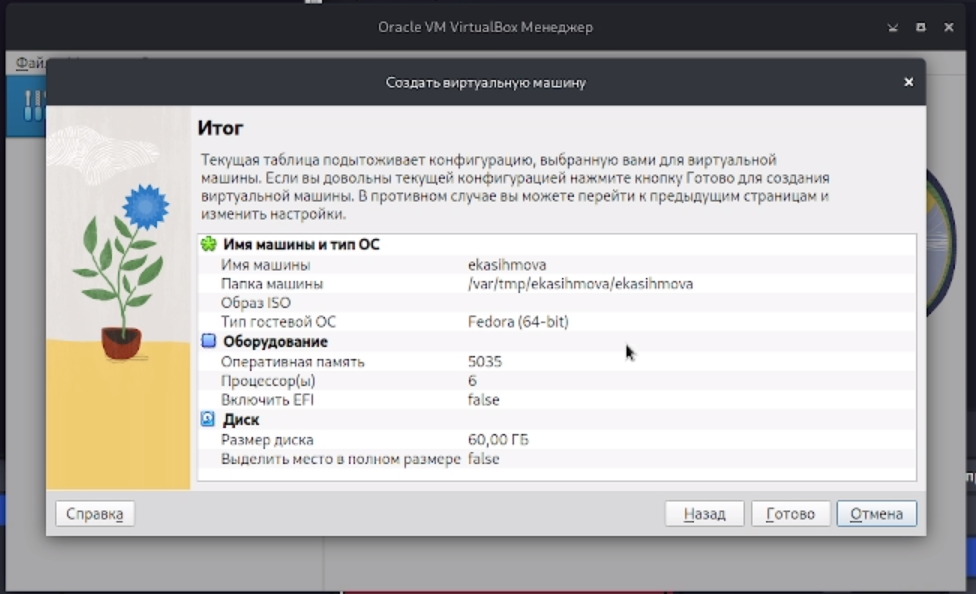{#fig:006 width=90%}

##

7) Затем запускаем эту вирт. машину. 

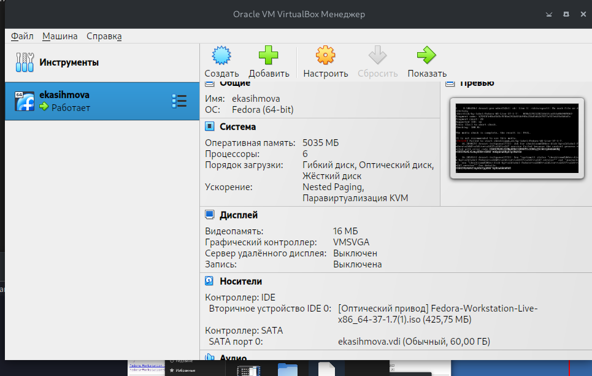{#fig:007 width=90%}

##

8)Вводим в DVD папку скачанной федоры.


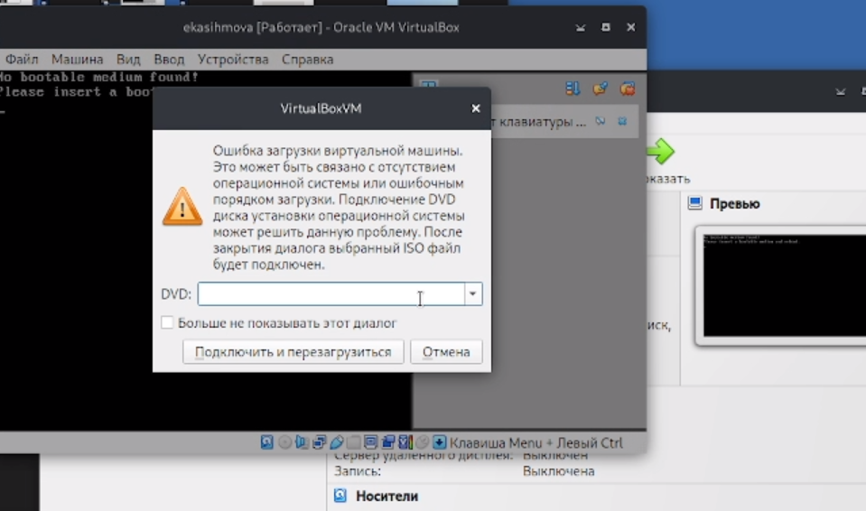{#fig:008 width=90%}

##

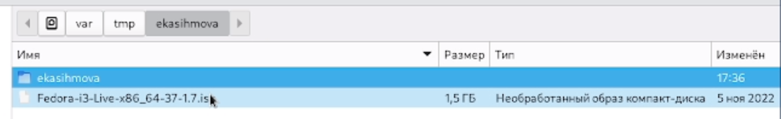{#fig:009 width=90%}

##

9)Запускаем ее.

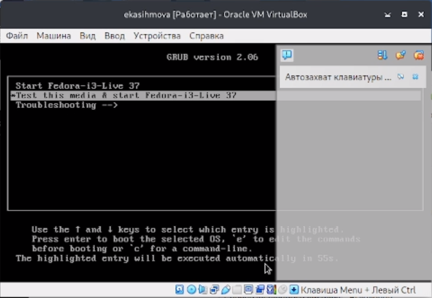{#fig:010 width=90%}

##

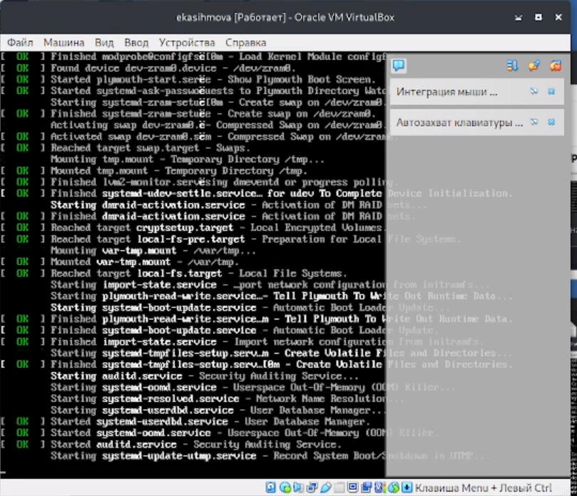{#fig:011 width=90%}

##

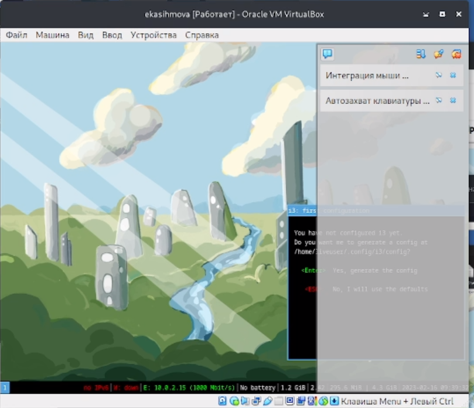{#fig:012 width=90%}

##

10)Нажав клавиши Alt+Enter мы открываем терминал. 


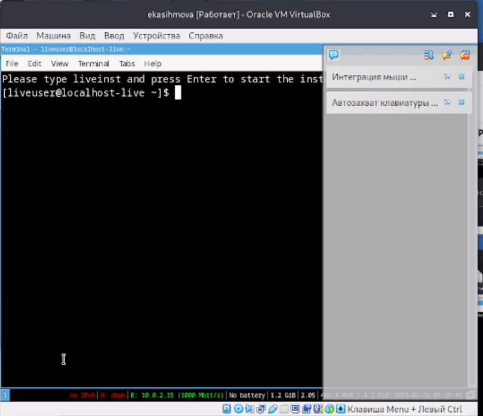{#fig:013 width=90%}

##

11)В окне терминала проанализирую последовательность загрузки системы, выполнив команду dmesg.

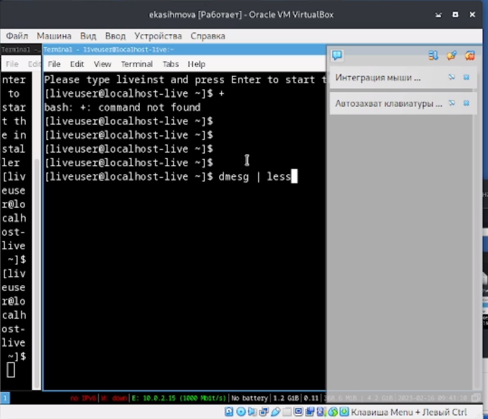{#fig:014 width=90%}

##

12)Далее использую поиск Версии ядра Linux и Частоты процессора.

 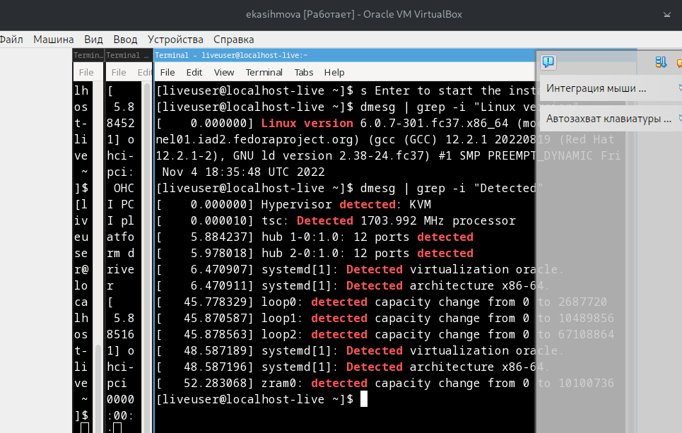{#fig:015 width=90%}
 
##
 
13)Далее использую поиск Модели процессора. 


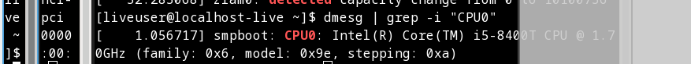{#fig:016 width=90%}

##

13)Далее использую поиск Объёмф доступной оперативной памяти. 

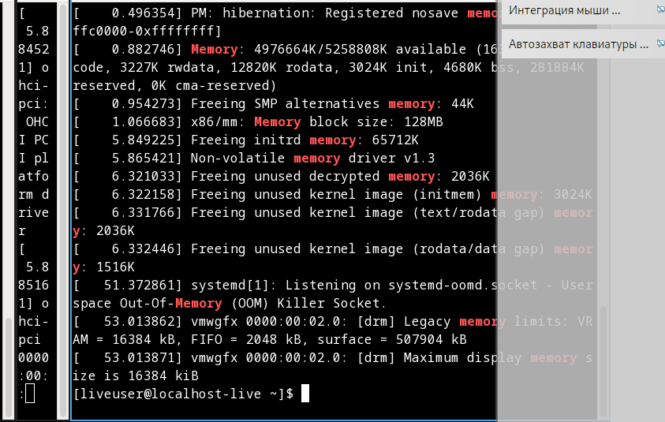{#fig:017 width=90%}

##

14)Далее использую поиск Типа обнаруженного гипервизора.

 
 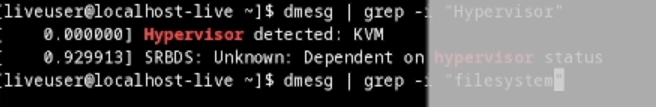{#fig:018 width=90%}
 
##
 
15)Далее использую поиск Типа файловой системы корневого раздела.


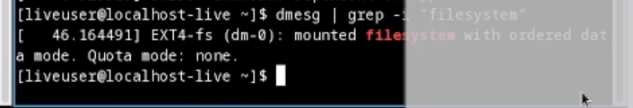{#fig:019 width=90%}

##

16)Далее использую поиск Последовательности монтирования файловых систем. 


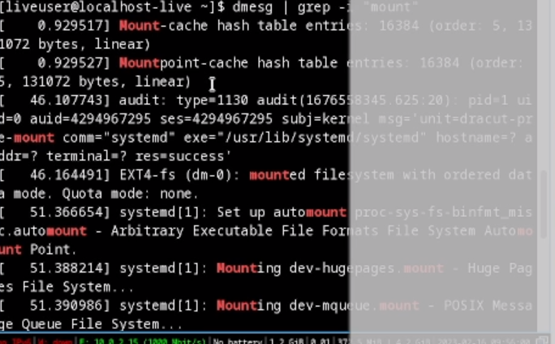{#fig:020 width=90%}

## Результаты

Создали виртуальную машину.
Внесли в нее федору.
Работали с терминалом на этой виртуальной машине.


## Итоговый слайд

Проделав данную лабораторную работу мы преобрели практическиу навыки установки операционной системы на виртуальную машину, настройки минимально необходимых для дальнейшей работы сервисов.
 

