---
## Front matter
title: "Лабораторная работа №1"
subtitle: "Архитектура операционных систем"
author: "Касымова Эллина"

## Generic otions
lang: ru-RU
toc-title: "Содержание"

## Bibliography
bibliography: bib/cite.bib
csl: pandoc/csl/gost-r-7-0-5-2008-numeric.csl

## Pdf output format
toc: true # Table of contents
toc-depth: 2
lof: true # List of figures
lot: true # List of tables
fontsize: 12pt
linestretch: 1.5
papersize: a4
documentclass: scrreprt
## I18n polyglossia
polyglossia-lang:
  name: russian
  options:
	- spelling=modern
	- babelshorthands=true
polyglossia-otherlangs:
  name: english
## I18n babel
babel-lang: russian
babel-otherlangs: english
## Fonts
mainfont: PT Serif
romanfont: PT Serif
sansfont: PT Sans
monofont: PT Mono
mainfontoptions: Ligatures=TeX
romanfontoptions: Ligatures=TeX
sansfontoptions: Ligatures=TeX,Scale=MatchLowercase
monofontoptions: Scale=MatchLowercase,Scale=0.9
## Biblatex
biblatex: true
biblio-style: "gost-numeric"
biblatexoptions:
  - parentracker=true
  - backend=biber
  - hyperref=auto
  - language=auto
  - autolang=other*
  - citestyle=gost-numeric
## Pandoc-crossref LaTeX customization
figureTitle: "Рис."
tableTitle: "Таблица"
listingTitle: "Листинг"
lofTitle: "Список иллюстраций"
lotTitle: "Список таблиц"
lolTitle: "Листинги"
## Misc options
indent: true
header-includes:
  - \usepackage{indentfirst}
  - \usepackage{float} # keep figures where there are in the text
  - \floatplacement{figure}{H} # keep figures where there are in the text
---

# Цель работы

Целью данной работы является приобретение практических навыков установки операционной системы на виртуальную машину, настройки минимально необходимых для дальнейшей работы сервисов.

Цель данного шаблона --- максимально упростить подготовку отчётов по
лабораторным работам.  Модифицируя данный шаблон, студенты смогут без
труда подготовить отчёт по лабораторным работам, а также познакомиться
с основными возможностями разметки Markdown.

# Теоретическое введение

Здесь описываются теоретические аспекты, связанные с выполнением работы.

Например, в табл. @tbl:std-dir приведено краткое описание стандартных каталогов Unix.

: Описание некоторых каталогов файловой системы GNU Linux {#tbl:std-dir}

| Имя каталога | Описание каталога                                                                                                          |
|--------------|----------------------------------------------------------------------------------------------------------------------------|
| `/`          | Корневая директория, содержащая всю файловую                                                                               |
| `/bin `      | Основные системные утилиты, необходимые как в однопользовательском режиме, так и при обычной работе всем пользователям     |
| `/etc`       | Общесистемные конфигурационные файлы и файлы конфигурации установленных программ                                           |
| `/home`      | Содержит домашние директории пользователей, которые, в свою очередь, содержат персональные настройки и данные пользователя |
| `/media`     | Точки монтирования для сменных носителей                                                                                   |
| `/root`      | Домашняя директория пользователя  `root`                                                                                   |
| `/tmp`       | Временные файлы                                                                                                            |
| `/usr`       | Вторичная иерархия для данных пользователя                                                                                 |

Более подробно об Unix см. в [@gnu-doc:bash;@newham:2005:bash;@zarrelli:2017:bash;@robbins:2013:bash;@tannenbaum:arch-pc:ru;@tannenbaum:modern-os:ru].

# Выполнение лабораторной работы

1) Загружаем Fedora на компьютер.

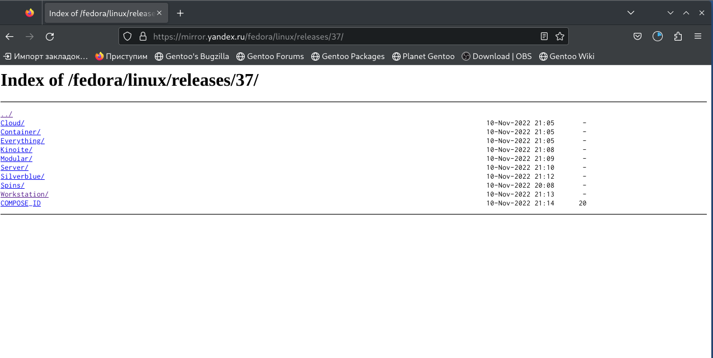{#fig:001 width=90%}

2)Запускаем виртуальную машину через терминал, с помощью команды VirtualBox.

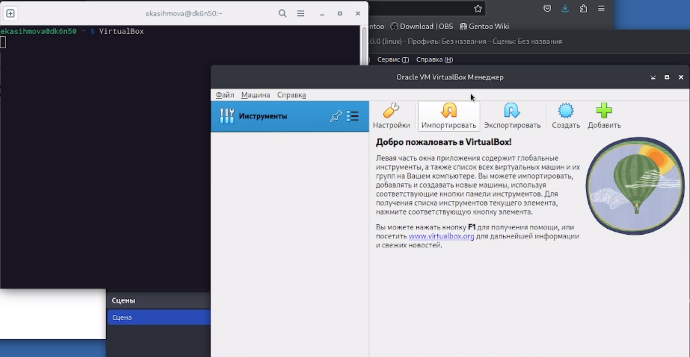{#fig:002 width=90%}

3)Настраиваем ее: вводим имя пользователя, папку /var/tmp/ekasihmova, выбираем Linux и Fedora(64-bit).

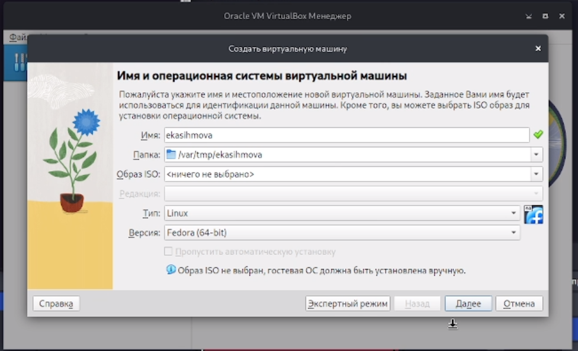{#fig:003 width=90%}

4)Увеличиваем размер ОЗУ и количество вртуальных процессоров.

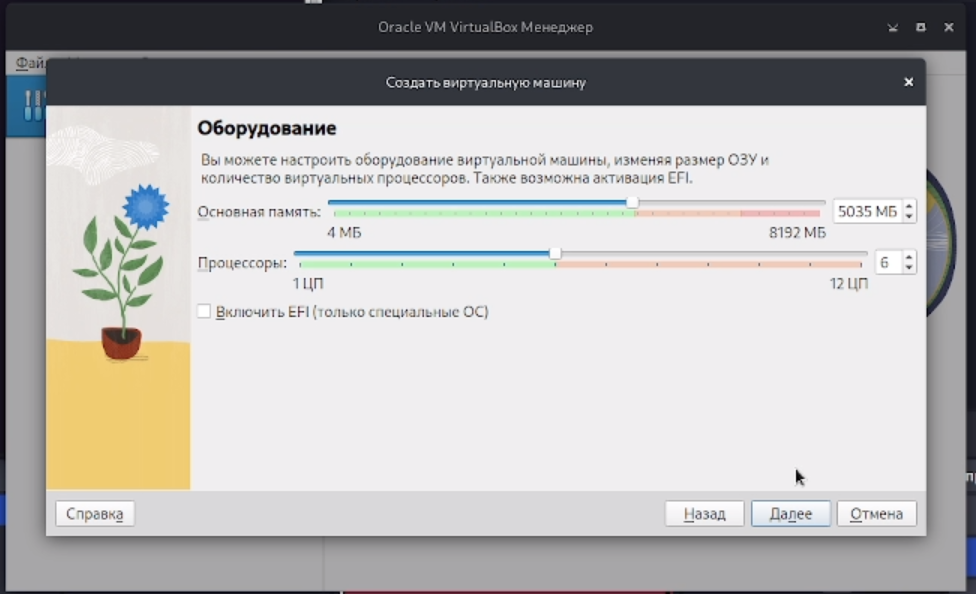{#fig:004 width=90%}

5)Мы создаем виртуальный жесткий диск и задаем ему размернорсть емкостью 60гб.

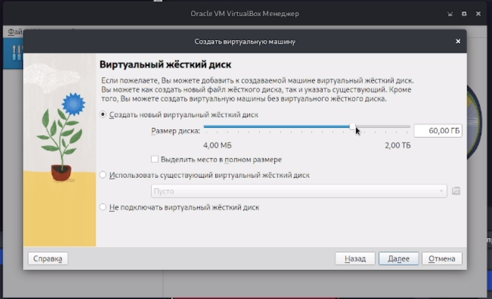{#fig:005 width=90%}

6) Выодится итог настройки.

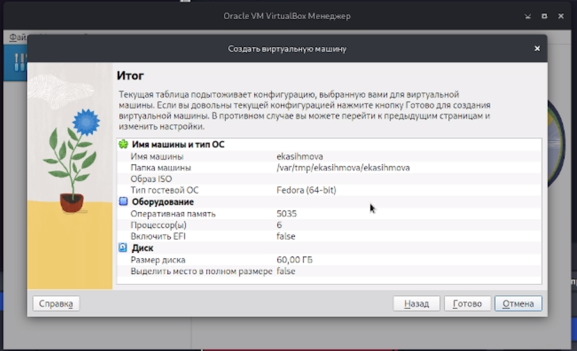{#fig:006 width=90%}

7) Затем запускаем эту вирт. машину.

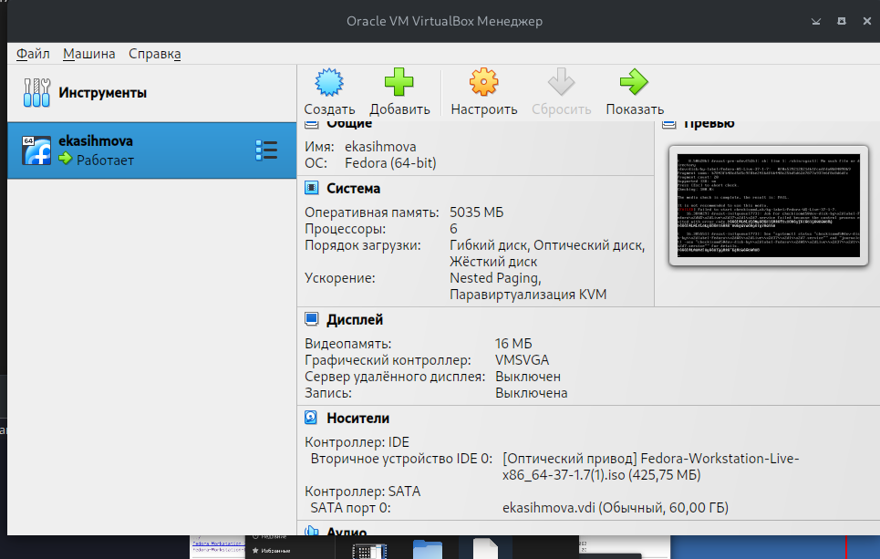{#fig:007 width=90%}

8)Вводим в DVD папку скачанной федоры.

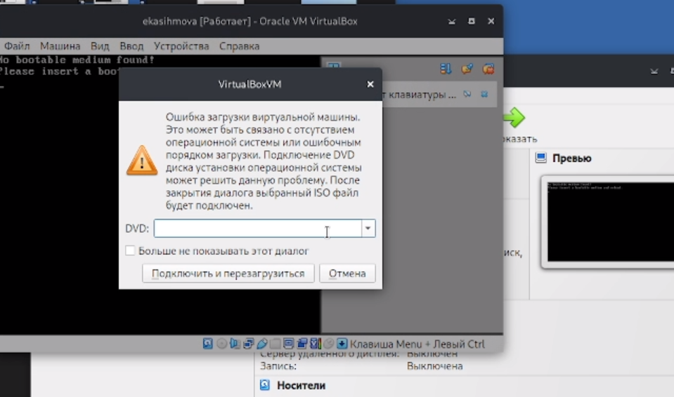{#fig:008 width=90%}

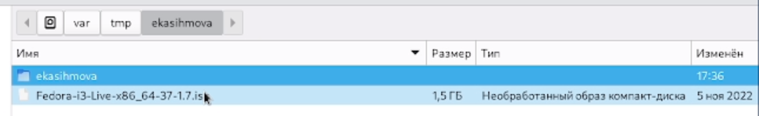{#fig:009 width=90%}

9)Запускаем ее.

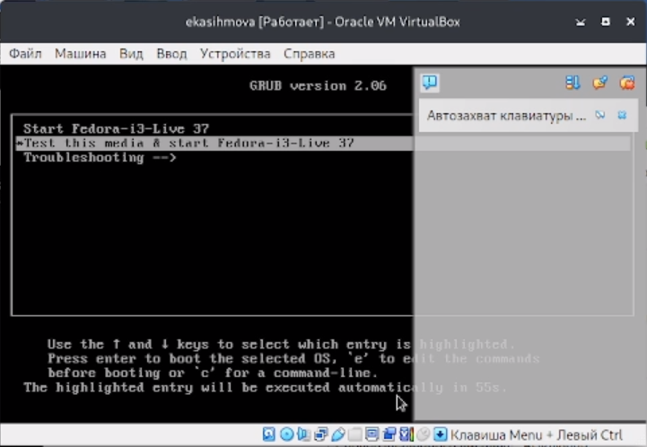{#fig:010 width=90%}

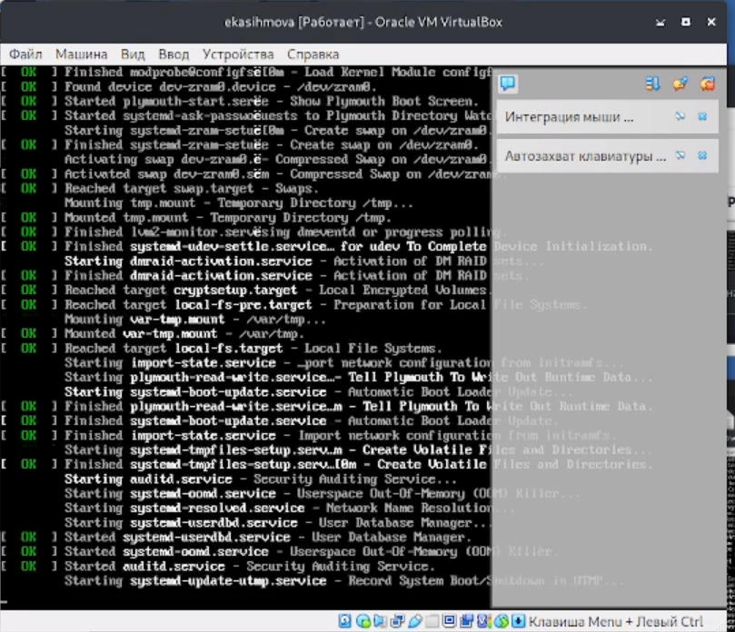{#fig:011 width=90%}

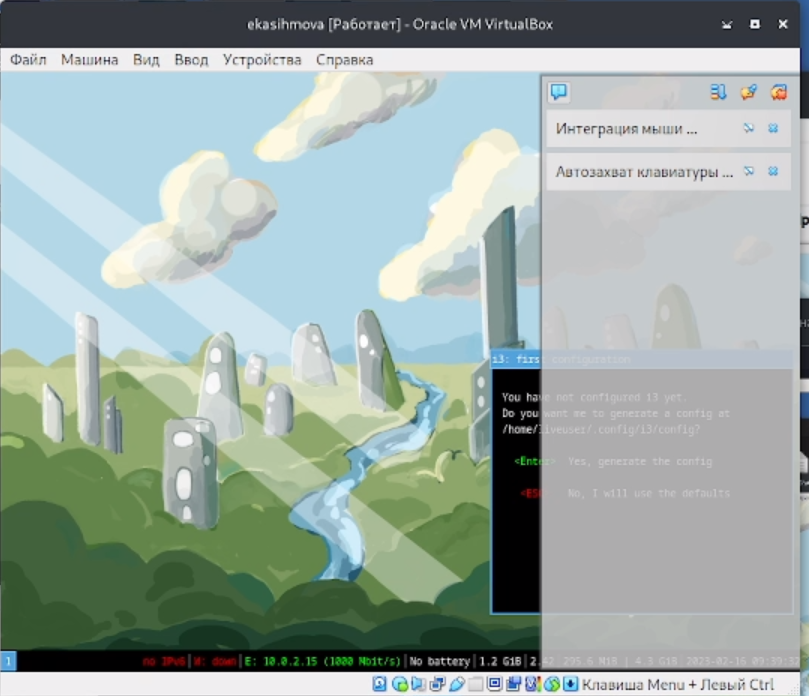{#fig:012 width=90%}

10)Нажав клавиши Alt+Enter мы открываем терминал.

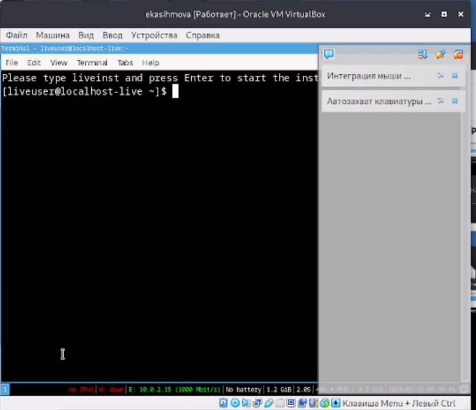{#fig:013 width=90%}

11)В окне терминала проанализирую последовательность загрузки системы, выполнив команду dmesg.

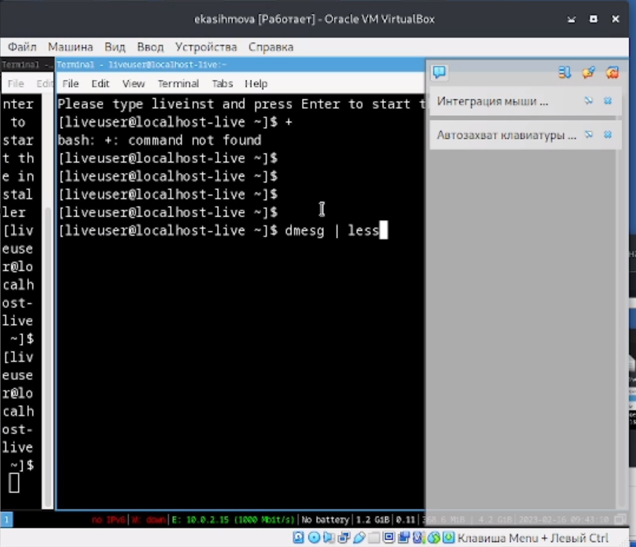{#fig:014 width=90%}

12)Далее использую поиск Версии ядра Linux и Частоты процессора.

 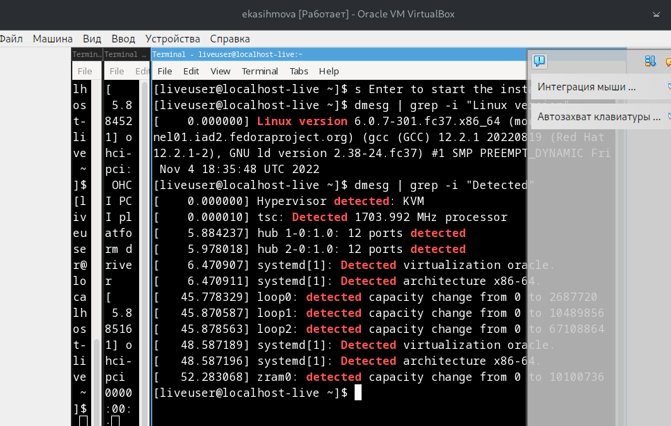{#fig:015 width=90%}
 
13)Далее использую поиск Модели процессора.

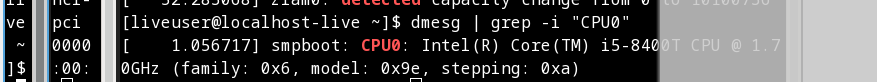{#fig:016 width=90%}

13)Далее использую поиск Объёмф доступной оперативной памяти.

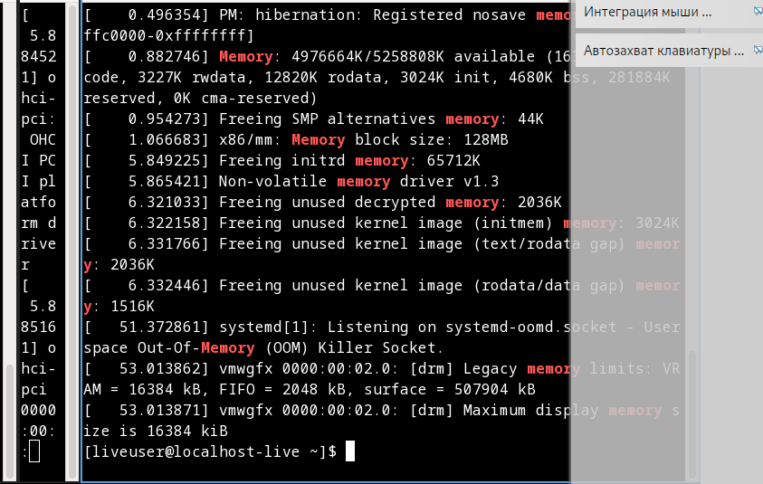{#fig:017 width=90%}

14)Далее использую поиск Типа обнаруженного гипервизора.
 
 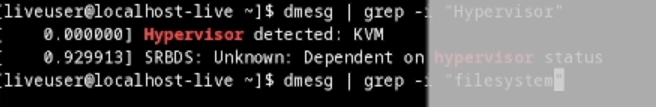{#fig:018 width=90%}
 
15)Далее использую поиск Типа файловой системы корневого раздела.

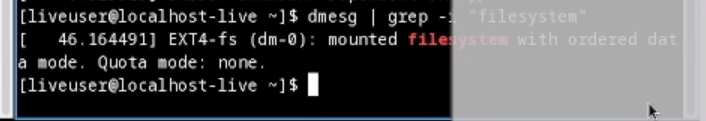{#fig:019 width=90%}

16)Далее использую поиск Последовательности монтирования файловых систем.

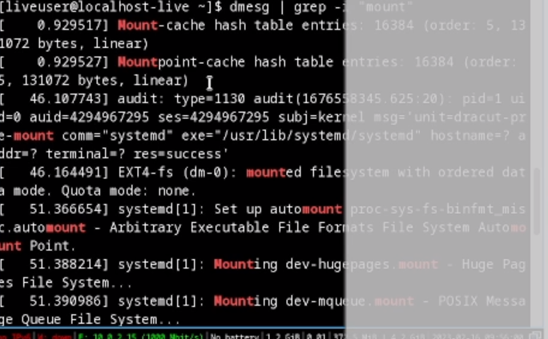{#fig:020 width=90%}

# Контрольные вопросы.

1)Какую информацию содержит учётная запись пользователя?

 Имя и пароль.
 
2)Укажите команды терминала и приведите примеры.

info
mv
ls
du
Mkdir
Chmod
History
 
3)Что такое файловая система? Приведите примеры с краткой характеристикой.
Файловая система- это часть операционной системы, суть
которой состоит в том, чтобы обеспечить пользователю удобный
интерфейс при работе с данными, хранящимися на диске, и
обеспечить совместное использование файлов несколькими
пользователями и процессами.
информация о разрешенном доступе,
пароль для доступа к файлу,
владелец файла,
создатель файла,
признак "только для чтения",
признак "скрытый файл",
признак "системный файл",
признак "архивный файл",
признак "двоичный/символьный",
признак "временный" (удалить после завершения
процесса),
признак блокировки,
длина записи,
указатель на ключевое поле в записи,
длина ключа,
времена создания, последнего доступа и последнего
изменения,
текущий размер файла,
максимальный размер файла.

4) Как посмотреть, какие файловые системы подмонтированы в ОС?

Делается это при помощи команды mount

5)Как удалить зависший процесс?

Команда kill

# Выводы

Проделав данную лабораторную работу мы преобрели практическиу навыки установки операционной системы на виртуальную машину, настройки минимально необходимых для дальнейшей работы сервисов.

# Список литературы{.unnumbered}

::: {#refs}
:::
