---
## Front matter
lang: ru-RU
title: Лабораторная работа №2
subtitle: Простейший шаблон
author:
  - Касымова Эллина
institute:
  - Российский университет дружбы народов, Москва, Россия

## i18n babel
babel-lang: russian
babel-otherlangs: english

## Formatting pdf
toc: false
toc-title: Содержание
slide_level: 2
aspectratio: 169
section-titles: true
theme: metropolis
header-includes:
 - \metroset{progressbar=frametitle,sectionpage=progressbar,numbering=fraction}
 - '\makeatletter'
 - '\beamer@ignorenonframefalse'
 - '\makeatother'
---

## Докладчик


  * Касымова Эллина Руслановна
  * студентка направления НБИбд-01-22
  * Российский университет дружбы народов


## Актуальность

Актуальность данной лабораторной работы состоит в том, что мы познаем работу с гитхабом.

## Объект и предмет исследования

- Презентация как текст
- Программное обеспечение для создания презентаций
- Входные и выходные форматы презентаций

## Материалы и методы

- Процессор `pandoc` для входного формата Markdown
- Результирующие форматы
	- `pdf`
	- `html`
- Автоматизация процесса создания: `Makefile`

## Процессор `pandoc`

- Pandoc: преобразователь текстовых файлов
- Сайт: <https://pandoc.org/>
- Репозиторий: <https://github.com/jgm/pandoc>

## Формат `pdf`

- Использование LaTeX
- Пакет для презентации: [beamer](https://ctan.org/pkg/beamer)
- Тема оформления: `metropolis`

## Код для формата `pdf`

```yaml
slide_level: 2
aspectratio: 169
section-titles: true
theme: metropolis
```

## Формат `html`

- Используется фреймворк [reveal.js](https://revealjs.com/)
- Используется [тема](https://revealjs.com/themes/) `beige`

## Код для формата `html`

- Тема задаётся в файле `Makefile`

```make
REVEALJS_THEME = beige 
```


## Получающиеся форматы

- Полученный `pdf`-файл можно демонстрировать в любой программе просмотра `pdf`
- Полученный `html`-файл содержит в себе все ресурсы: изображения, css, скрипты


## Материалы и методы

- Представляйте данные качественно
- Количественно, только если крайне необходимо
- Излишние детали не нужны

## Содержание исследования

1)Создаем репозиторий для предмета "Операционные системы".

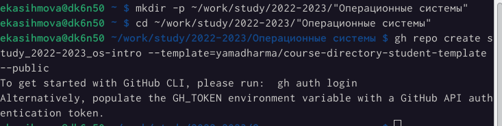{#fig:001 width=90%}

##

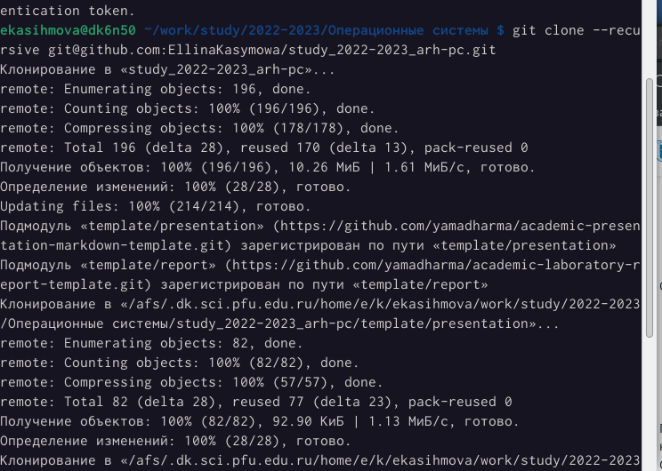{#fig:002 width=90%}

##

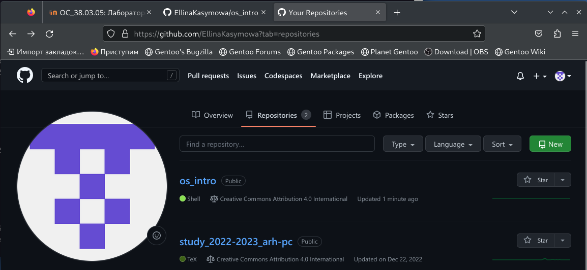{#fig:003 width=90%}

##

2)Задаю имя и email своего репозитория

{#fig:004 width=90%}

##

{#fig:005 width=90%}

##


3)Генерирую ключ.

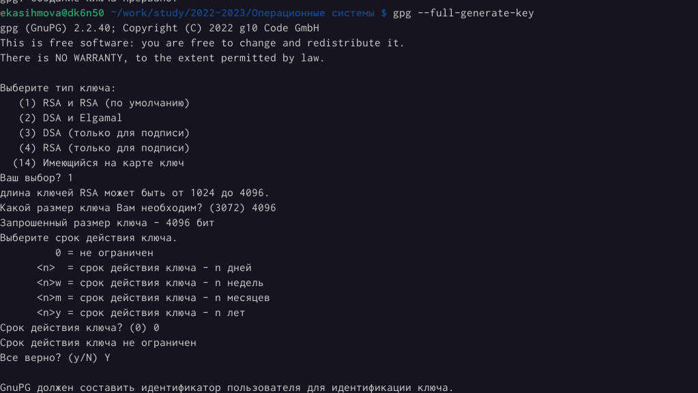{#fig:006 width=90%}

##

{#fig:007 width=90%}

##

4)Вывожу список ключей и копирую отпечаток приватного ключа

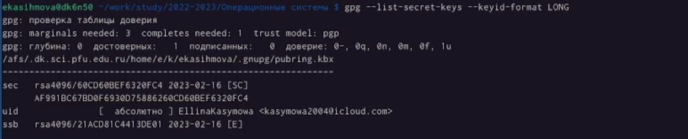{#fig:008 width=90%}

##

5)Экспортирую ключ в формате ASCII по его отпечатку.

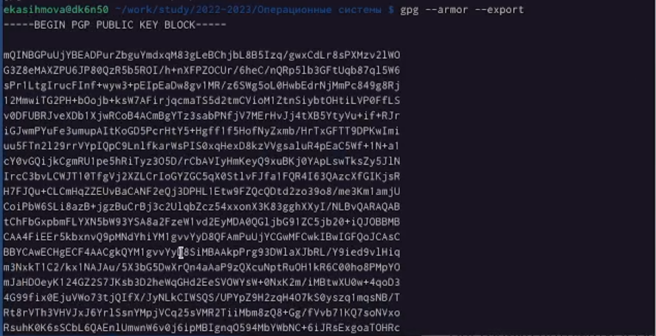{#fig:009 width=90%}

##

6)Копирую свой сгенерированный PGP ключ в буфер обмена.

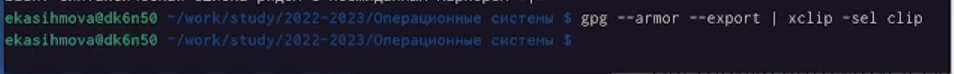{#fig:010 width=90%}

##

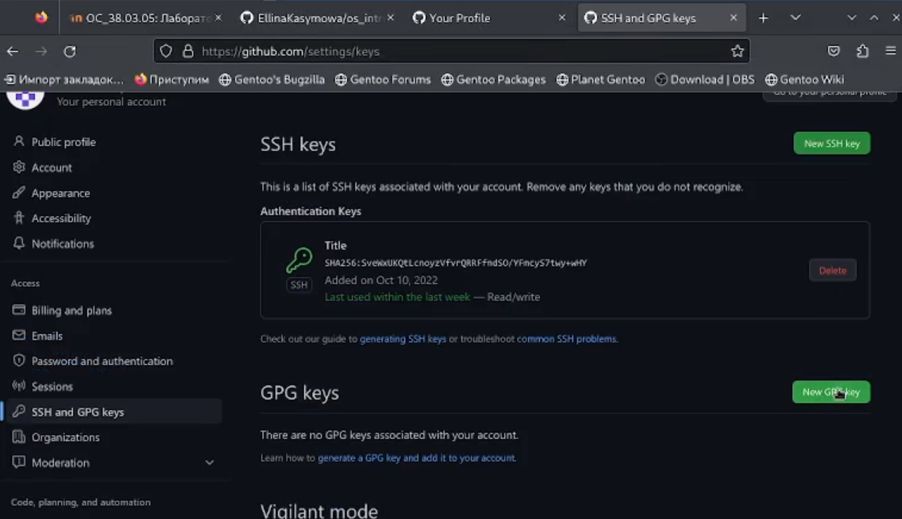{#fig:011 width=90%}

##

7) Вставляю код в New GPG key.

{#fig:012 width=90%}

##

8)Мы получили GPG ключ.

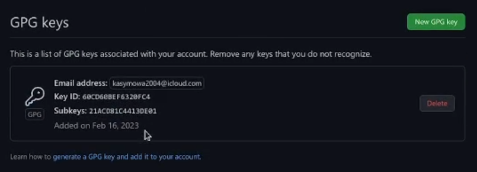{#fig:013 width=90%}

##

9)Далее переходим в os-intro и создаю необходимые каталоги, коммитим

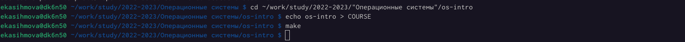{#fig:014 width=90%}

##

{#fig:015 width=90%}

##

10)Используя введёный email, указываю Git, применяемый при подписи коммитов.

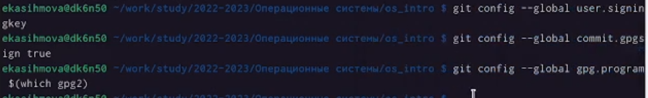{#fig:016 width=90%}

##

11)Отправляю файлы на сервер.

{#fig:017 width=90%}

##

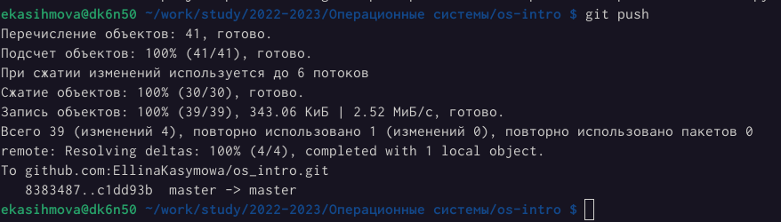{#fig:018 width=90%}


## Результаты

Мы научились пользоваться гитхабом и его командами.


## Итоговый слайд

Проделав данную лабораторную работу мы изучили идеалогию и применение средств контроля версий и осовоили умение по работе с git.


