---
## Front matter
title: "Лабораторная работа №2"
subtitle: "Архитектура операционных систем"
author: "Касымова Эллина"

## Generic otions
lang: ru-RU
toc-title: "Содержание"

## Bibliography
bibliography: bib/cite.bib
csl: pandoc/csl/gost-r-7-0-5-2008-numeric.csl

## Pdf output format
toc: true # Table of contents
toc-depth: 2
lof: true # List of figures
lot: true # List of tables
fontsize: 12pt
linestretch: 1.5
papersize: a4
documentclass: scrreprt
## I18n polyglossia
polyglossia-lang:
  name: russian
  options:
	- spelling=modern
	- babelshorthands=true
polyglossia-otherlangs:
  name: english
## I18n babel
babel-lang: russian
babel-otherlangs: english
## Fonts
mainfont: PT Serif
romanfont: PT Serif
sansfont: PT Sans
monofont: PT Mono
mainfontoptions: Ligatures=TeX
romanfontoptions: Ligatures=TeX
sansfontoptions: Ligatures=TeX,Scale=MatchLowercase
monofontoptions: Scale=MatchLowercase,Scale=0.9
## Biblatex
biblatex: true
biblio-style: "gost-numeric"
biblatexoptions:
  - parentracker=true
  - backend=biber
  - hyperref=auto
  - language=auto
  - autolang=other*
  - citestyle=gost-numeric
## Pandoc-crossref LaTeX customization
figureTitle: "Рис."
tableTitle: "Таблица"
listingTitle: "Листинг"
lofTitle: "Список иллюстраций"
lotTitle: "Список таблиц"
lolTitle: "Листинги"
## Misc options
indent: true
header-includes:
  - \usepackage{indentfirst}
  - \usepackage{float} # keep figures where there are in the text
  - \floatplacement{figure}{H} # keep figures where there are in the text
---

# Цель работы

1)Изучить идеологию и применение средств контроля версий.
2)Освоить умения по работе с git.

Цель данного шаблона --- максимально упростить подготовку отчётов по
лабораторным работам.  Модифицируя данный шаблон, студенты смогут без
труда подготовить отчёт по лабораторным работам, а также познакомиться
с основными возможностями разметки Markdown.

# Задание

Создать базовую конфигурацию для работы с git.
Создать ключ SSH.
Создать ключ PGP.
Настроить подписи git.
Зарегистрироваться на Github.
Создать локальный каталог для выполнения заданий по предмету.

# Теоретическое введение

Системы контроля версий. Общие понятия

Системы контроля версий (Version Control System, VCS) применяются при работе нескольких человек над одним проектом. Обычно основное дерево проекта хранится в локальном или удалённом репозитории, к которому настроен доступ для участников проекта. При внесении изменений в содержание проекта система контроля версий позволяет их фиксировать, совмещать изменения, произведённые разными участниками проекта, производить откат к любой более ранней версии проекта, если это требуется.

В классических системах контроля версий используется централизованная модель, предполагающая наличие единого репозитория для хранения файлов. Выполнение большинства функций по управлению версиями осуществляется специальным сервером. Участник проекта (пользователь) перед началом работы посредством определённых команд получает нужную ему версию файлов. После внесения изменений, пользователь размещает новую версию в хранилище. При этом предыдущие версии не удаляются из центрального хранилища и к ним можно вернуться в любой момент. Сервер может сохранять не полную версию изменённых файлов, а производить так называемую дельта-компрессию — сохранять только изменения между последовательными версиями, что позволяет уменьшить объём хранимых данных.

Системы контроля версий поддерживают возможность отслеживания и разрешения конфликтов, которые могут возникнуть при работе нескольких человек над одним файлом. Можно объединить (слить) изменения, сделанные разными участниками (автоматически или вручную), вручную выбрать нужную версию, отменить изменения вовсе или заблокировать файлы для изменения. В зависимости от настроек блокировка не позволяет другим пользователям получить рабочую копию или препятствует изменению рабочей копии файла средствами файловой системы ОС, обеспечивая таким образом, привилегированный доступ только одному пользователю, работающему с файлом.

Системы контроля версий также могут обеспечивать дополнительные, более гибкие функциональные возможности. Например, они могут поддерживать работу с несколькими версиями одного файла, сохраняя общую историю изменений до точки ветвления версий и собственные истории изменений каждой ветви. Кроме того, обычно доступна информация о том, кто из участников, когда и какие изменения вносил. Обычно такого рода информация хранится в журнале изменений, доступ к которому можно ограничить.

В отличие от классических, в распределённых системах контроля версий центральный репозиторий не является обязательным.

Среди классических VCS наиболее известны CVS, Subversion, а среди распределённых — Git, Bazaar, Mercurial. Принципы их работы схожи, отличаются они в основном синтаксисом используемых в работе команд.

Например, в табл. @tbl:std-dir приведено краткое описание стандартных каталогов Unix.

: Описание некоторых каталогов файловой системы GNU Linux {#tbl:std-dir}

| Имя каталога | Описание каталога                                                                                                          |
|--------------|----------------------------------------------------------------------------------------------------------------------------|
| `/`          | Корневая директория, содержащая всю файловую                                                                               |
| `/bin `      | Основные системные утилиты, необходимые как в однопользовательском режиме, так и при обычной работе всем пользователям     |
| `/etc`       | Общесистемные конфигурационные файлы и файлы конфигурации установленных программ                                           |
| `/home`      | Содержит домашние директории пользователей, которые, в свою очередь, содержат персональные настройки и данные пользователя |
| `/media`     | Точки монтирования для сменных носителей                                                                                   |
| `/root`      | Домашняя директория пользователя  `root`                                                                                   |
| `/tmp`       | Временные файлы                                                                                                            |
| `/usr`       | Вторичная иерархия для данных пользователя                                                                                 |

Более подробно об Unix см. в [@gnu-doc:bash;@newham:2005:bash;@zarrelli:2017:bash;@robbins:2013:bash;@tannenbaum:arch-pc:ru;@tannenbaum:modern-os:ru].

# Выполнение лабораторной работы

1)Создаем репозиторий для предмета "Операционные системы".

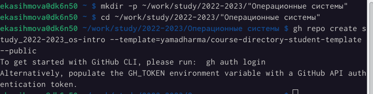{#fig:001 width=90%}

{#fig:002 width=90%}

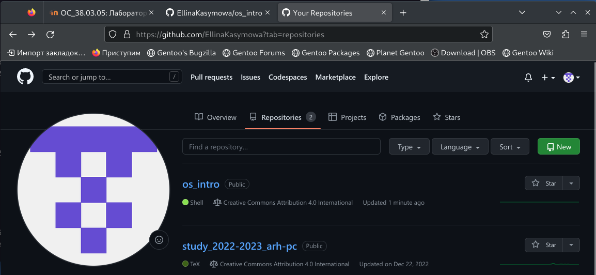{#fig:003 width=90%}

2)Задаю имя и email своего репозитория

{#fig:004 width=90%}

{#fig:005 width=90%}

3)Генерирую ключ.

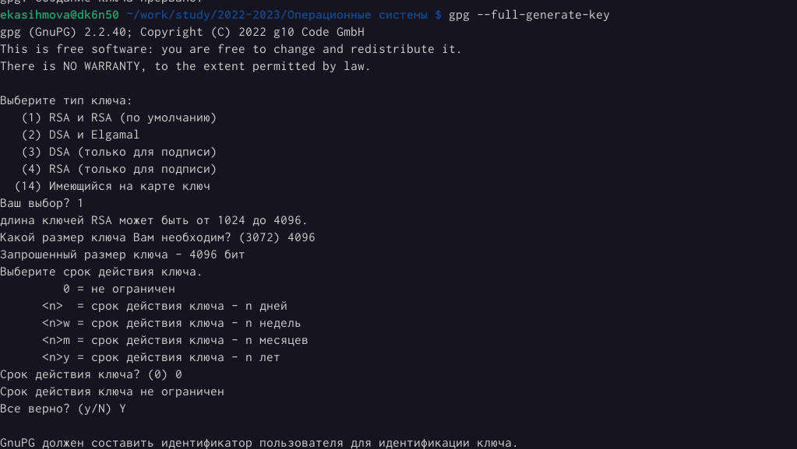{#fig:006 width=90%}

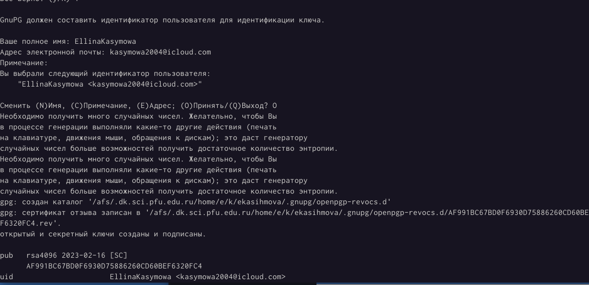{#fig:007 width=90%}

4)Вывожу список ключей и копирую отпечаток приватного ключа

{#fig:008 width=90%}

5)Экспортирую ключ в формате ASCII по его отпечатку.

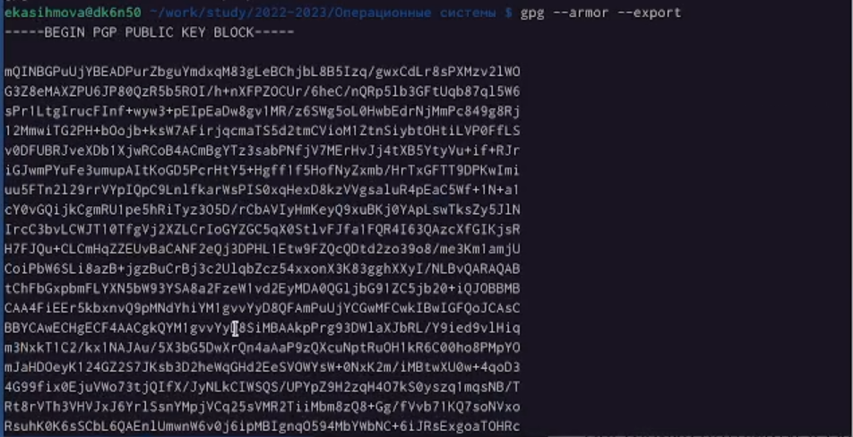{#fig:009 width=90%}

6)Копирую свой сгенерированный PGP ключ в буфер обмена.

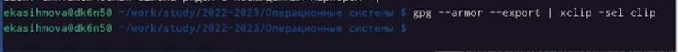{#fig:010 width=90%}

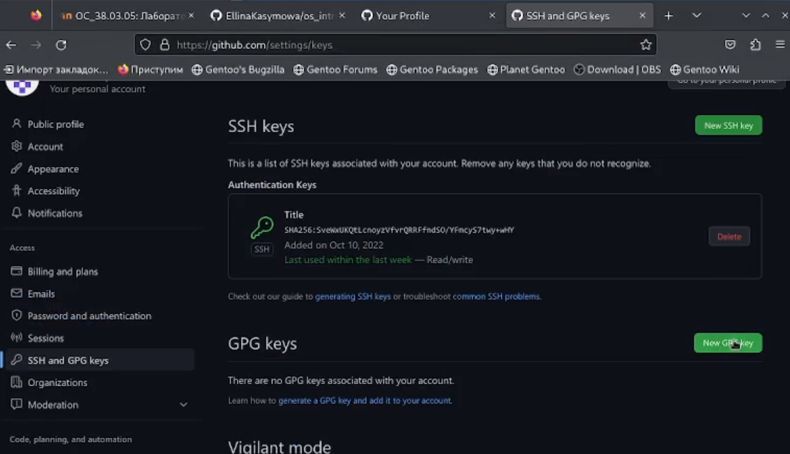{#fig:011 width=90%}

7) Вставляю код в New GPG key.

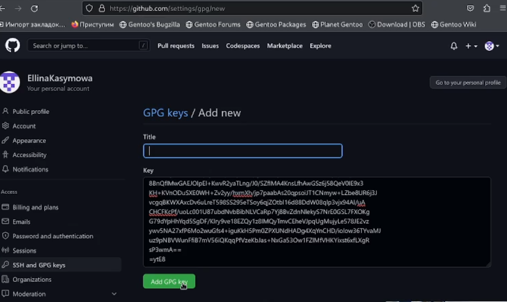{#fig:012 width=90%}

8)Мы получили GPG ключ.

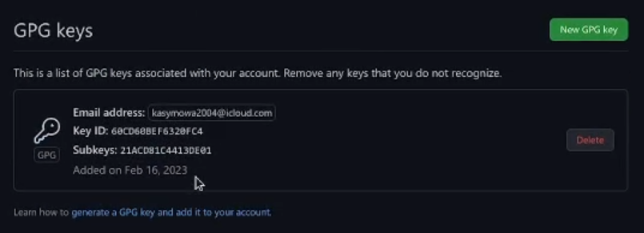{#fig:013 width=90%}

9)Далее переходим в os-intro и создаю необходимые каталоги, коммитим

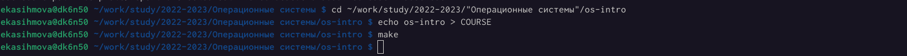{#fig:014 width=90%}

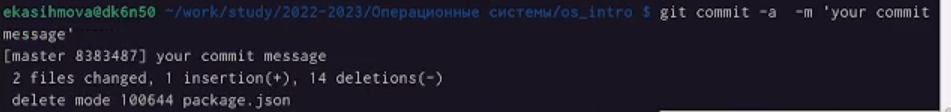{#fig:015 width=90%}

10)Используя введёный email, указываю Git, применяемый при подписи коммитов.

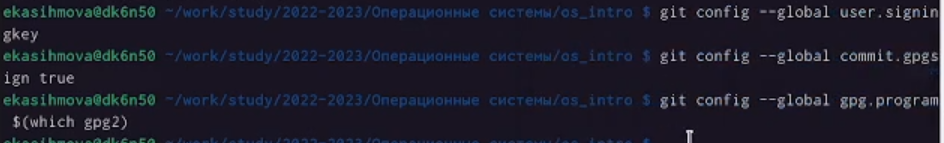{#fig:016 width=90%}

11)Отправляю файлы на сервер.

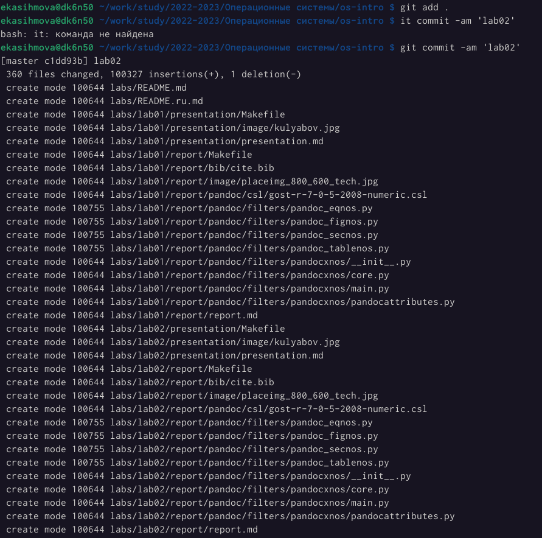{#fig:017 width=90%}

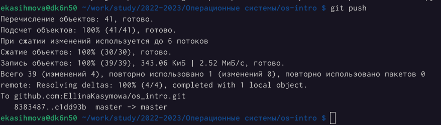{#fig:018 width=90%}

# Контрольные вопросы

1)Что такое системы контроля версий (VCS) и для решения каких задач они предназначаются?

Система контроля версий (VCS) — это система, регистрирующая изменения в одном или
нескольких файлах с тем, чтобы в дальнейшем была возможность вернуться к
определённым старым версиям этих файлов. Для примеров в этой книге мы будем
использовать исходные коды программ, но на самом деле под версионный контроль
можно поместить файлы практически любого типа. Если вы графический или веб-
дизайнер и хотели бы хранить каждую версию изображения или макета — а этого вам
наверняка хочется — то пользоваться системой контроля версий будет очень мудрым
решением. даёт возможность возвращать отдельные файлы к прежнему виду, возвращать
к прежнему состоянию весь проект, просматривать происходящие со временем изменения,
определять, кто последним вносил изменения во внезапно переставший работать модуль,
кто и когда внёс в код какую-то ошибку, и многое другое. Вообще, если, пользуясь, вы всё
испортите или потеряете файлы, всё можно будет легко восстановить. Вдобавок,
накладные расходы за всё, что вы получаете, будут очень маленькими.

2)Объясните следующие понятия VCS и их отношения: хранилище, commit, история, рабочая копия.

Хранилище-система, которая обеспечивает хранение всех существовавших вариантов
файлов Commit-фиксация изменений История-список предыдущих ревизий Рабочая
копия-копия другой ветки Команде commit можно передать сообщение, описывающее
изменения в ревизии. Она также записывает идентификатор пользователя, текущее время
и временную зону, плюс список измененных файлов и их содержимого. Сообщение,
описывающее изменения, определяется через опцию -m, или – message. Можно также
вводить сообщения, состоящие из нескольких строк; в большинстве оболочек вы можете
сделать это оставив открытую кавычку в конце строки. commit -m "добавлен первый файла.

3)Что представляют собой и чем отличаются централизованные и децентрализованные VCS? Приведите примеры VCS каждого вида.

Системы контроля версий. Централизованная система контроля версий Subversion и
децентрализованная система контроля версий Mercurial. Существуют СКВ
централизованные, в которых имеется один репозиторий, в который собираются
изменения со всех рабочих копий разработчиков, и децентрализованные, когда
репозиториев много, и они могут обмениваться изменениями между собой.
Централизованные СКВ - репозиторий один. У каждого разработчика своя рабочая копия.
Время от времени разработчик может затягивать к себе в рабочую копию новые
изменения из репозитория, или проталкивать свои изменения из своей рабочей копии в
репозиторий. Прочие особенности централизованных СКВ зависят от реализации.

4)Опишите действия с VCS при единоличной работе с хранилищем.

Традиционные системы управления версиями используют централизованную модель,
когда имеется единое хранилище документов, управляемое специальным сервером,
который и выполняет большую часть функций по управлению версиями. Пользователь,
работающий с документами, должен сначала получить нужную ему версию документа из
хранилища; обычно создаётся локальная копия документа, т. н. «рабочая копия». Может
быть получена последняя версия или любая из предыдущих, которая может быть выбрана
по номеру версии или дате создания, иногда и по другим признакам. После того, как в
документ внесены нужные изменения, новая версия помещается в хранилище. В отличие
от простого сохранения файла, предыдущая версия не стирается, а тоже остаётся в
хранилище и может быть оттуда получена в любое время. Сервер может использовать т. н.
дельта-компрессию — такой способ хранения документов, при котором сохраняются
только изменения между последовательными версиями, что позволяет уменьшить объём
хранимых данных. Поскольку обычно наиболее востребованной является последняя
версия файла, система может при сохранении новой версии сохранять её целиком, заменяя
в хранилище последнюю ранее сохранённую версию на разницу между этой и последней
версией. Некоторые системы (например, ClearCase) поддерживают сохранение версий
обоих видов: большинство версий сохраняется в виде дельт, но периодически (по специальной команде администратора) выполняется сохранение версий всех файлов в
полном виде; такой подход обеспечивает максимально полное восстановление истории в
случае повреждения репозитория.

5)Опишите порядок работы с общим хранилищем VCS.

Традиционные системы управления версиями используют централизованную модель,
когда имеется единое хранилище документов, управляемое специальным сервером,
который и выполняет большую часть функций по управлению версиями. Пользователь,
работающий с документами, должен сначала получить нужную ему версию документа из
хранилища; обычно создаётся локальная копия документа, т. н. «рабочая копия». Может
быть получена последняя версия или любая из предыдущих, которая может быть выбрана
по номеру версии или дате создания, иногда и по другим признакам. После того, как в
документ внесены нужные изменения, новая версия помещается в хранилище. В отличие
от простого сохранения файла, предыдущая версия не стирается, а тоже остаётся в
хранилище и может быть оттуда получена в любое время. Сервер может использовать т. н.
дельт компрессию — такой способ хранения документов, при котором сохраняются
только изменения между последовательными версиями, что позволяет уменьшить объём
хранимых данных. Поскольку обычно наиболее востребованной является последняя
версия файла, система может при сохранении новой версии сохранять её целиком, заменяя
в хранилище последнюю ранее сохранённую версию на разницу между этой и последней
версией. Некоторые системы (например, ClearCase) поддерживают сохранение версий
обоих видов: большинство версий сохраняется в виде дельт, но периодически (по
специальной команде администратора) выполняется сохранение версий всех файлов в
полном виде; такой подход обеспечивает максимально полное восстановление истории в
случае повреждения репозитория.

6)Каковы основные задачи, решаемые инструментальным средством git?

Устанавливает единственную новую команду, git. Все возможности предоставляются
через подкоманды этой команды. Вы можете просмотреть краткую справку командой
help. Некоторые идеи группируются по темам, используйте help topics для списка
доступных тем. Одна из функций системы контроля версий — отслеживать кто сделал
изменения. В распределенных системах для этого требуется идентифицировать каждого
автора уникально в глобальном плане. Большинство людей уже имеют такой
идентификатор: email адрес. Bazaar достаточно умен, чтобы автоматически создавать
email адрес из текущего имени и адреса хоста.
Основные задачи: создание ветки, размещение веток, просмотр изменений, фиксация
изменений, сообщение из текстового редактора, выборочная фиксация, удаление
зафиксированных изменений, игнорирование файлов, просмотр истории, статистика
ветки, контроль файлов и каталогов, ветвление, объединение веток, публикация ветки.

7)Назовите и дайте краткую характеристику командам git.

Обновление рабочей копии По мере внесения изменений в проект рабочая копия на
компьютере разработчика стареет, расхождение её с основной версией проекта
увеличивается. Это повышает риск возникновения конфликтных изменений (см. ниже).
Поэтому удобно поддерживать рабочую копию в состоянии, максимально близком к
текущей основной версией, для чего разработчик выполняет операцию обновления
рабочей копии (update) насколько возможно часто (реальная частота обновлений
определяется частотой внесения изменений, зависящей от активности разработки и числа
разработчиков, а также временем, затрачиваемым на каждое обновление — если оно
велико, разработчик вынужден ограничичать частоту обновлений, чтобы не терять время).
Модификация проекта Разработчик модифицирует проект, изменяя вхо дящие в него
файлы в рабочей копии в соответствии с проектным заданием. Эта работа производится
локально и не требует обращений к серверу VCS. Фиксация изменений Завершив
очередной этап работы над заданием,разработчик фиксирует (commit) свои изменения,
передавая их на сервер (либо в основную ветвь, если работа над заданием полностью
завершена, либо в отдельную ветвь разработки данного задания). VCS может требовать от
разработчика перед фиксацией обязательно выполнить обновление рабочей копии. При
наличии в системе поддержки отложенных изменений (shelving) изменения могут быть
переданы на сервер без фиксации. Если утверждённая политика работы в VCS это
позволяет, то фиксация изменений может проводиться не ежедневно, а только по
завершении работы над заданием; в этом случае до завершения работы все связанные с
заданием изменения сохраняются только в локальной рабочей копии разработчика.

8)Приведите примеры использования при работе с локальным и удалённым
репозиториями.

Мы создаем новую ветку выполнив git init в уже созданном каталоге: % mkdir tutorial % cd
tutorial % ls -a ./ ../ % pwd /home/mbp/work/bzr.test/tutorial % % git init % ls -aF ./ ../ .git/ %
Мы обычно обращаемся к веткам на нашем компьютере просто передав имя каталога
содержащего ветку. bzr также поддерживает доступ к веткам через http и sftp, например:
git log http://bazaar-vcs.org git // git.dev/ git log sftp://bazaarvcs.org/bzr/bzr.dev/ Установив
для git плагины можно также осуществлять доступ к веткам с использованием rsync.
Команда status показывает какие изменения были сделаны в рабочем каталоге с момента
последней ревизии: % git status modified: foo bzr status скрывает неинтересные файлы,
которые либо не менялись, либо игнорируются. Также команде status могут быть
переданы необязательные имена файлов, или каталогов для проверки. Команда diff
показывает изменения в тексте файлов в стандартном формате diff. Вывод этой команды
может быть передан другим командам, таким как ”patch”, ”diffstat”, ”filterdiff” и
”colordiff”: % git diff === added file ’hello.txt’ --- hello.txt 1970-01-01 00:00:00 +0000 +++
hello.txt 2005-10-18 14:23:29 +00006.2. Указания к лабораторной работе 75 @@ -0,0 +1,1
@@ +hello world Команде commit можно передать сообщение описывающее изменения в
ревизии. Она также записывает идентификатор пользователя, текущее время и временную
зону, плюс список измененных файлов и их содержимого. git commit -m "добавлен первый
файл" Если вы передадите список имен файлов, или каталогов после команды commit, то
будут зафиксированы только изменения для переданных объектов. Например: bzr commit -
m "исправления документации" commit.py Если вы сделали какие-либо изменения и не
хотите оставлять их, используйте команду revert, что бы вернутся к состоянию
предыдущей ревизии. Многие деревья с исходным кодом содержат файлы которые не
нужно хранить под контролем версий, например резервные файлы текстового редактора,
объектные файлы и собранные программы. Вы можете просто не добавлять их, но они
всегда будут обнаруживаться как неизвестные. Вы также можете сказать git игнорировать
их добавив их в файл .ignore в корне рабочего дерева. Для получения списка файлов
которые игнорируются и соответствующих им шаблонов используйте команду ignored: %
ignored config.h ./config.h configure.in~ *~ log Команда bzr log показывает список
предыдущих ревизий. Команда log --forward делает тоже самое, но в хронологическом
порядке, показывая более поздние ревизии в конце может контролировать файлы и
каталоги, отслеживая переименования и упрощая их последующее объединение: % mkdir
src % echo ’int main() {}’ > src/simple.c % add src added src added src/simple.c % status added:
src/ src/simple.c bzr remove удаляет файл из под контроля версий, но может и не удалять
рабочую копию файла2. Это удобно, когда вы добавили не тот файл, или решили, что
файл на самом деле не должен быть под контролем версий. % rm -r src % remove -v
hello.txt ? hello.txt % status removed: hello.txt src/ src/simple.c unknown: hello.txt Часто вместо того что бы начинать свой собственный проект, выхотите предложить изменения для уже готового проекта. Что бы сделать это вам нужно получить копию готовой ветки.
Так как эта копия может быть потенциальной новой веткой.Если две ветки разошлись (обе
имеют уникальные изменения) тогда merge — это подходящая команда для
использования. Объединение автоматически вычислит изменения, которые существуют на
объединяемой ветке и отсутствуют в локальной ветке и попытается объединить их с
локальной веткой. git merge URL.

9)Что такое и зачем могут быть нужны ветви (branches)?

Часто вместо того что бы начинать свой собственный проект, вы хотите предложить
изменения для уже готового проекта. Что бы сделать это вам нужно получить копию
готовой ветки. Так как эта копия может быть потенциальной новой веткой эта команда
называется branch: Управление версиями git branch cd git.dev Эта команда копирует
полную историю ветки и после этого вы можете делать все операции с ней локально:
просматривать журнал, создавать и объединять другие ветки.

10)Как и зачем можно игнорировать некоторые файлы при commit?

Нет проблем если шаблон для игнорирования подходит для файла под контролем версий,
или вы добавили файл, который игнорируется. Шаблоны не имеют никакого эффекта на
файлы под контролем версий, они только определяют показываются неизвестные файлы,
или просто игнорируются. Файл git.rignore обычно должен быть под контролем версий,
что бы новые копии ветки видели такие же шаблоны: git add . gitignore git commit -m
"Добавлены шаблоны для игнорирования". Многие деревья с исходным кодом содержат
файлы, которые не нужно хранить под контролем версий, например, резервные файлы
текстового редактора, объектные файлы и собранные программы. Вы можете просто не
добавлять их, но они всегда будут обнаруживаться как неизвестные. Вы также можете
сказать bzr игнорировать их добавив их в файл в корне рабочего дерева. Этот файл
содержит список шаблонов файлов, по одному в каждой строчке. Обычное содержимое
может быть таким: *.o *~ *.tmp *.py [ co ] Если шаблон содержит слеш, то он будет
сопоставлен с полным путем начиная от корня рабочего дерева; иначе он сопоставляется
только с именем файла. Таким образом пример выше игнорирует файлы с расширением .o
во всех подкаталогах, но пример ниже игнорирует только config.h в корне рабочего дерева и HTML файлы в каталоге doc/: ./config.h doc/*.html Для получения списка файлов которые игнорируются и соответствующих им шаблонов используйте команду git ignored : $ git ignored config.h ./config.h configure.in~ *~ $

# Выводы

Проделав данную лабораторную работу мы изучили идеалогию и применение средств контроля версий и осовоили умение по работе с git.

# Список литературы{.unnumbered}

::: {#refs}
:::
