---
## Front matter
lang: ru-RU
title: Лабораторная работа №4
subtitle: Простейший шаблон
author:
  - Касымова Эллина
institute:
  - Российский университет дружбы народов, Москва, Россия

## i18n babel
babel-lang: russian
babel-otherlangs: english

## Formatting pdf
toc: false
toc-title: Содержание
slide_level: 2
aspectratio: 169
section-titles: true
theme: metropolis
header-includes:
 - \metroset{progressbar=frametitle,sectionpage=progressbar,numbering=fraction}
 - '\makeatletter'
 - '\beamer@ignorenonframefalse'
 - '\makeatother'
---

# Информация

## Докладчик


  * Касымова Эллина Руслановна
  * студентка направления НБИбд-01-22
  * Российский университет дружбы народов


## Актуальность

Актуальность этой работы вто что мы практикуем создание каталогов и работу с ними.


## Материалы и методы

- Процессор `pandoc` для входного формата Markdown
- Результирующие форматы
	- `pdf`
	- `html`
- Автоматизация процесса создания: `Makefile`


## Процессор `pandoc`

- Pandoc: преобразователь текстовых файлов
- Сайт: <https://pandoc.org/>
- Репозиторий: <https://github.com/jgm/pandoc>

## Формат `pdf`

- Использование LaTeX
- Пакет для презентации: [beamer](https://ctan.org/pkg/beamer)
- Тема оформления: `metropolis`

## Код для формата `pdf`

```yaml
slide_level: 2
aspectratio: 169
section-titles: true
theme: metropolis
```

## Формат `html`

- Используется фреймворк [reveal.js](https://revealjs.com/)
- Используется [тема](https://revealjs.com/themes/) `beige`

## Код для формата `html`

- Тема задаётся в файле `Makefile`

```make
REVEALJS_THEME = beige 
```

## Получающиеся форматы

- Полученный `pdf`-файл можно демонстрировать в любой программе просмотра `pdf`
- Полученный `html`-файл содержит в себе все ресурсы: изображения, css, скрипты

## Содержание исследования

## Определяем полное имя моего домашнего каталога.Далее относительно этого каталога буду выполнять последующие упражнения.

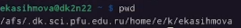{#fig:001 width=90%}

## Перехожу в каталог /tmp.Вывожу на экран содержимое каталога /tmp. Для этого использую команду ls с различными опциями.

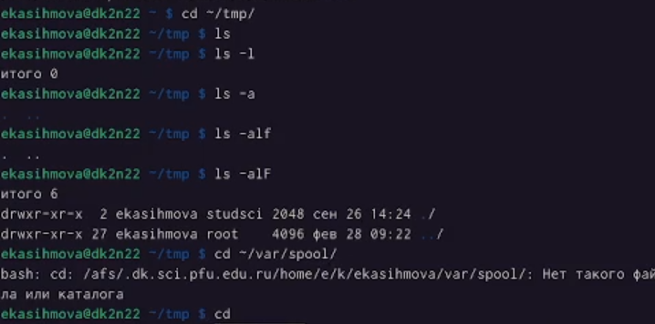{#fig:002 width=90%}

## В каталоге /var/spool существует подкаталог с именем cron

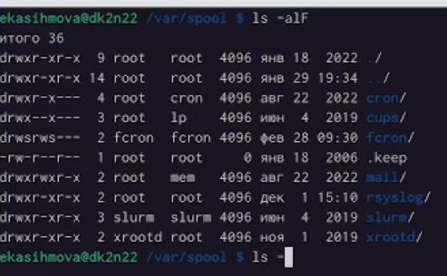{#fig:003 width=90%}

## Перехожу в домашний каталог и вывожу на экран его содержимое.Определила владельца файла и подкаталогов.

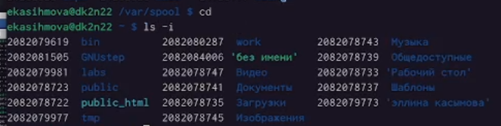{#fig:004 width=90%}

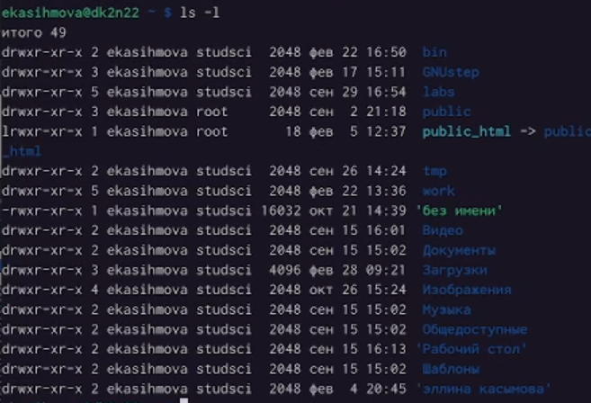{#fig:005 width=90%}

## В домашнем каталоге создаю новый каталог с именем newdir.В каталоге ~/newdir создаю новый каталог с именем morefun.

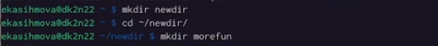{#fig:006 width=90%}

## В домашнем каталоге создаю одной командой три новых каталога с именами
letters, memos, misk. Затем удаляю эти каталоги одной командой.

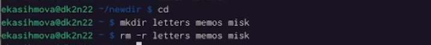{#fig:007 width=90%}

## Попробю удалить ранее созданный каталог ~/newdir командой rm.Удаляю каталог ~/newdir/morefun из домашнего каталога.

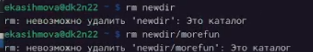{#fig:008 width=90%}

## С помощью команды man определяю, какую опцию команды ls нужно использовать для просмотра содержимое не только указанного каталога, но и подкаталогов,
входящих в него.

{#fig:009 width=90%}

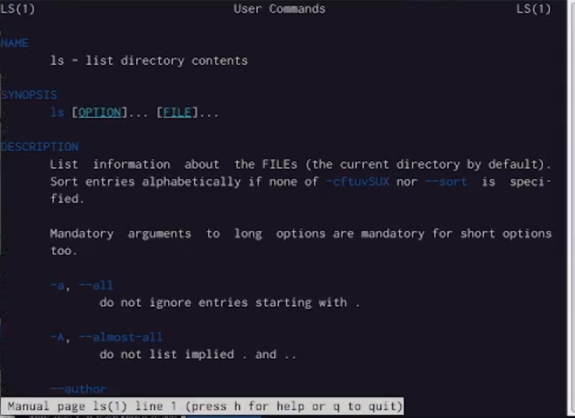{#fig:010 width=90%}

## Использую команду man для просмотра описания следующих команд: cd, pwd, mkdir,
rmdir, rm.

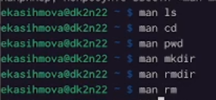{#fig:011 width=90%}

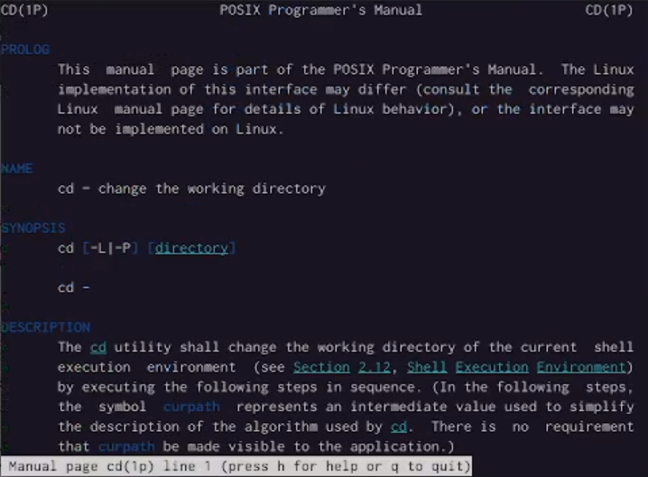{#fig:012 width=90%}

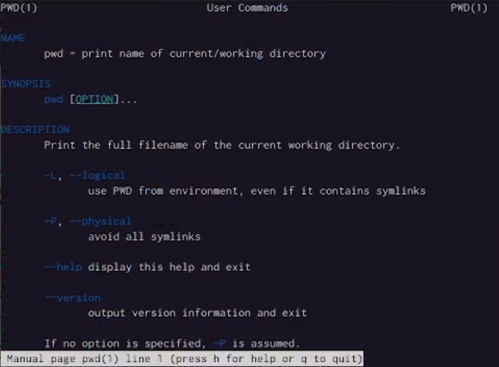{#fig:013 width=90%}

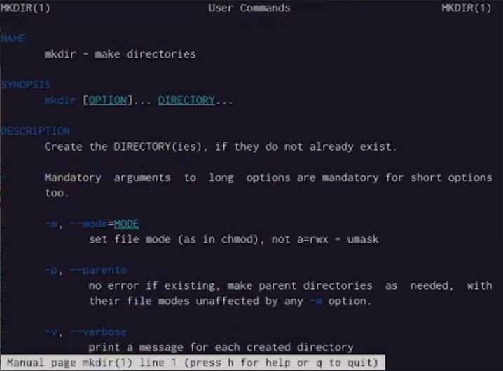{#fig:014 width=90%}

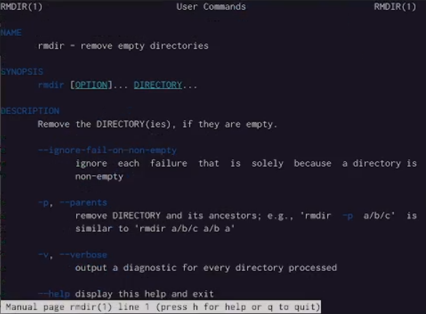{#fig:015 width=90%}

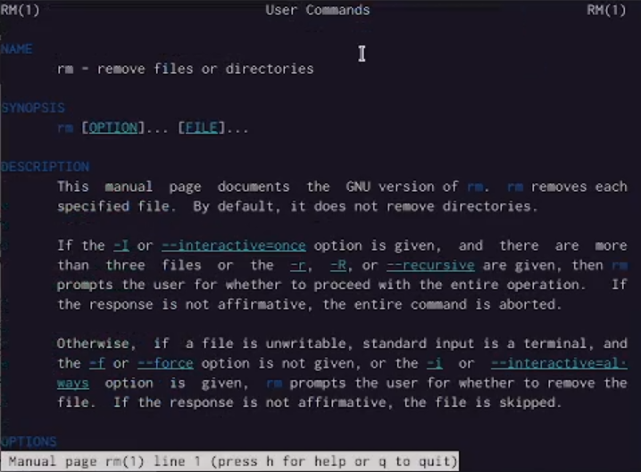{#fig:016 width=90%}

## Используя информацию, полученную при помощи команды history, выполняю модификацию и исполнение нескольких команд из буфера команд.

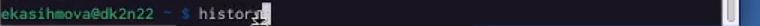{#fig:017 width=90%}

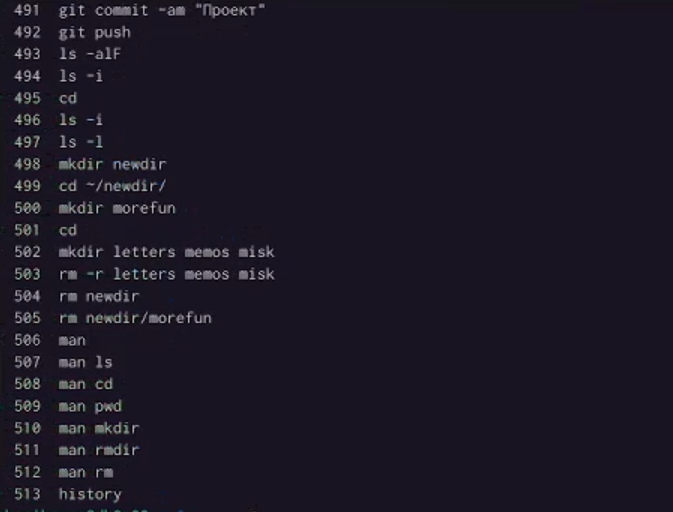{#fig:018 width=90%}

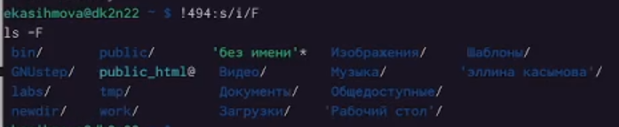{#fig:019 width=90%}

## Результаты

Результат этой работы в том что мы научились новым комнадам для работ с каталогами


