---
## Front matter
title: "Лабораторная работа №4 "
subtitle: "Операционные системы"
author: "Касымова Эллина"

## Generic otions
lang: ru-RU
toc-title: "Содержание"

## Bibliography
bibliography: bib/cite.bib
csl: pandoc/csl/gost-r-7-0-5-2008-numeric.csl

## Pdf output format
toc: true # Table of contents
toc-depth: 2
lof: true # List of figures
lot: true # List of tables
fontsize: 12pt
linestretch: 1.5
papersize: a4
documentclass: scrreprt
## I18n polyglossia
polyglossia-lang:
  name: russian
  options:
	- spelling=modern
	- babelshorthands=true
polyglossia-otherlangs:
  name: english
## I18n babel
babel-lang: russian
babel-otherlangs: english
## Fonts
mainfont: PT Serif
romanfont: PT Serif
sansfont: PT Sans
monofont: PT Mono
mainfontoptions: Ligatures=TeX
romanfontoptions: Ligatures=TeX
sansfontoptions: Ligatures=TeX,Scale=MatchLowercase
monofontoptions: Scale=MatchLowercase,Scale=0.9
## Biblatex
biblatex: true
biblio-style: "gost-numeric"
biblatexoptions:
  - parentracker=true
  - backend=biber
  - hyperref=auto
  - language=auto
  - autolang=other*
  - citestyle=gost-numeric
## Pandoc-crossref LaTeX customization
figureTitle: "Рис."
tableTitle: "Таблица"
listingTitle: "Листинг"
lofTitle: "Список иллюстраций"
lotTitle: "Список таблиц"
lolTitle: "Листинги"
## Misc options
indent: true
header-includes:
  - \usepackage{indentfirst}
  - \usepackage{float} # keep figures where there are in the text
  - \floatplacement{figure}{H} # keep figures where there are in the text
---

# Цель работы

Приобретение практических навыков взаимодействия пользователя с системой по-
средством командной строки.

Цель данного шаблона --- максимально упростить подготовку отчётов по
лабораторным работам.  Модифицируя данный шаблон, студенты смогут без
труда подготовить отчёт по лабораторным работам, а также познакомиться
с основными возможностями разметки Markdown.

# Задание

1. Что такое командная строка?
2. При помощи какой команды можно определить абсолютный путь текущего каталога?
Приведите пример.
3. При помощи какой команды и каких опций можно определить только тип файлов
и их имена в текущем каталоге? Приведите примеры.
4. Каким образом отобразить информацию о скрытых файлах? Приведите примеры.
5. При помощи каких команд можно удалить файл и каталог? Можно ли это сделать
одной и той же командой? Приведите примеры.
6. Каким образом можно вывести информацию о последних выполненных пользовате-
лем командах? работы?
7. Как воспользоваться историей команд для их модифицированного выполнения? При-
ведите примеры.
8. Приведите примеры запуска нескольких команд в одной строке.
9. Дайте определение и приведите примера символов экранирования.
10. Охарактеризуйте вывод информации на экран после выполнения команды ls с опцией
l.
11. Что такое относительный путь к файлу? Приведите примеры использования относи-
тельного и абсолютного пути при выполнении какой-либо команды.
12. Как получить информацию об интересующей вас команде?
13. Какая клавиша или комбинация клавиш служит для автоматического дополнения
вводимых команд?

# Выполнение лабораторной работы

1)Определяем полное имя моего домашнего каталога.Далее относительно этого каталога буду выполнять последующие упражнения.

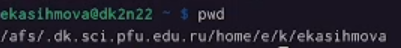{#fig:001 width=90%}

2)Перехожу в каталог /tmp.Вывожу на экран содержимое каталога /tmp. Для этого использую команду ls с различными опциями.

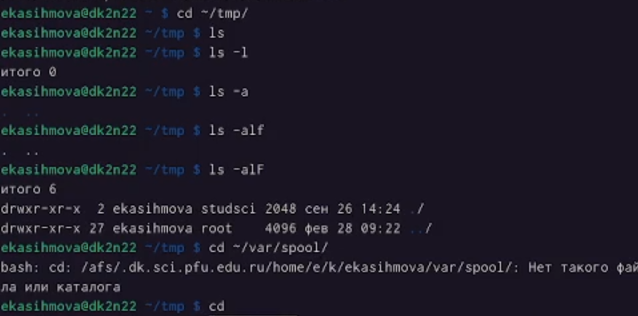{#fig:002 width=90%}

3)В каталоге /var/spool существует подкаталог с именем cron

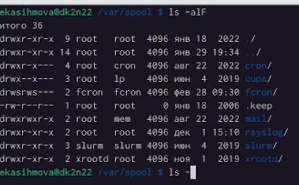{#fig:003 width=90%}

4)Перехожу в домашний каталог и вывожу на экран его содержимое.Определила владельца файла и подкаталогов.

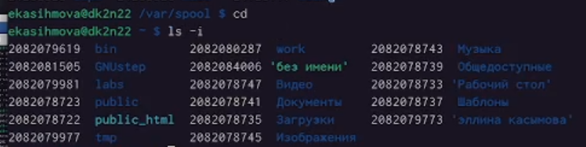{#fig:004 width=90%}

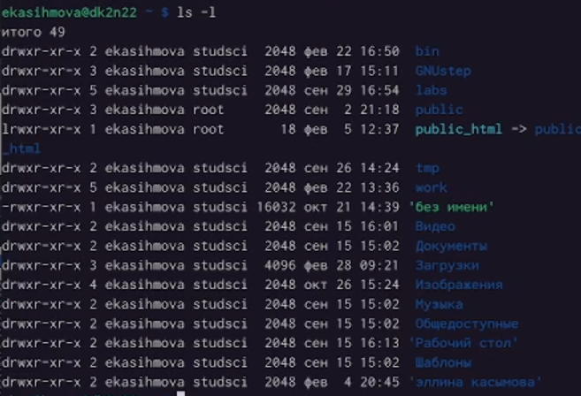{#fig:005 width=90%}

5)В домашнем каталоге создаю новый каталог с именем newdir.В каталоге ~/newdir создаю новый каталог с именем morefun.

{#fig:006 width=90%}

6)В домашнем каталоге создаю одной командой три новых каталога с именами
letters, memos, misk. Затем удаляю эти каталоги одной командой.

{#fig:007 width=90%}

7)Попробю удалить ранее созданный каталог ~/newdir командой rm.Удаляю каталог ~/newdir/morefun из домашнего каталога.

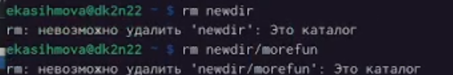{#fig:008 width=90%}

8)С помощью команды man определяю, какую опцию команды ls нужно использовать для просмотра содержимое не только указанного каталога, но и подкаталогов,
входящих в него.

{#fig:009 width=90%}

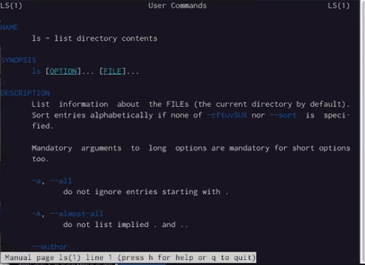{#fig:010 width=90%}

9)Использую команду man для просмотра описания следующих команд: cd, pwd, mkdir,
rmdir, rm.

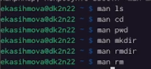{#fig:011 width=90%}

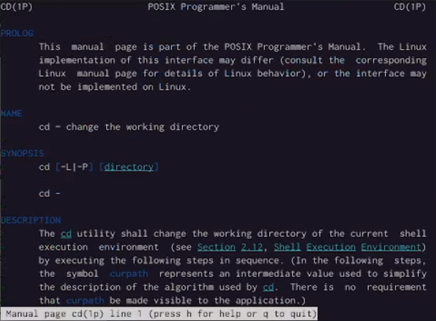{#fig:012 width=90%}

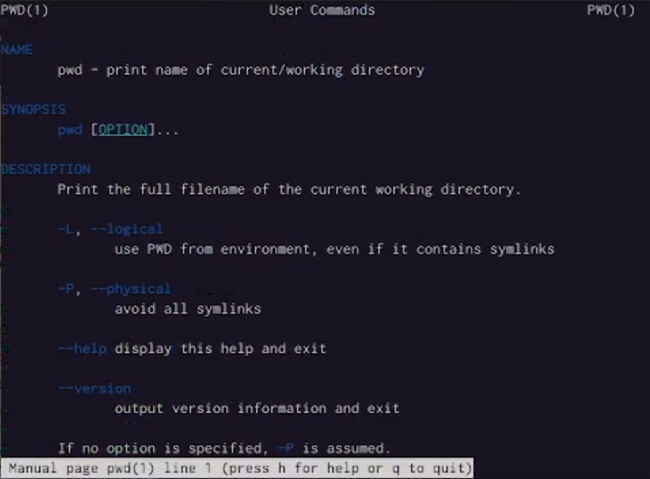{#fig:013 width=90%}

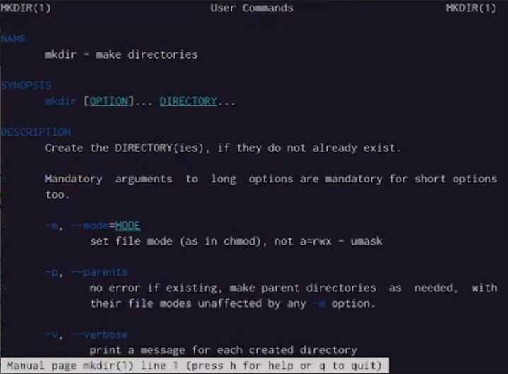{#fig:014 width=90%}

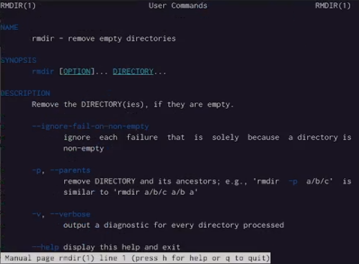{#fig:015 width=90%}

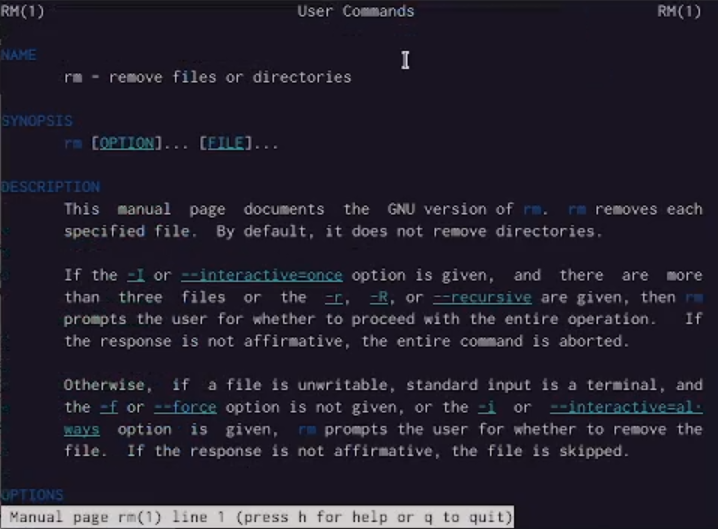{#fig:016 width=90%}

10)Используя информацию, полученную при помощи команды history, выполняю модификацию и исполнение нескольких команд из буфера команд.

{#fig:017 width=90%}

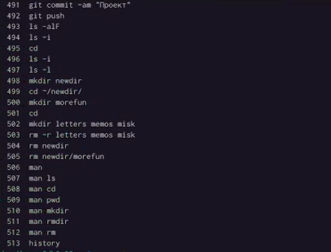{#fig:018 width=90%}

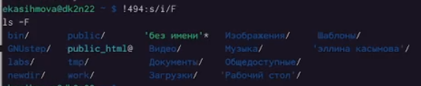{#fig:019 width=90%}

# Ответы на вопросы

1. Что такое командная строка - инструмент для передачи дейтвий которые должен выполнить компьютерю
2. pwd, realpath

3. ls -F

4. Можно отредактировать скрытый файл и заметить что он отображается, в данном случае стоит использовать ls, а точнее ls -a.
Пример: ls -a. Вывод: . ..

5. При помощи rm, rmdir можно удалить файл и каталог, можно это сделать
одной и той же командой.
Пример: rm -r letters memos misk
Пример: rmdir -r letters memos misk

6. history

7. Пример: "!501:s/i/l". Выбираем строчку, пишем её номер в начале, далее команду которую хотим заменить на следующую.

8. Используем запятые для того чтобы записать сразу несколько командю

9. Экранирование - способ заключения в кавычки одиночного символа. Экранируемый символ (\) сообщает интерпретатору, что следующий за этим символ воспринимается как обычный символ.
Пример: "echo "Мир: \"world\"." # echo "Мир: \"world\".

10. Охарактеризуйте вывод информации на экран после выполнения команды ls с опцией

11. Относительный путь к файлу - это путь к файлу относительно текущей папки. Например, при использовании pwd.

12. Получить информацию об интересующей вас команде можно с помощью команды man.
Man ls выдаёт все варианты действий с комнадой.

13. Сочетание клавиш Ctr+C прерывает текущий процесс, запущенный в терминале.

# Выводы

Проделав данную лабораторную работ мы научились практическим навыкам взаимодействия пользователя с системой посредством командной строки.

# Список литературы{.unnumbered}

::: {#refs}
:::
