---
## Front matter
lang: ru-RU
title:  Лабораторная работа №5
subtitle: Простейший шаблон
author:
  - Касымова Эллина
institute:
  - Российский университет дружбы народов, Москва, Россия
date: 09 март 2023

## i18n babel
babel-lang: russian
babel-otherlangs: english

## Formatting pdf
toc: false
toc-title: Содержание
slide_level: 2
aspectratio: 169
section-titles: true
theme: metropolis
header-includes:
 - \metroset{progressbar=frametitle,sectionpage=progressbar,numbering=fraction}
 - '\makeatletter'
 - '\beamer@ignorenonframefalse'
 - '\makeatother'
---

# Информация

## Докладчик

  * Касымова Эллина Руслановна
  * студентка направления НБИбд-01-22
  * Российский университет дружбы народов


## Актуальность

Актуальность этой темы состоит в том что мы работаем с системой файлов и разбираем ее от и до.


## Материалы и методы

- Процессор `pandoc` для входного формата Markdown
- Результирующие форматы
	- `pdf`
	- `html`
- Автоматизация процесса создания: `Makefile`


## Процессор `pandoc`

- Pandoc: преобразователь текстовых файлов
- Сайт: <https://pandoc.org/>
- Репозиторий: <https://github.com/jgm/pandoc>

## Формат `pdf`

- Использование LaTeX
- Пакет для презентации: [beamer](https://ctan.org/pkg/beamer)
- Тема оформления: `metropolis`

## Код для формата `pdf`

```yaml
slide_level: 2
aspectratio: 169
section-titles: true
theme: metropolis
```

## Формат `html`

- Используется фреймворк [reveal.js](https://revealjs.com/)
- Используется [тема](https://revealjs.com/themes/) `beige`

## Код для формата `html`

- Тема задаётся в файле `Makefile`

```make
REVEALJS_THEME = beige 
```

## Получающиеся форматы

- Полученный `pdf`-файл можно демонстрировать в любой программе просмотра `pdf`
- Полученный `html`-файл содержит в себе все ресурсы: изображения, css, скрипты


## Содержание исследования

## Выполняю все примеры, приведённые в первой части описания лабораторной работы.

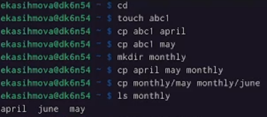{#fig:001 width=90%}

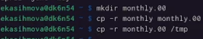{#fig:002 width=90%}

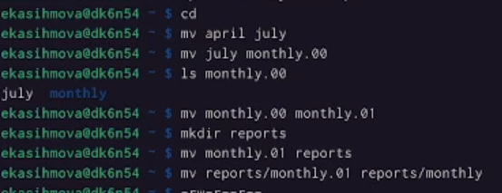{#fig:003 width=90%}

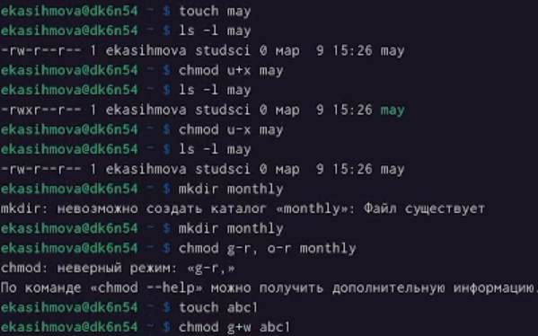{#fig:004 width=90%}

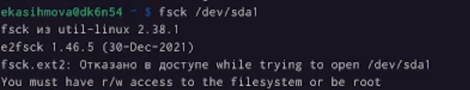{#fig:005 width=90%}

## Копирую файл /usr/include/sys/io.h в домашний каталог и называю его
equipment.

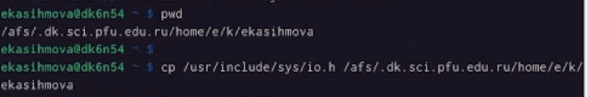{#fig:006 width=90%}

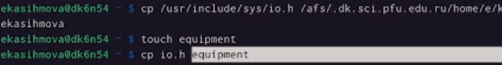{#fig:007 width=90%}

## В домашнем каталоге создаю директорию ~/ski.plases. Перемещаю файл equipment в каталог ~/ski.plases.Переименовываю файл ~/ski.plases/equipment в ~/ski.plases/equiplist.

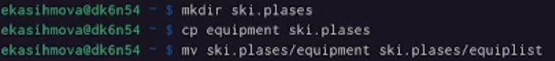{#fig:008 width=90%}

## Создаю в домашнем каталоге файл abc1 и копирую его в каталог
~/ski.plases, называю его equiplist2.  Создаю каталог с именем equipment в каталоге ~/ski.plases.Перемещаю файлы ~/ski.plases/equiplist и equiplist2 в каталог
~/ski.plases/equipment

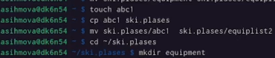{#fig:009 width=90%}

## Создаю и перемещаю каталог ~/newdir в каталог ~/ski.plases и называю
его plans.

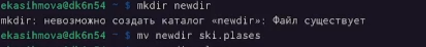{#fig:010 width=90%}

{#fig:11 width=90%}

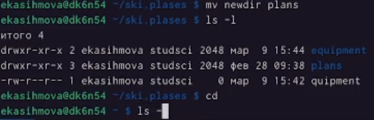{#fig:0012 width=90%}

## Просмотриваю содержимое файла /etc/password. Копирую файл ~/feathers в файл ~/file.old. Перемещаю файл ~/file.old в каталог ~/play.Копирую каталог ~/play в каталог ~/fun.Перемещаю каталог ~/fun в каталог ~/play и называю его games.

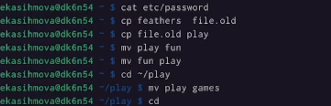{#fig:013 width=90%}

## Лишаю владельца файла ~/feathers права на чтение.Затеи копирую файл feathers и проверяю на команду cat.

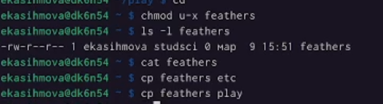{#fig:014 width=90%}

## Даю владельцу файла ~/feathers право на чтение.

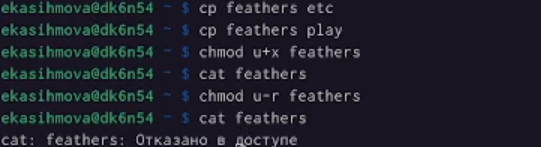{#fig:015 width=90%}

## Лишаю владельца каталога ~/play права на выполнение.Перехожу в каталог ~/play.Даю владельцу каталога ~/play право на выполнение.

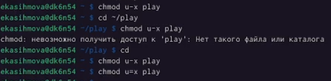{#fig:016 width=90%}

## Читаю man по командам mount, fsck, mkfs, kill.

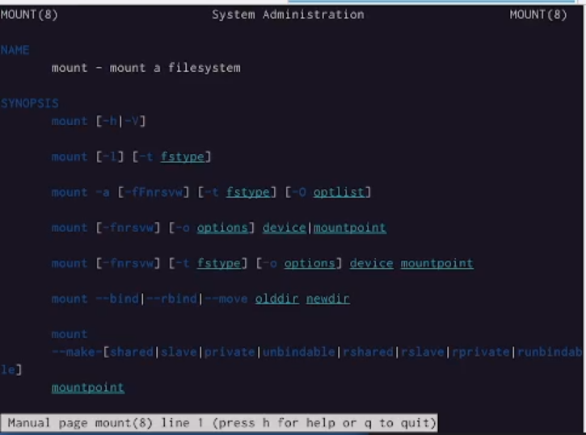{#fig:017 width=90%}

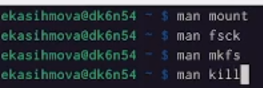{#fig:018 width=90%}


## Итоговый слайд

Проделав данную лабораторную работу мы ознакомились с файловой системой Linux, её структурой, именами и содержанием каталогов. 


:::

