---
## Front matter
title: "Лаборатноая работа №5"
subtitle: "Операционные системы"
author: "Касымова Эллина"

## Generic otions
lang: ru-RU
toc-title: "Содержание"

## Bibliography
bibliography: bib/cite.bib
csl: pandoc/csl/gost-r-7-0-5-2008-numeric.csl

## Pdf output format
toc: true # Table of contents
toc-depth: 2
lof: true # List of figures
lot: true # List of tables
fontsize: 12pt
linestretch: 1.5
papersize: a4
documentclass: scrreprt
## I18n polyglossia
polyglossia-lang:
  name: russian
  options:
	- spelling=modern
	- babelshorthands=true
polyglossia-otherlangs:
  name: english
## I18n babel
babel-lang: russian
babel-otherlangs: english
## Fonts
mainfont: PT Serif
romanfont: PT Serif
sansfont: PT Sans
monofont: PT Mono
mainfontoptions: Ligatures=TeX
romanfontoptions: Ligatures=TeX
sansfontoptions: Ligatures=TeX,Scale=MatchLowercase
monofontoptions: Scale=MatchLowercase,Scale=0.9
## Biblatex
biblatex: true
biblio-style: "gost-numeric"
biblatexoptions:
  - parentracker=true
  - backend=biber
  - hyperref=auto
  - language=auto
  - autolang=other*
  - citestyle=gost-numeric
## Pandoc-crossref LaTeX customization
figureTitle: "Рис."
tableTitle: "Таблица"
listingTitle: "Листинг"
lofTitle: "Список иллюстраций"
lotTitle: "Список таблиц"
lolTitle: "Листинги"
## Misc options
indent: true
header-includes:
  - \usepackage{indentfirst}
  - \usepackage{float} # keep figures where there are in the text
  - \floatplacement{figure}{H} # keep figures where there are in the text
---

# Цель работы

Ознакомление с файловой системой Linux, её структурой, именами и содержанием
каталогов. Приобретение практических навыков по применению команд для работы
с файлами и каталогами, по управлению процессами (и работами), по проверке исполь-
зования диска и обслуживанию файловой системы.

Цель данного шаблона --- максимально упростить подготовку отчётов по
лабораторным работам.  Модифицируя данный шаблон, студенты смогут без
труда подготовить отчёт по лабораторным работам, а также познакомиться
с основными возможностями разметки Markdown.

# Выполнение лабораторной работы

1)Выполняю все примеры, приведённые в первой части описания лабораторной работы.

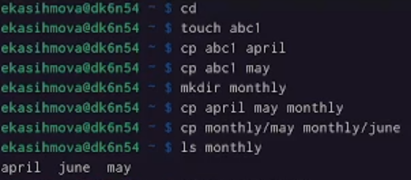{#fig:001 width=90%}

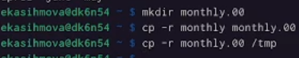{#fig:002 width=90%}

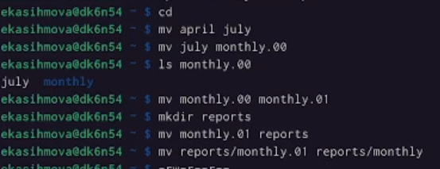{#fig:003 width=90%}

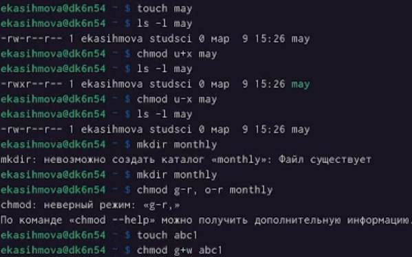{#fig:004 width=90%}

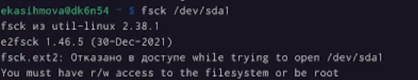{#fig:005 width=90%}

2)Копирую файл /usr/include/sys/io.h в домашний каталог и называю его
equipment.

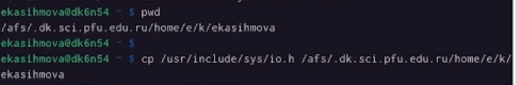{#fig:006 width=90%}

{#fig:007 width=90%}

3) В домашнем каталоге создаю директорию ~/ski.plases. Перемещаю файл equipment в каталог ~/ski.plases.Переименовываю файл ~/ski.plases/equipment в ~/ski.plases/equiplist.

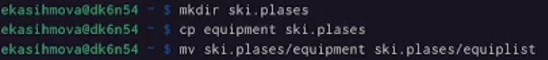{#fig:008 width=90%}

4)Создаю в домашнем каталоге файл abc1 и копирую его в каталог
~/ski.plases, называю его equiplist2.  Создаю каталог с именем equipment в каталоге ~/ski.plases.Перемещаю файлы ~/ski.plases/equiplist и equiplist2 в каталог
~/ski.plases/equipment

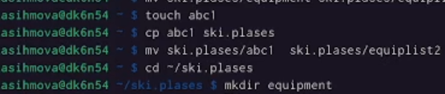{#fig:009 width=90%}

5)Создаю и перемещаю каталог ~/newdir в каталог ~/ski.plases и называю
его plans.

{#fig:010 width=90%}

{#fig:11 width=90%}

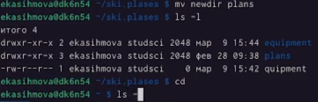{#fig:0012 width=90%}

6)Просмотриваю содержимое файла /etc/password. Копирую файл ~/feathers в файл ~/file.old. Перемещаю файл ~/file.old в каталог ~/play.Копирую каталог ~/play в каталог ~/fun.Перемещаю каталог ~/fun в каталог ~/play и называю его games.

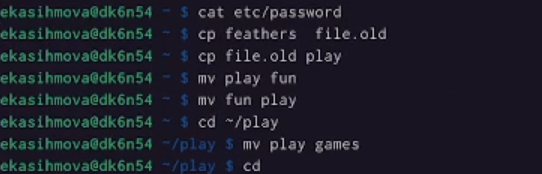{#fig:013 width=90%}

7)Лишаю владельца файла ~/feathers права на чтение.Затеи копирую файл feathers и проверяю на команду cat.

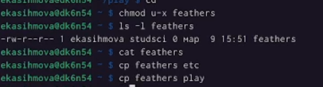{#fig:014 width=90%}

8)Даю владельцу файла ~/feathers право на чтение.

{#fig:015 width=90%}

9)Лишаю владельца каталога ~/play права на выполнение.Перехожу в каталог ~/play.Даю владельцу каталога ~/play право на выполнение.

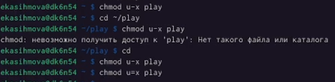{#fig:016 width=90%}

10)Читаю man по командам mount, fsck, mkfs, kill.

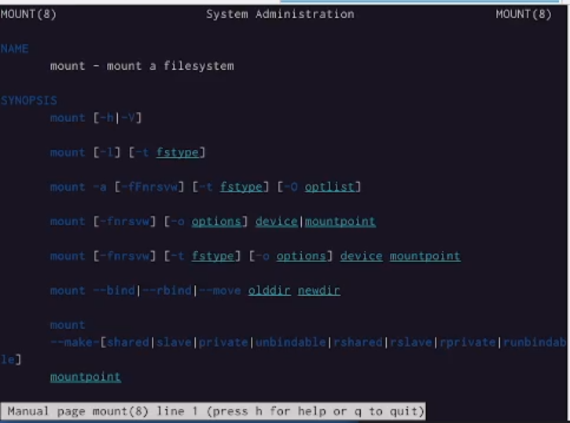{#fig:017 width=90%}

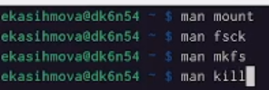{#fig:018 width=90%}

# Выводы

Проделав данную лабораторную работу мы ознакомились с файловой системой Linux, её структурой, именами и содержанием каталогов. 

# Список литературы{.unnumbered}

::: {#refs}
:::
