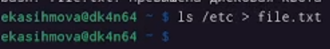
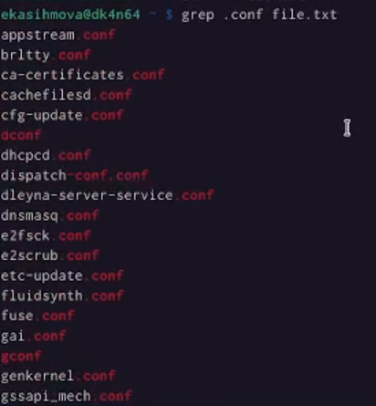
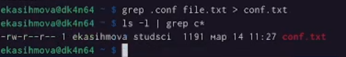
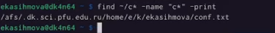
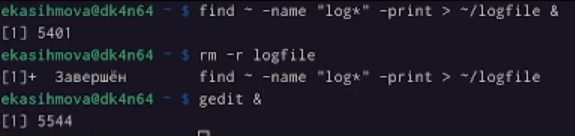
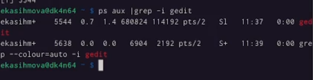
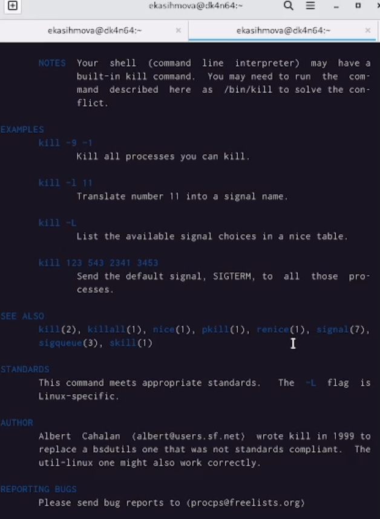
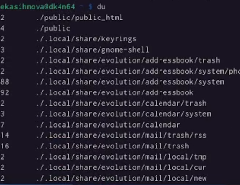
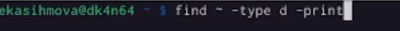
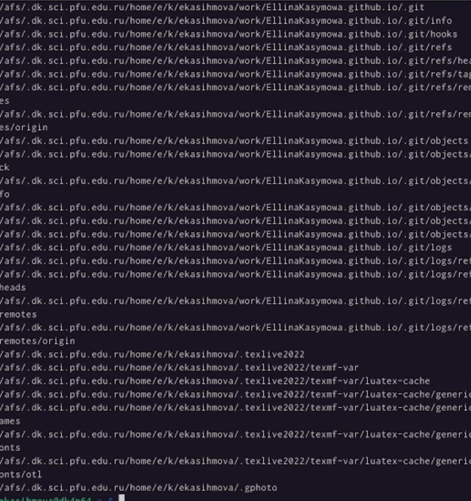

---
## Front matter
lang: ru-RU
title: Лабораторная работа №6
subtitle: Простейший шаблон
author:
  - Касымова Эллина
institute:
  - Российский университет дружбы народов, Москва, Россия

## i18n babel
babel-lang: russian
babel-otherlangs: english

## Formatting pdf
toc: false
toc-title: Содержание
slide_level: 2
aspectratio: 169
section-titles: true
theme: metropolis
header-includes:
 - \metroset{progressbar=frametitle,sectionpage=progressbar,numbering=fraction}
 - '\makeatletter'
 - '\beamer@ignorenonframefalse'
 - '\makeatother'
---

# Информация

## Докладчик


  * Касымова Эллина Руслановна
  * студентка направления НБИбд-01-22
  * Российский университет дружбы народов


## Актуальность

Актуальность этой работы вто что мы практикуем создание каталогов и работу с ними.


## Материалы и методы

- Процессор `pandoc` для входного формата Markdown
- Результирующие форматы
	- `pdf`
	- `html`
- Автоматизация процесса создания: `Makefile`


## Процессор `pandoc`

- Pandoc: преобразователь текстовых файлов
- Сайт: <https://pandoc.org/>
- Репозиторий: <https://github.com/jgm/pandoc>

## Формат `pdf`

- Использование LaTeX
- Пакет для презентации: [beamer](https://ctan.org/pkg/beamer)
- Тема оформления: `metropolis`

## Код для формата `pdf`

```yaml
slide_level: 2
aspectratio: 169
section-titles: true
theme: metropolis
```

## Формат `html`

- Используется фреймворк [reveal.js](https://revealjs.com/)
- Используется [тема](https://revealjs.com/themes/) `beige`

## Код для формата `html`

- Тема задаётся в файле `Makefile`

```make
REVEALJS_THEME = beige 
```

## Получающиеся форматы

- Полученный `pdf`-файл можно демонстрировать в любой программе просмотра `pdf`
- Полученный `html`-файл содержит в себе все ресурсы: изображения, css, скрипты

## Содержание исследования

## Записыва. в файл file.txt названия файлов, содержащихся в каталоге /etc. Дописываю в этот же файл названия файлов, содержащихся в моем домашнем каталоге.

{#fig:001 width=90%}

## Вывожу имена всех файлов из file.txt, имеющих расширение .conf, после чего
записываю их в новый текстовой файл conf.txt.

{#fig:002 width=90%}

## Определяю, какие файлы в вашем домашнем каталоге имеют имена, начинавшиеся
с символа c.

{#fig:003 width=90%}

{#fig:004 width=90%}

## Запускаю в фоновом режиме процесс, который будет записывать в файл ~/logfile
файлы, имена которых начинаются с log. Затем все удаляю. Запуская из консоли в фоновом режиме редактор gedit.

{#fig:005 width=90%}

## Определяю идентификатор процесса gedit, используя команду ps, конвейер и фильтр
grep.

{#fig:006 width=90%}

## Прочтите справку (man) команды kill, после чего используйте её для завершения
процесса gedit.

{#fig:007 width=90%}

## Выполняю команду du, предварительно получив более подробную информацию
об этих командах, с помощью команды man.

{#fig:008 width=90%}

## Воспользовавшись справкой команды find, вывожу имена всех директорий, имеющихся в моем домашнем каталоге.

{#fig:009 width=90%}

{#fig:010 width=90%}


## Итоговый слайд

Мы преобрели практические навыки: о управлению процессами (и заданиями), по
проверке использования диска и обслуживанию файловых систем.


