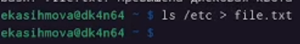
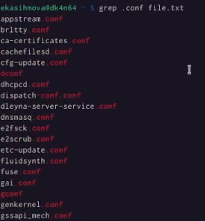
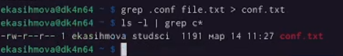
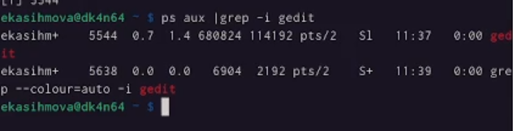
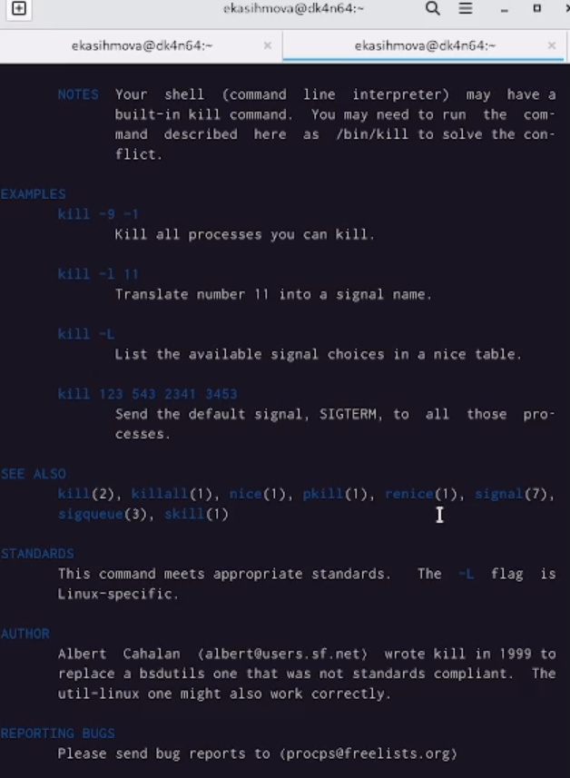
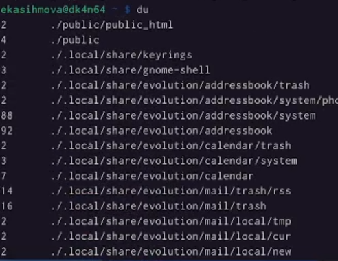
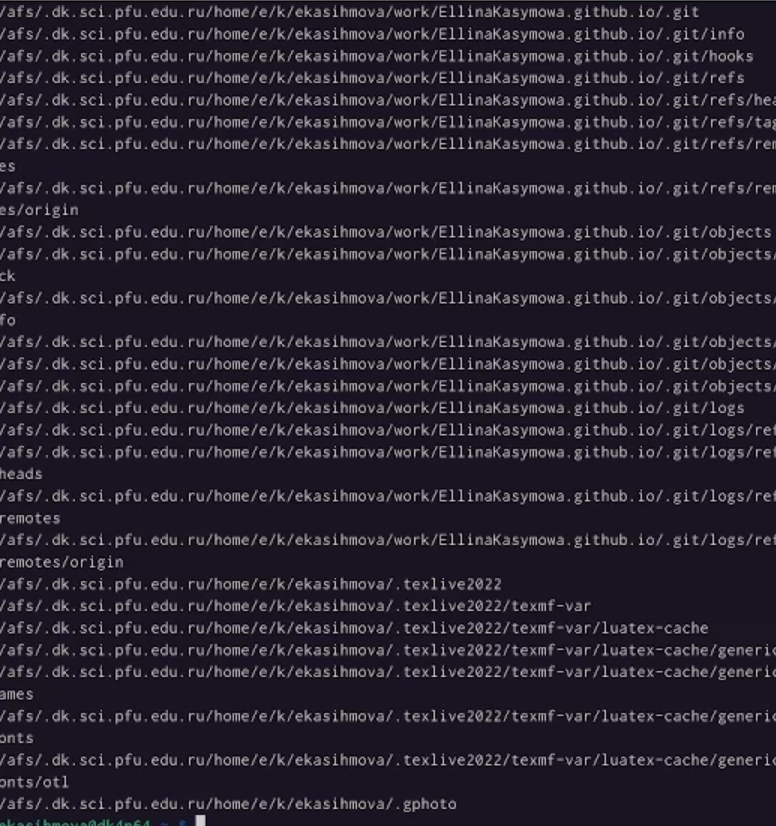

---
## Front matter
title: "Лабораторная работа №6"
subtitle: "Операционные системы"
author: "Касымова Эллина"

## Generic otions
lang: ru-RU
toc-title: "Содержание"

## Bibliography
bibliography: bib/cite.bib
csl: pandoc/csl/gost-r-7-0-5-2008-numeric.csl

## Pdf output format
toc: true # Table of contents
toc-depth: 2
lof: true # List of figures
lot: true # List of tables
fontsize: 12pt
linestretch: 1.5
papersize: a4
documentclass: scrreprt
## I18n polyglossia
polyglossia-lang:
  name: russian
  options:
	- spelling=modern
	- babelshorthands=true
polyglossia-otherlangs:
  name: english
## I18n babel
babel-lang: russian
babel-otherlangs: english
## Fonts
mainfont: PT Serif
romanfont: PT Serif
sansfont: PT Sans
monofont: PT Mono
mainfontoptions: Ligatures=TeX
romanfontoptions: Ligatures=TeX
sansfontoptions: Ligatures=TeX,Scale=MatchLowercase
monofontoptions: Scale=MatchLowercase,Scale=0.9
## Biblatex
biblatex: true
biblio-style: "gost-numeric"
biblatexoptions:
  - parentracker=true
  - backend=biber
  - hyperref=auto
  - language=auto
  - autolang=other*
  - citestyle=gost-numeric
## Pandoc-crossref LaTeX customization
figureTitle: "Рис."
tableTitle: "Таблица"
listingTitle: "Листинг"
lofTitle: "Список иллюстраций"
lotTitle: "Список таблиц"
lolTitle: "Листинги"
## Misc options
indent: true
header-includes:
  - \usepackage{indentfirst}
  - \usepackage{float} # keep figures where there are in the text
  - \floatplacement{figure}{H} # keep figures where there are in the text
---

# Цель работы

Ознакомление с инструментами поиска файлов и фильтрации текстовых данных.
Приобретение практических навыков: по управлению процессами (и заданиями), по
проверке использования диска и обслуживанию файловых систем

Цель данного шаблона --- максимально упростить подготовку отчётов по
лабораторным работам.  Модифицируя данный шаблон, студенты смогут без
труда подготовить отчёт по лабораторным работам, а также познакомиться
с основными возможностями разметки Markdown.

# Выполнение лабораторной работы

1) Записыва. в файл file.txt названия файлов, содержащихся в каталоге /etc. Дописываю в этот же файл названия файлов, содержащихся в моем домашнем каталоге.

{#fig:001 width=90%}

2)Вывожу имена всех файлов из file.txt, имеющих расширение .conf, после чего
записываю их в новый текстовой файл conf.txt.

{#fig:002 width=90%}

3)Определяю, какие файлы в вашем домашнем каталоге имеют имена, начинавшиеся
с символа c.

{#fig:003 width=90%}

{#fig:004 width=90%}

4)Запускаю в фоновом режиме процесс, который будет записывать в файл ~/logfile
файлы, имена которых начинаются с log. Затем все удаляю. Запуская из консоли в фоновом режиме редактор gedit.

{#fig:005 width=90%}

5)Определяю идентификатор процесса gedit, используя команду ps, конвейер и фильтр
grep.

{#fig:006 width=90%}

6)Прочтите справку (man) команды kill, после чего используйте её для завершения
процесса gedit.

{#fig:007 width=90%}

7)Выполняю команду du, предварительно получив более подробную информацию
об этих командах, с помощью команды man.

{#fig:008 width=90%}

8)Воспользовавшись справкой команды find, вывожу имена всех директорий, имеющихся в моем домашнем каталоге.

{#fig:009 width=90%}

{#fig:010 width=90%}

# Выводы

Проделав данную лабораторную работу мы ознакомились с инструментами поиска файлов и фильтрации текстовых данных.

# Список литературы{.unnumbered}

::: {#refs}
:::
