---
## Front matter
lang: ru-RU
title: Лабораторная работа №7
subtitle: ОПерационные системы
author:
  - Касымова Эллина
institute:
  - Российский университет дружбы народов, Москва, Россия
date: 22 марта 2023

## i18n babel
babel-lang: russian
babel-otherlangs: english

## Formatting pdf
toc: false
toc-title: Содержание
slide_level: 2
aspectratio: 169
section-titles: true
theme: metropolis
header-includes:
 - \metroset{progressbar=frametitle,sectionpage=progressbar,numbering=fraction}
 - '\makeatletter'
 - '\beamer@ignorenonframefalse'
 - '\makeatother'
---

# Информация

## Докладчик


  * Касымова Эллина Руслановна
  * студентка направления НБИбд-01-22
  * Российский университет дружбы народов


## Актуальность

Актульность этой темы в том , что мы осваиваем работу с MC. 

## Формат `pdf`

- Использование LaTeX
- Пакет для презентации: [beamer](https://ctan.org/pkg/beamer)
- Тема оформления: `metropolis`

## Код для формата `pdf`

```yaml
slide_level: 2
aspectratio: 169
section-titles: true
theme: metropolis
```

## Формат `html`

- Используется фреймворк [reveal.js](https://revealjs.com/)
- Используется [тема](https://revealjs.com/themes/) `beige`

## Код для формата `html`

- Тема задаётся в файле `Makefile`

```make
REVEALJS_THEME = beige 
```

## Получающиеся форматы

- Полученный `pdf`-файл можно демонстрировать в любой программе просмотра `pdf`
- Полученный `html`-файл содержит в себе все ресурсы: изображения, css, скрипты

## Изучила информацию о mc, вызвав в командной строке man mс.

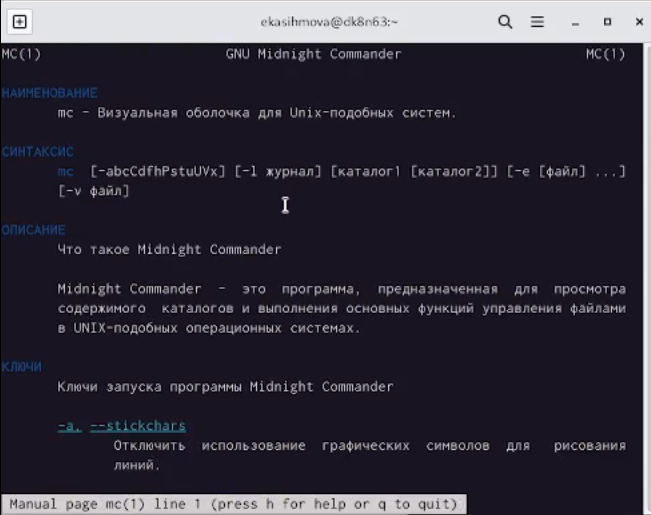{#fig:001 width=90%}

## Запустила из командной строки mc, изучила его структуру и меню.

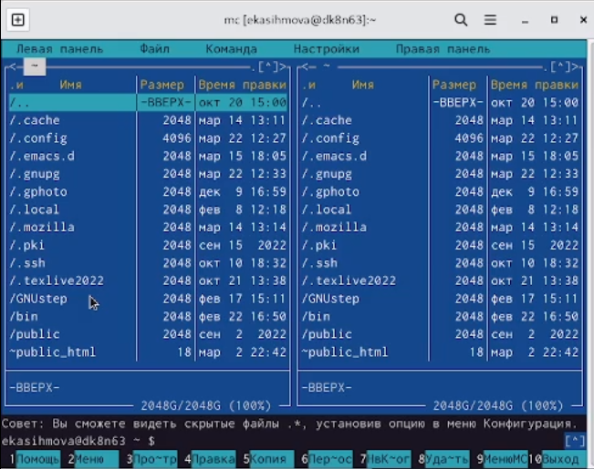{#fig:002 width=90%}

## Выполните несколько операций в mc, используя управляющие клавиши (операции
с панелями; выделение/отмена выделения файлов, копирование/перемещение фай-
лов, получение информации о размере и правах доступа на файлы и/или каталоги
и т.п.)

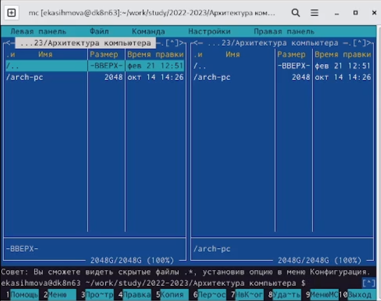{#fig:003 width=90%}

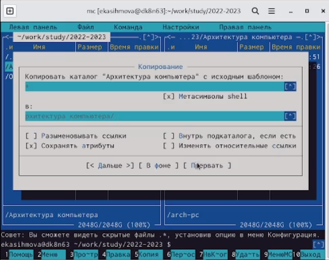{#fig:004 width=90%}

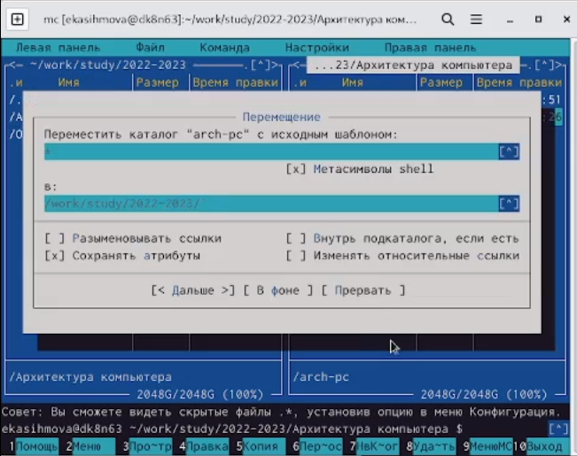{#fig:005 width=90%}

## Выполните основные команды меню левой (или правой) панели. Оцените степень
подробности вывода информации о файлах

{#fig:006 width=90%}

## Используя возможности подменю Файл , выполните:
– просмотр содержимого текстового файла;
– редактирование содержимого текстового файла (без сохранения результатов
редактирования);
– создание каталога;
– копирование в файлов в созданный каталог.

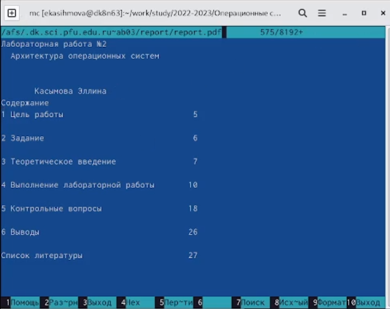{#fig:007 width=90%}

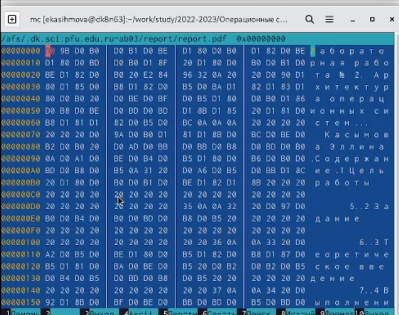{#fig:008 width=90%}

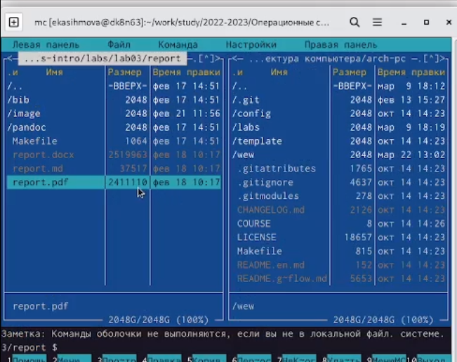{#fig:009 width=90%}

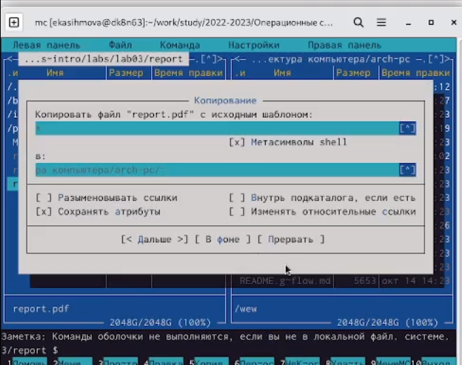{#fig:010 width=90%}


## С помощью соответствующих средств подменю Команда осуществите:
– поиск в файловой системе файла с заданными условиями (например, файла
с расширением .c или .cpp, содержащего строку main);
– выбор и повторение одной из предыдущих команд;
– переход в домашний каталог;
– анализ файла меню и файла расширений

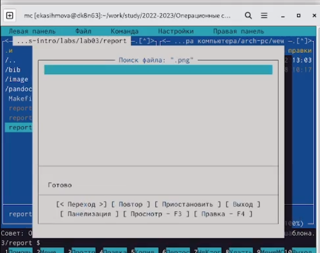{#fig:0011 width=90%}


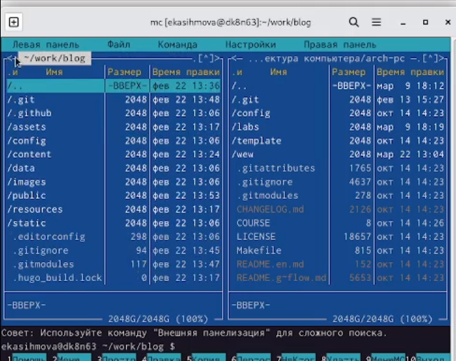{#fig:012 width=90%}


## Вызовите подменю Настройки . Освойте операции, определяющие структуру экрана mc (Full screen, Double Width, Show Hidden Files и т.д.

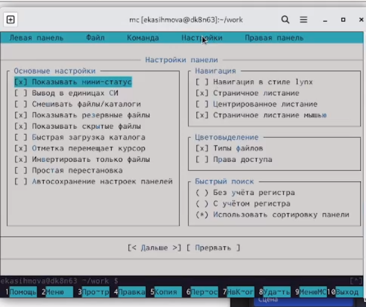{#fig:013 width=90%}

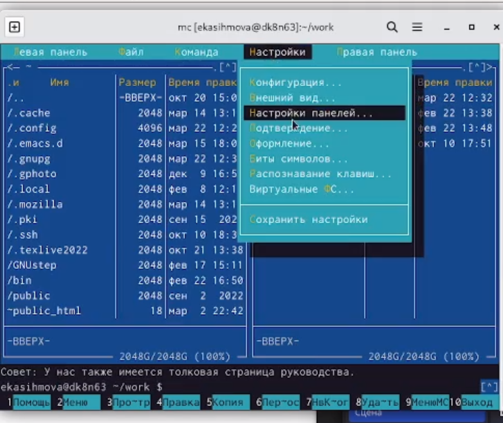{#fig:014 width=90%}

## Выполнение Задания.

## Создайте текстовой файл text.txt.

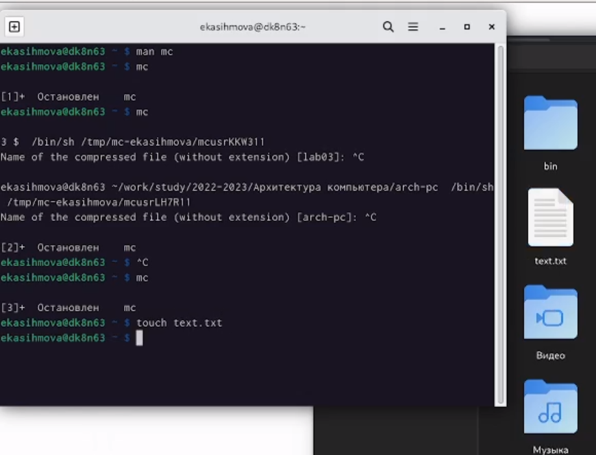{#fig:015 width=90%}

## Откройте этот файл с помощью встроенного в mc редактора.

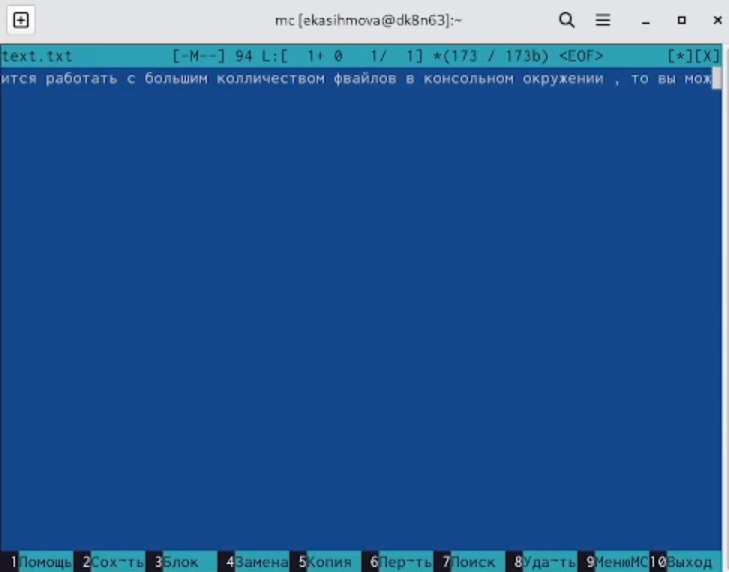{#fig:016 width=90%}

## Вставьте в открытый файл небольшой фрагмент текста, скопированный из любого
другого файла или Интернета

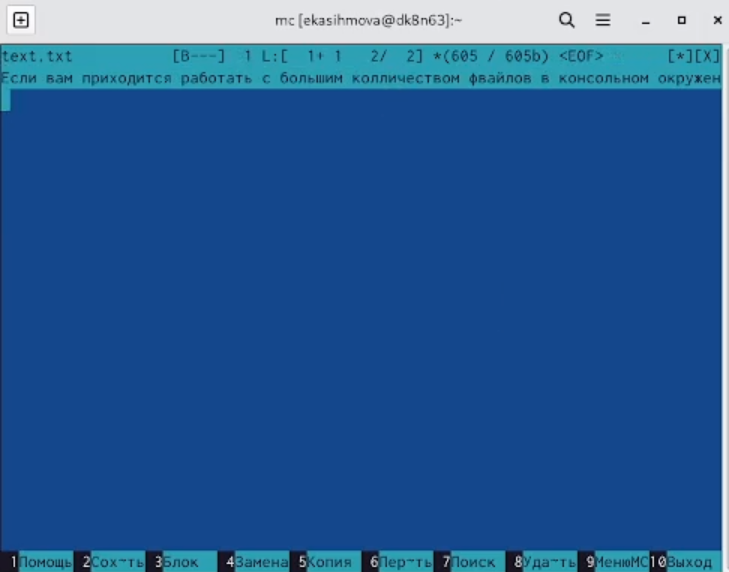{#fig:017 width=90%}

## Проделайте с текстом следующие манипуляции, используя горячие клавиши:
4.1. Удалите строку текста.
4.2. Выделите фрагмент текста и скопируйте его на новую строку.
Кулябов Д. С. и др. Операционные системы 69
4.3. Выделите фрагмент текста и перенесите его на новую строку.
4.4. Сохраните файл.
4.5. Отмените последнее действие.
4.6. Перейдите в конец файла (нажав комбинацию клавиш) и напишите некоторый
текст.
4.7. Перейдите в начало файла (нажав комбинацию клавиш) и напишите некоторый
текст.

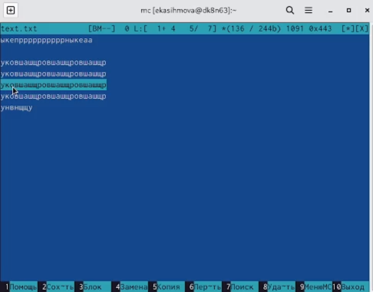{#fig:018 width=90%}

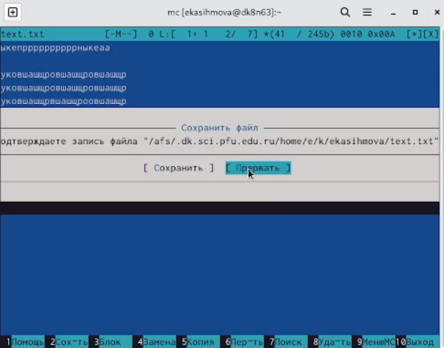{#fig:019 width=90%}

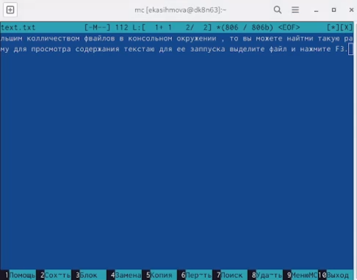{#fig:020 width=90%}

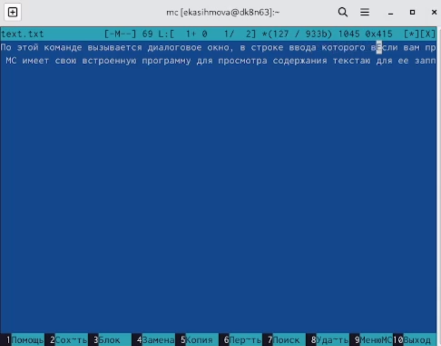{#fig:021 width=90%}

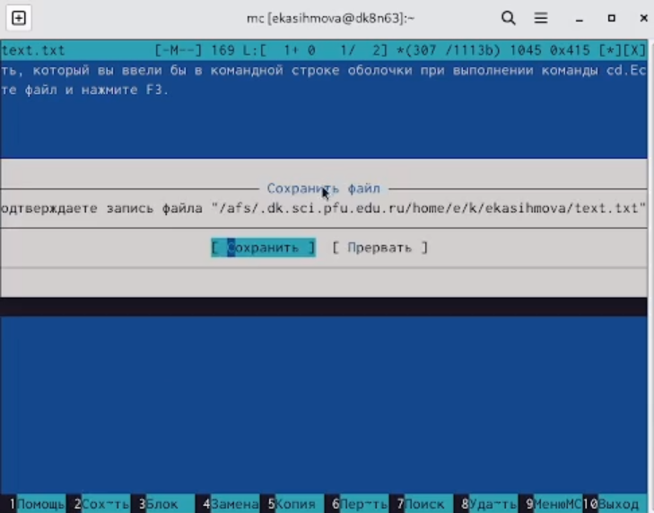{#fig:022 width=90%}

## Откройте файл с исходным текстом в терминале.

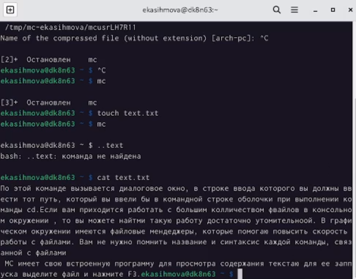{#fig:023 width=90%}


## Итоговый слайд

- Проделав данную лаборатоную работу мы освоили основные возможности командной оболочки Midnight Commander. Приобрели навыки практической работы по просмотру каталогов и файлов; манипуляций с ними.

:::

