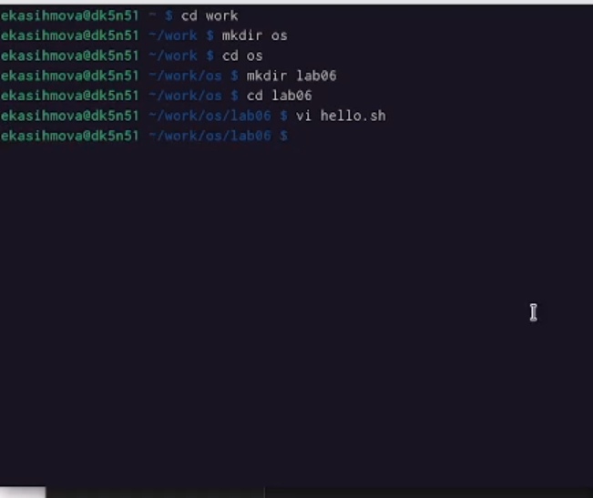
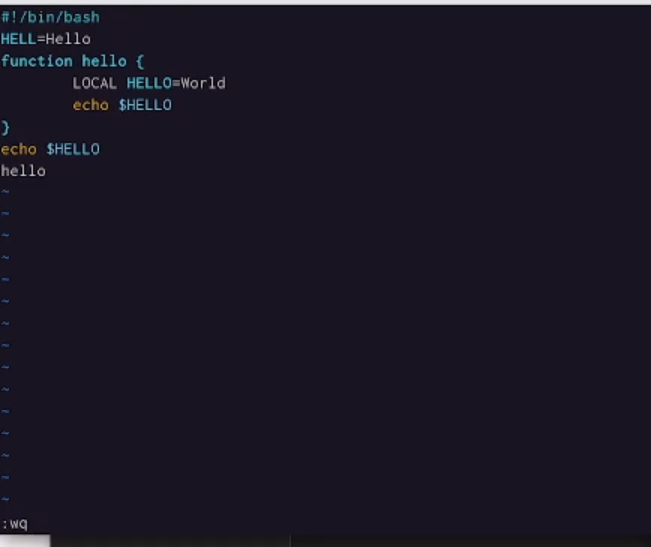
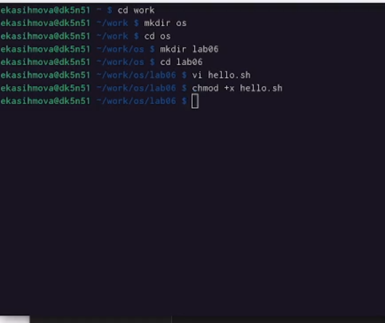
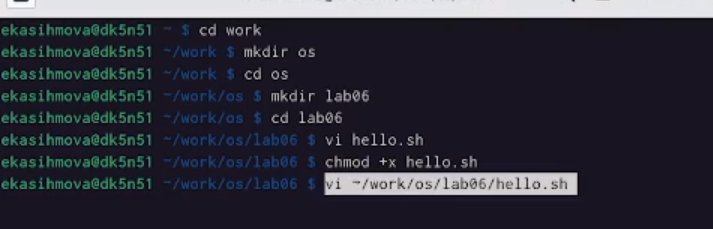
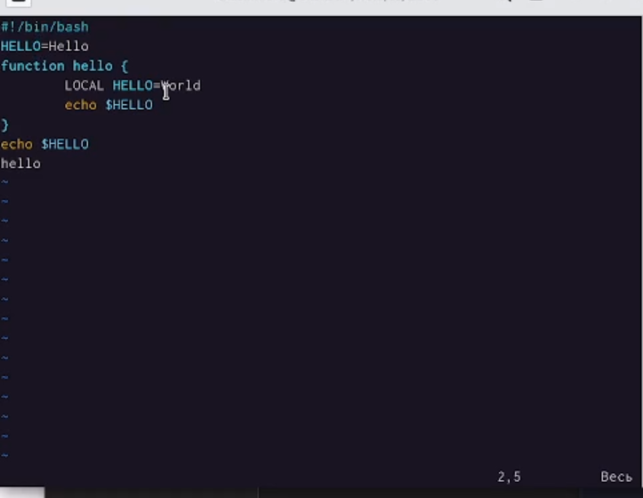
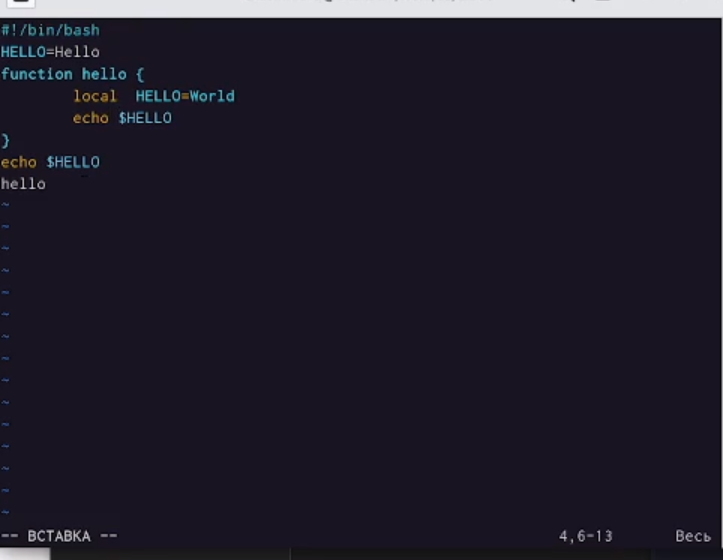
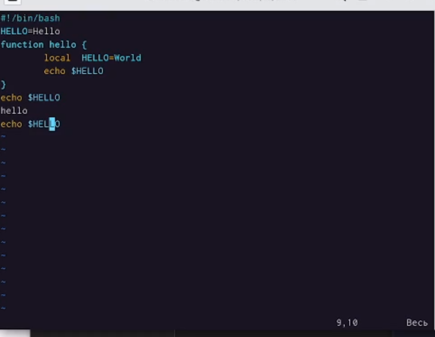
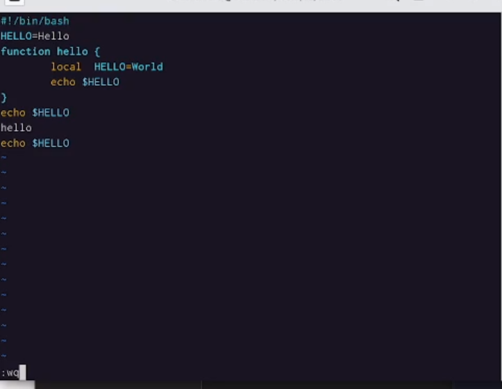

---
## Front matter
lang: ru-RU
title: Лабораторная работа№8
subtitle: Операционные системы
author:
  - Касымова Эллина
institute:
  - Российский университет дружбы народов, Москва, Россия
date: 27 марта 2023

## i18n babel
babel-lang: russian
babel-otherlangs: english

## Formatting pdf
toc: false
toc-title: Содержание
slide_level: 2
aspectratio: 169
section-titles: true
theme: metropolis
header-includes:
 - \metroset{progressbar=frametitle,sectionpage=progressbar,numbering=fraction}
 - '\makeatletter'
 - '\beamer@ignorenonframefalse'
 - '\makeatother'
---


## Докладчик

  * Касымова Эллина Руслановна
  * студентка направления НБИбд-01-22
  * Российский университет дружбы народов


## Актуальность

Актуальность этой темы заключается в том , что мы изучаем новый редактор который пригодится нам в этой лабораторнй работе. 

## Объект и предмет исследования

- Презентация как текст
- Программное обеспечение для создания презентаций
- Входные и выходные форматы презентаций


## Материалы и методы

- Процессор `pandoc` для входного формата Markdown
- Результирующие форматы
	- `pdf`
	- `html`
- Автоматизация процесса создания: `Makefile`


```yaml
slide_level: 2
aspectratio: 169
section-titles: true
theme: metropolis
```

## Формат `html`

- Используется фреймворк [reveal.js](https://revealjs.com/)
- Используется [тема](https://revealjs.com/themes/) `beige`

## Код для формата `html`

- Тема задаётся в файле `Makefile`

```make
REVEALJS_THEME = beige 
```


## Получающиеся форматы

- Полученный `pdf`-файл можно демонстрировать в любой программе просмотра `pdf`
- Полученный `html`-файл содержит в себе все ресурсы: изображения, css, скрипты


## Содержание исследования

## Заходим в папку ворк, дабвляем папку ос, переходим туда, создаем лаб6, переходим туда, затем переходим редактор.

{#fig:001 width=90%}

## Вставляем туда текст, нажимаю клавишу Esc для перехода в командный режим после завершения ввода текста.Нажимаю : для перехода в режим последней строки и внизу вашего экрана появится приглашение в виде двоеточия. Нажимаю w (записать) и q (выйти), а затем нажмите клавишу Enter для сохранения вашего текста и завершения работы.

{#fig:002 width=90%}

## Делаю файл исполняемым.

{#fig:003 width=90%}

## Вывожу vi на редактирование файла.

{#fig:004 width=90%}

## Устанавливаю курсор в конец слова HELL второй строки. Перехожу в режим вставки и замените на HELLO. Нажмите Esc для возврата в командный режим.

{#fig:005 width=90%}

## Устанавливаю курсор на четвертую строку и сотрите слово LOCAL. Перехожу в режим вставки и набираю следующий текст: local, нажмите Esc для возврата в командный режим.

{#fig:006 width=90%}

# Устанавливаю курсор на последней строке файла. Вставляю после неё строку,содержащую
следующий текст: echo $HELLO. Нажимаю Esc для перехода в командный режим. Удаляю последнюю строку. Ввожу команду отмены изменений u для отмены последней команды. Ввожу символ : для перехода в режим последней строки. Записывю произведённые
изменения и выйдите из vi.

{#fig:007 width=90%}
 
## рисунок 

{#fig:008 width=90%}


## Итоговый слайд

Проделав данную лабораторную работу мы освоили новый редактор vi

