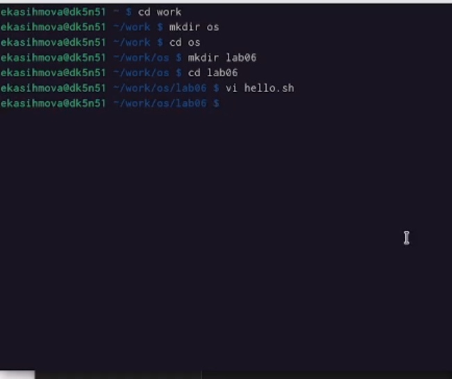
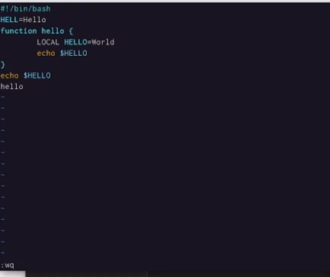
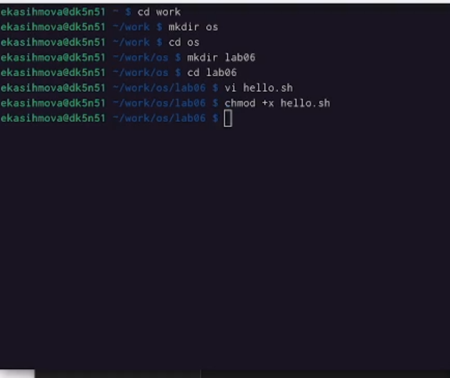
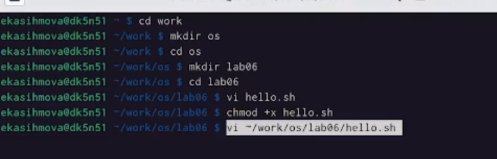
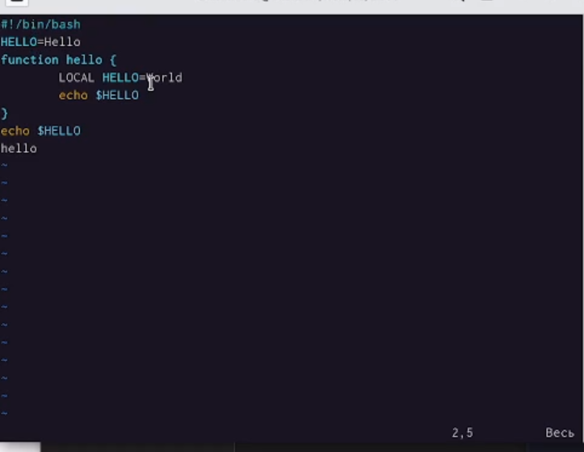
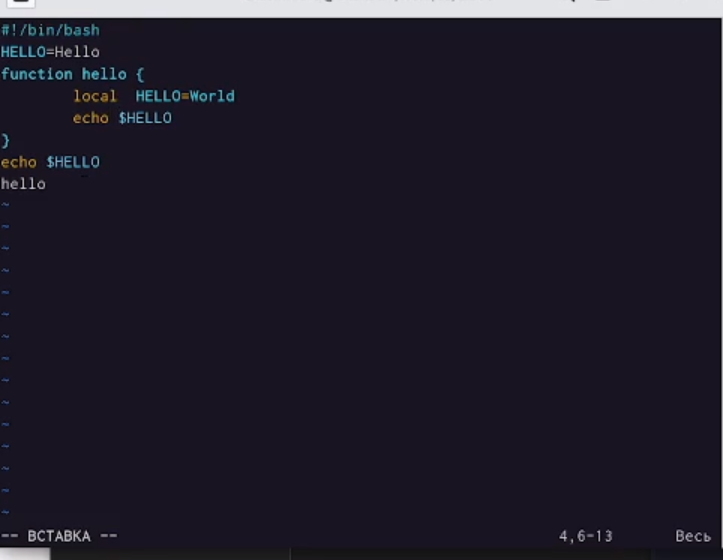
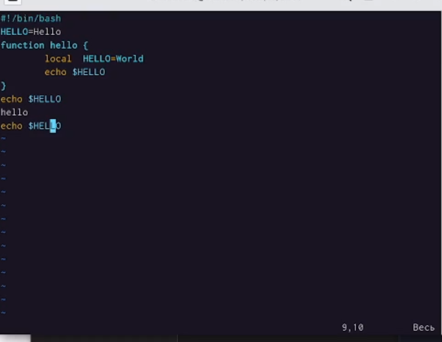
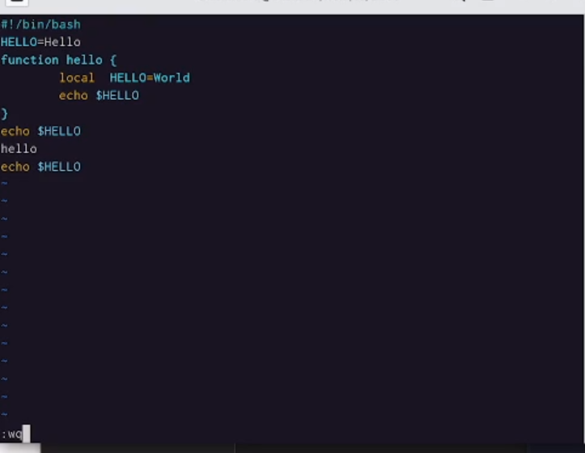

---
## Front matter
title: Лабораторная работа №8
subtitle: Операционные системы
author: Касымова Эллина

## Generic otions
lang: ru-RU
toc-title: "Содержание"

## Bibliography
bibliography: bib/cite.bib
csl: pandoc/csl/gost-r-7-0-5-2008-numeric.csl

## Pdf output format
toc: true # Table of contents
toc-depth: 2
lof: true # List of figures
lot: true # List of tables
fontsize: 12pt
linestretch: 1.5
papersize: a4
documentclass: scrreprt
## I18n polyglossia
polyglossia-lang:
  name: russian
  options:
	- spelling=modern
	- babelshorthands=true
polyglossia-otherlangs:
  name: english
## I18n babel
babel-lang: russian
babel-otherlangs: english
## Fonts
mainfont: PT Serif
romanfont: PT Serif
sansfont: PT Sans
monofont: PT Mono
mainfontoptions: Ligatures=TeX
romanfontoptions: Ligatures=TeX
sansfontoptions: Ligatures=TeX,Scale=MatchLowercase
monofontoptions: Scale=MatchLowercase,Scale=0.9
## Biblatex
biblatex: true
biblio-style: "gost-numeric"
biblatexoptions:
  - parentracker=true
  - backend=biber
  - hyperref=auto
  - language=auto
  - autolang=other*
  - citestyle=gost-numeric
## Pandoc-crossref LaTeX customization
figureTitle: "Рис."
tableTitle: "Таблица"
listingTitle: "Листинг"
lofTitle: "Список иллюстраций"
lotTitle: "Список таблиц"
lolTitle: "Листинги"
## Misc options
indent: true
header-includes:
  - \usepackage{indentfirst}
  - \usepackage{float} # keep figures where there are in the text
  - \floatplacement{figure}{H} # keep figures where there are in the text
---

# Цель работы

Познакомиться с операционной системой Linux. Получить практические навыки рабо-
ты с редактором vi, установленным по умолчанию практически во всех дистрибутивах.

Цель данного шаблона --- максимально упростить подготовку отчётов по
лабораторным работам.  Модифицируя данный шаблон, студенты смогут без
труда подготовить отчёт по лабораторным работам, а также познакомиться
с основными возможностями разметки Markdown.

# Задание

1. Создание нового файла с использованием vi.
2. Редактирование существующего файла.

# Выполнение лабораторной работы

1) Заходим в папку ворк, дабвляем папку ос, переходим туда, создаем лаб6, переходим туда, затем переходим редактор.

{#fig:001 width=90%}

2) Вставляем туда текст, нажимаю клавишу Esc для перехода в командный режим после завершения ввода текста.Нажимаю : для перехода в режим последней строки и внизу вашего экрана появится приглашение в виде двоеточия. Нажимаю w (записать) и q (выйти), а затем нажмите клавишу Enter для сохранения вашего текста и завершения работы.

{#fig:002 width=90%}

3) Делаю файл исполняемым.

{#fig:003 width=90%}

4) Вывожу vi на редактирование файла.

{#fig:004 width=90%}

5) Устанавливаю курсор в конец слова HELL второй строки. Перехожу в режим вставки и замените на HELLO. Нажмите Esc для возврата в командный режим.

{#fig:005 width=90%}

6) Устанавливаю курсор на четвертую строку и сотрите слово LOCAL. Перехожу в режим вставки и набираю следующий текст: local, нажмите Esc для возврата в командный режим.

{#fig:006 width=90%}

7)Устанавливаю курсор на последней строке файла. Вставляю после неё строку,содержащую
следующий текст: echo $HELLO. Нажимаю Esc для перехода в командный режим. Удаляю последнюю строку. Ввожу команду отмены изменений u для отмены последней команды. Ввожу символ : для перехода в режим последней строки. Записывю произведённые
изменения и выйдите из vi.

{#fig:007 width=90%}

{#fig:008 width=90%}

# Выводы

Проделав данную лабораторную работу мы освоили новый редактор vi 

# Список литературы{.unnumbered}

::: {#refs}
:::
