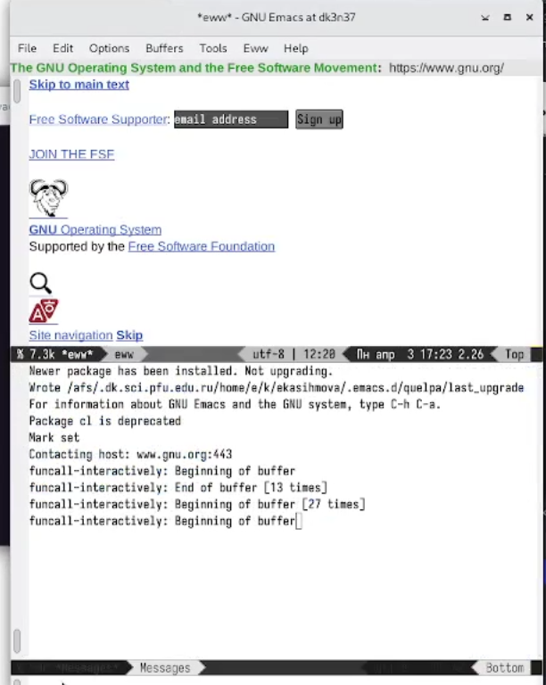
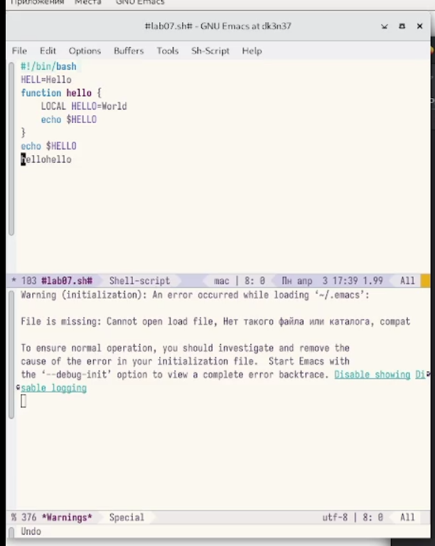
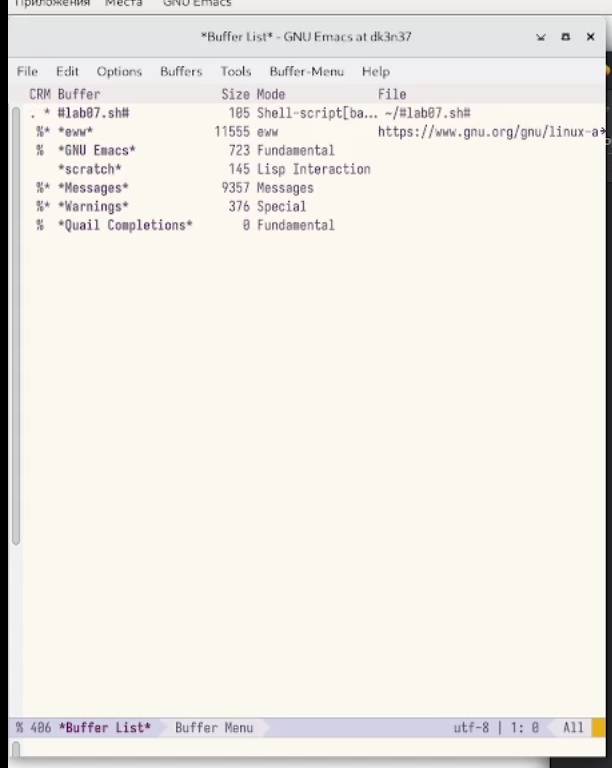
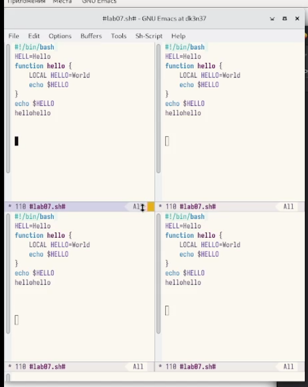
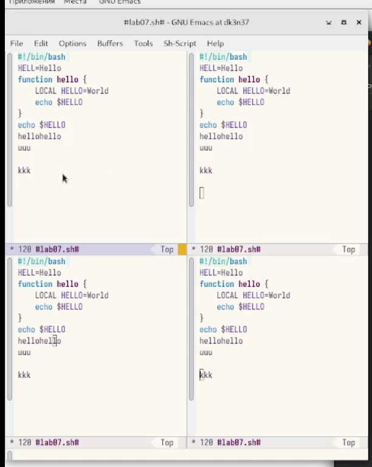
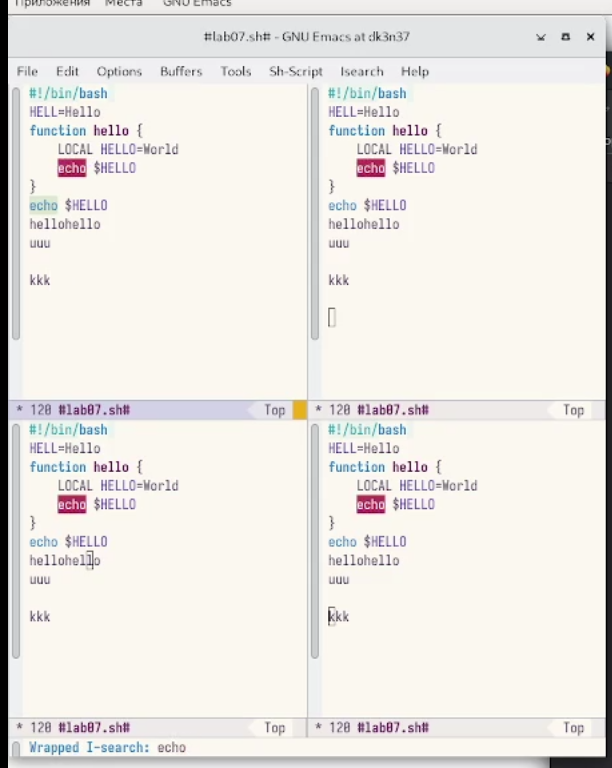

---
## Front matter
lang: ru-RU
title: Лабораторная работа №9
subtitle: Операционные системы
author:
  - Касымова Эллина
institute:
  - Российский университет дружбы народов, Москва, Россия
date: 03 апреля 2023

## i18n babel
babel-lang: russian
babel-otherlangs: english

## Formatting pdf
toc: false
toc-title: Содержание
slide_level: 2
aspectratio: 169
section-titles: true
theme: metropolis
header-includes:
 - \metroset{progressbar=frametitle,sectionpage=progressbar,numbering=fraction}
 - '\makeatletter'
 - '\beamer@ignorenonframefalse'
 - '\makeatother'
---


## Докладчик

  * Касымова Эллина Руслановна
  * студентка направления НБИбд-01-22

## Актуальность

Актуальность этой темы в то что что мы изучаем новый редактор.


## Материалы и методы

- Процессор `pandoc` для входного формата Markdown
- Результирующие форматы
	- `pdf`
	- `html`
- Автоматизация процесса создания: `Makefile`


## Процессор `pandoc`

- Pandoc: преобразователь текстовых файлов
- Сайт: <https://pandoc.org/>
- Репозиторий: <https://github.com/jgm/pandoc>

## Формат `pdf`

- Использование LaTeX
- Пакет для презентации: [beamer](https://ctan.org/pkg/beamer)
- Тема оформления: `metropolis`

## Код для формата `pdf`

```yaml
slide_level: 2
aspectratio: 169
section-titles: true
theme: metropolis
```

## Формат `html`

- Используется фреймворк [reveal.js](https://revealjs.com/)
- Используется [тема](https://revealjs.com/themes/) `beige`

## Код для формата `html`

- Тема задаётся в файле `Makefile`

```make
REVEALJS_THEME = beige 
```


- Полученный `pdf`-файл можно демонстрировать в любой программе просмотра `pdf`
- Полученный `html`-файл содержит в себе все ресурсы: изображения, css, скрипты


- Не формулируйте более 1--2 целей исследования


## Открываю Emacs. 

{#fig:001 width=90%}

## Создаю файл lab07.sh с помощью комбинации Ctrl-x Ctrl-f (C-x C-f).Набираю текст.

{#fig:002 width=90%}

## Сохраняю файл с помощью комбинации Ctrl-x Ctrl-s (C-x C-s). Проделываю все команды : Вырезать одной командой целую строку (С-k).Вставить эту строку в конец файла (C-y).Выделить область текста (C-space).Скопировать область в буфер обмена (M-w).Вставить область в конец файла.Вновь выделить эту область и на этот раз вырезать её (C-w).Отмените последнее действие (C-/).Переместите курсор в начало строки (C-a).Переместите курсор в конец строки (C-e).Переместите курсор в начало буфера (M-<).Переместите курсор в конец буфера (M->).

{#fig:003 width=90%}

## Вывожу список активных буферов на экран (C-x C-b).

{#fig:004 width=90%}

## Перемещаю во вновь открытое окно (C-x) o со списком открытых буферов
и переключаюсь на другой буфер.Закрываю это окно (C-x 0).Теперь вновь переключаюсь между буферами, но уже без вывода их списка наэкран (C-x b).

{#fig:005 width=90%}

## Делю фрейм на 4 части: разделяю фрейм на два окна по вертикали (C-x 3),
а затем каждое из этих окон на две части по горизонтали (C-x 2).

{#fig:006 width=90%}

## В каждом из четырёх созданных окон открыв новый буфер (файл) и ввожу
несколько строк текста.

{#fig:007 width=90%}

## Переключаюсь в режим поиска (C-s) и нахожу несколько слов, присутствующих
в тексте.Переключаюсь между результатами поиска, нажимая C-s. Выхожу из режима поиска, нажав C-g.Перехожу в режим поиска и замены (M-%), ввожу текст, который следует найти и заменить, нажимаю Enter , затем ввожу текст для замены. После того как будут подсвечены результаты поиска, нажимаю ! для подтверждения замены.Пробую другой режим поиска, нажав M-s o.

{#fig:008 width=90%}

## Вывод

Проделав данную лабораторную работу мы познакомились  с операционной системой Linux. Получила практические навыки работы с редактором Emacs.

