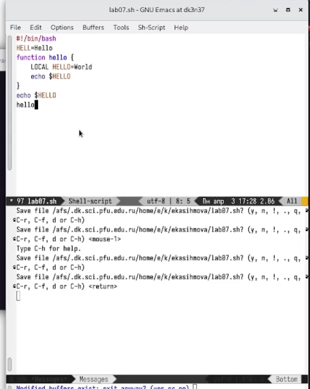
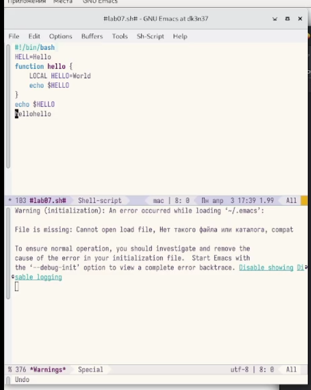
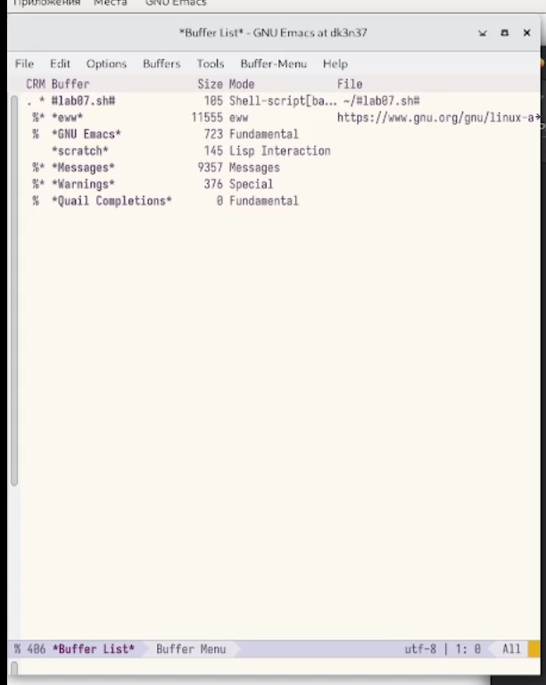
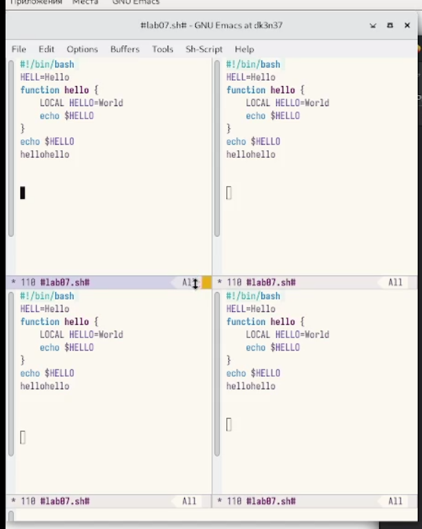
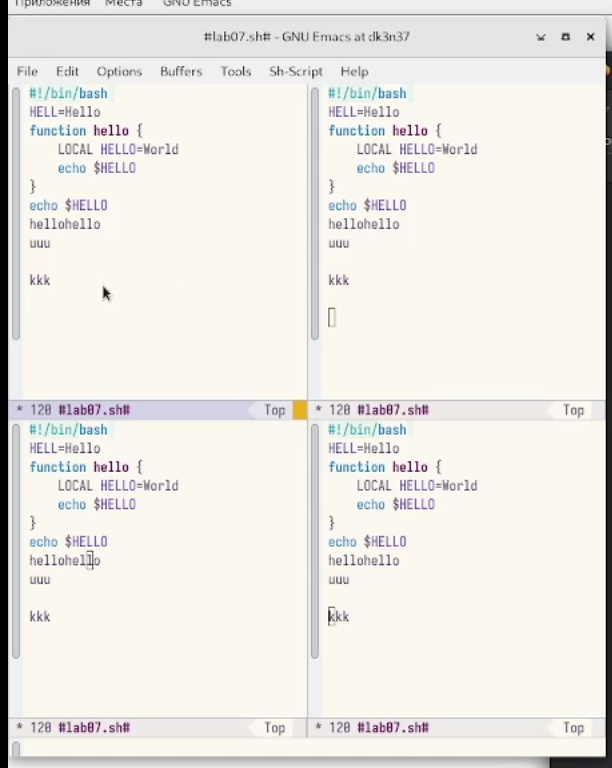
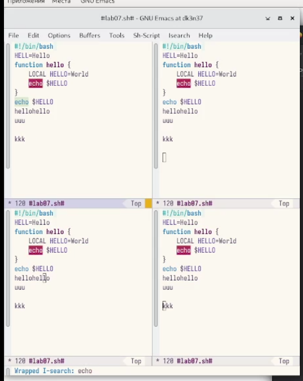

---
## Front matter
title: Лабораторная работа №9
subtitle: Операционные системы
author: Касымова Эллина

## Generic otions
lang: ru-RU
toc-title: "Содержание"

## Bibliography
bibliography: bib/cite.bib
csl: pandoc/csl/gost-r-7-0-5-2008-numeric.csl

## Pdf output format
toc: true # Table of contents
toc-depth: 2
lof: true # List of figures
lot: true # List of tables
fontsize: 12pt
linestretch: 1.5
papersize: a4
documentclass: scrreprt
## I18n polyglossia
polyglossia-lang:
  name: russian
  options:
	- spelling=modern
	- babelshorthands=true
polyglossia-otherlangs:
  name: english
## I18n babel
babel-lang: russian
babel-otherlangs: english
## Fonts
mainfont: PT Serif
romanfont: PT Serif
sansfont: PT Sans
monofont: PT Mono
mainfontoptions: Ligatures=TeX
romanfontoptions: Ligatures=TeX
sansfontoptions: Ligatures=TeX,Scale=MatchLowercase
monofontoptions: Scale=MatchLowercase,Scale=0.9
## Biblatex
biblatex: true
biblio-style: "gost-numeric"
biblatexoptions:
  - parentracker=true
  - backend=biber
  - hyperref=auto
  - language=auto
  - autolang=other*
  - citestyle=gost-numeric
## Pandoc-crossref LaTeX customization
figureTitle: "Рис."
tableTitle: "Таблица"
listingTitle: "Листинг"
lofTitle: "Список иллюстраций"
lotTitle: "Список таблиц"
lolTitle: "Листинги"
## Misc options
indent: true
header-includes:
  - \usepackage{indentfirst}
  - \usepackage{float} # keep figures where there are in the text
  - \floatplacement{figure}{H} # keep figures where there are in the text
---

# Цель работы

Познакомиться с операционной системой Linux. Получить практические навыки рабо-
ты с редактором Emacs.

Цель данного шаблона --- максимально упростить подготовку отчётов по
лабораторным работам.  Модифицируя данный шаблон, студенты смогут без
труда подготовить отчёт по лабораторным работам, а также познакомиться
с основными возможностями разметки Markdown.

# Выполнение лабораторной работы

1. Открываю Emacs. 

{#fig:001 width=90%}

2. Создаю файл lab07.sh с помощью комбинации Ctrl-x Ctrl-f (C-x C-f).Набираю текст.

{#fig:002 width=90%}

3. Сохраняю файл с помощью комбинации Ctrl-x Ctrl-s (C-x C-s). Проделываю все команды : Вырезать одной командой целую строку (С-k).Вставить эту строку в конец файла (C-y).Выделить область текста (C-space).Скопировать область в буфер обмена (M-w).Вставить область в конец файла.Вновь выделить эту область и на этот раз вырезать её (C-w).Отмените последнее действие (C-/).Переместите курсор в начало строки (C-a).Переместите курсор в конец строки (C-e).Переместите курсор в начало буфера (M-<).Переместите курсор в конец буфера (M->).

{#fig:003 width=90%}

4. Вывожу список активных буферов на экран (C-x C-b).

{#fig:004 width=90%}

5. Перемещаю во вновь открытое окно (C-x) o со списком открытых буферов
и переключаюсь на другой буфер.Закрываю это окно (C-x 0).Теперь вновь переключаюсь между буферами, но уже без вывода их списка наэкран (C-x b).

{#fig:005 width=90%}

6. Делю фрейм на 4 части: разделяю фрейм на два окна по вертикали (C-x 3),
а затем каждое из этих окон на две части по горизонтали (C-x 2).

{#fig:006 width=90%}

7. В каждом из четырёх созданных окон открыв новый буфер (файл) и ввожу
несколько строк текста.

{#fig:007 width=90%}

8. Переключаюсь в режим поиска (C-s) и нахожу несколько слов, присутствующих
в тексте.Переключаюсь между результатами поиска, нажимая C-s. Выхожу из режима поиска, нажав C-g.Перехожу в режим поиска и замены (M-%), ввожу текст, который следует найти и заменить, нажимаю Enter , затем ввожу текст для замены. После того как будут подсвечены результаты поиска, нажимаю ! для подтверждения замены.Пробую другой режим поиска, нажав M-s o.

{#fig:008 width=90%}

# Выводы

Проделав данную лабораторную работу мы познакомились  с операционной системой Linux. Получила практические навыки работы с редактором Emacs.

# Список литературы{.unnumbered}

::: {#refs}
:::
