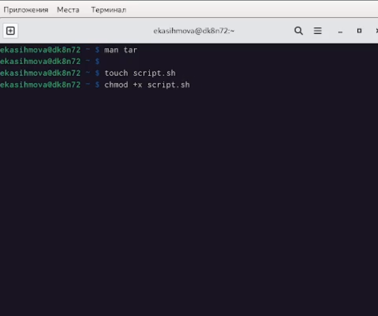
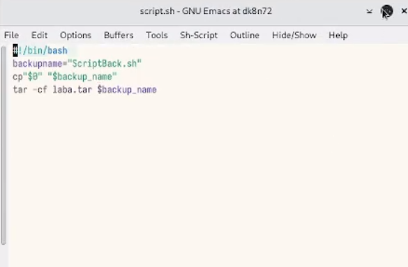
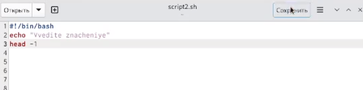
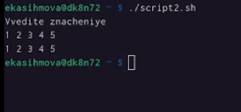
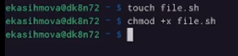
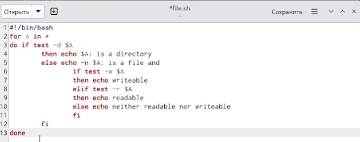
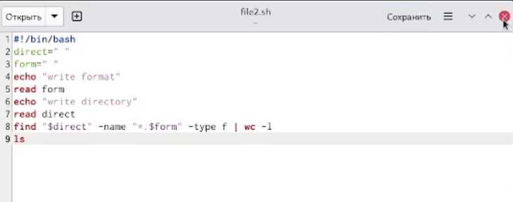
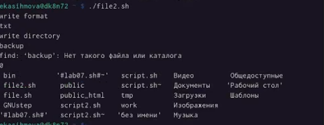

---
## Front matter
lang: ru-RU
title: Лабораторная работа №10
subtitle: Операционные системы
author:
  - Касымова Эллина
institute:
  - Российский университет дружбы народов, Москва, Россия
date: 12 апреля 2023

## i18n babel
babel-lang: russian
babel-otherlangs: english

## Formatting pdf
toc: false
toc-title: Содержание
slide_level: 2
aspectratio: 169
section-titles: true
theme: metropolis
header-includes:
 - \metroset{progressbar=frametitle,sectionpage=progressbar,numbering=fraction}
 - '\makeatletter'
 - '\beamer@ignorenonframefalse'
 - '\makeatother'
---

## Докладчик

  * Касымова Эллина Руслановна
  * студентка направления НБИбд-01-22

## Актуальность

Актуальность этой темы в том, что мы изучили программирование, обрели навыки в оболочке ОС UNIX/Linux.


## Материалы и методы

- Процессор `pandoc` для входного формата Markdown
- Результирующие форматы
	- `pdf`
	- `html`
- Автоматизация процесса создания: `Makefile`


## Процессор `pandoc`

- Pandoc: преобразователь текстовых файлов
- Сайт: <https://pandoc.org/>
- Репозиторий: <https://github.com/jgm/pandoc>

## Формат `pdf`

- Использование LaTeX
- Пакет для презентации: [beamer](https://ctan.org/pkg/beamer)
- Тема оформления: `metropolis`

## Код для формата `pdf`

```yaml
slide_level: 2
aspectratio: 169
section-titles: true
theme: metropolis
```

## Формат `html`

- Используется фреймворк [reveal.js](https://revealjs.com/)
- Используется [тема](https://revealjs.com/themes/) `beige`

## Код для формата `html`

- Тема задаётся в файле `Makefile`

```make
REVEALJS_THEME = beige 
```

## Получающиеся форматы

- Полученный `pdf`-файл можно демонстрировать в любой программе просмотра `pdf`
- Полученный `html`-файл содержит в себе все ресурсы: изображения, css, скрипты

## Создаем скрипт, который при запуске будет делать резервную копию самого себя  в другую директорию backup в вашем домашнем каталогеоткрываем файл и пишем текст.

{#fig:001 width=90%}

##

{#fig:002 width=90%}

## Создаем 2ой скрипт,обрабатывающий любое произвольное число аргументов командной строки, в том числе превышающее десять открываем файл и пишем текст.

{#fig:003 width=90%}

##

{#fig:004 width=90%}

## Выводим эту команду.

{#fig:005 width=90%}

## Написала командный файл — аналог команды ls (без использования самой этой ко-
манды и команды dir).Он выдавает информацию о нужном каталоге и выводит информацию о возможностях доступа к файлам этого каталога.

{#fig:006 width=90%}

##

{#fig:007 width=90%}

## Написала командный файл, который получает в качестве аргумента командной строки
формат файла (.txt, .doc, .jpg, .pdf и т.д.) и вычисляет количество таких файлов
в указанной директории. Путь к директории также передаётся в виде аргумента командной строки.

{#fig:008 width=90%}

##

{#fig:009 width=90%}


## Вывод

Проделав данную лабораторную работу мы  изучили основы программирования в оболочке ОС UNIX/Linux, научились писать небольшие командные файлы.

