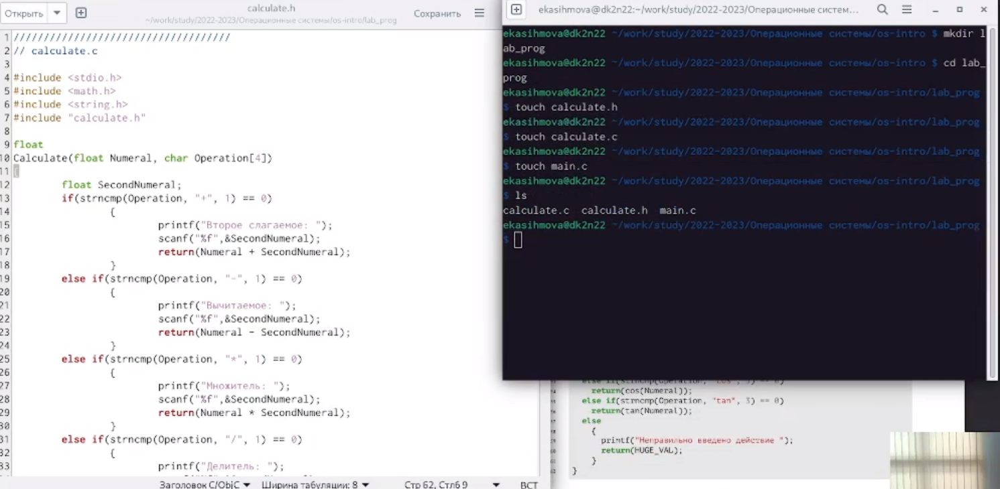
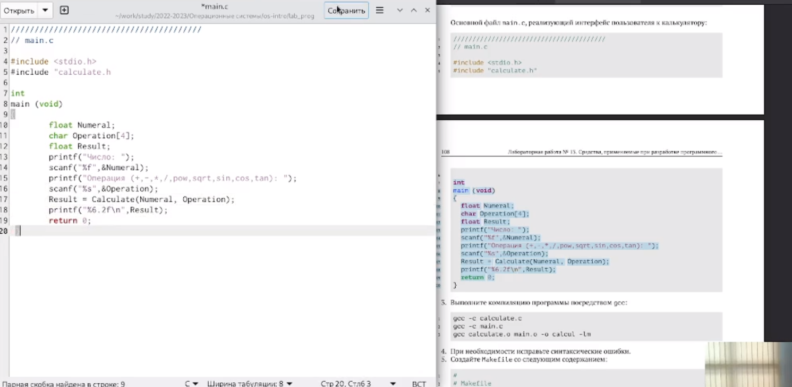
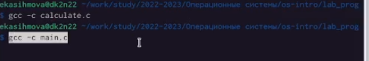
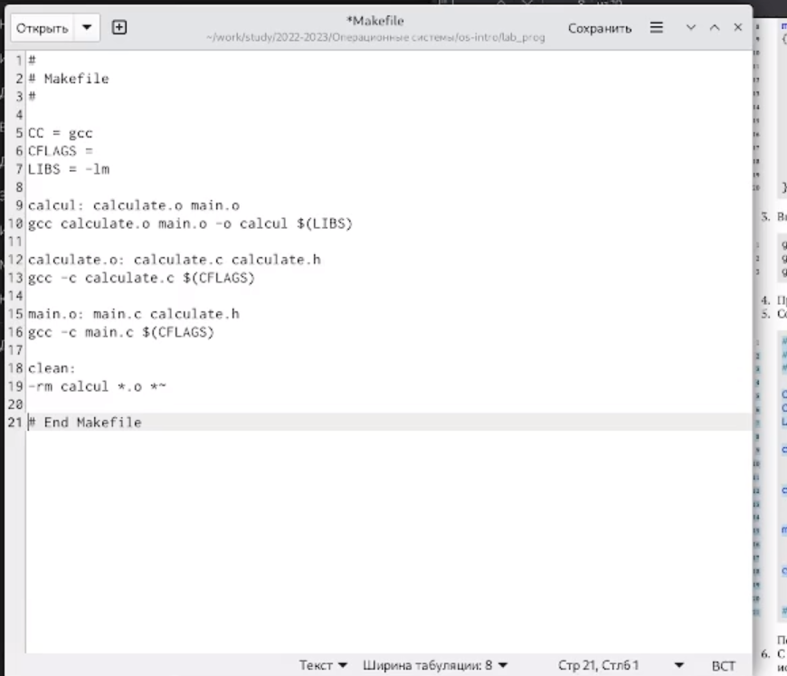
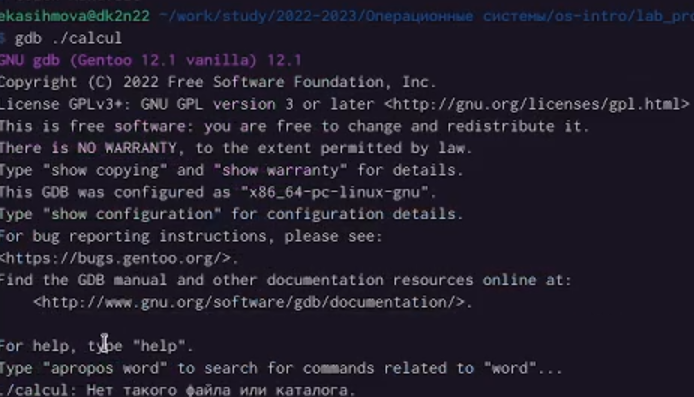
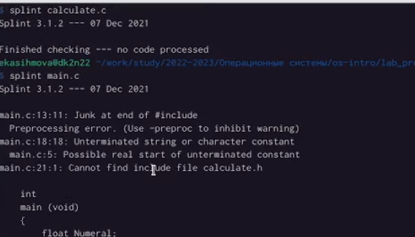

---
## Front matter
lang: ru-RU
title: Лабораторная работа №13
subtitle: Операционные системы
author:
  - Касымова Эллина
institute:
  - Российский университет дружбы народов, Москва, Россия
date: 3 мая 2023

## i18n babel
babel-lang: russian
babel-otherlangs: english

## Formatting pdf
toc: false
toc-title: Содержание
slide_level: 2
aspectratio: 169
section-titles: true
theme: metropolis
header-includes:
 - \metroset{progressbar=frametitle,sectionpage=progressbar,numbering=fraction}
 - '\makeatletter'
 - '\beamer@ignorenonframefalse'
 - '\makeatother'
---

## Докладчик

  * Касымова Эллина Руслановна
  * студентка направления НБИбд-01-22

## Актуальность

Актуальность этой темы в том, что мы изучили программирование, обрели навыки в оболочке ОС UNIX/Linux.

## В домашнем каталоге создайте подкаталог ~/work/os/lab_prog. Создайте в нём файлы: calculate.h, calculate.c, main.c. Это будет примитивнейший калькулятор, способный складывать, вычитать, умножатьи делить, возводить число в степень, брать квадратный корень, вычислять sin, cos, tan.При запуске он будет запрашивать первое число, операцию, второе число. После этого программа выведет результат и остановится

{#fig:001 width=90%}

## Основной файл main.c, реализующий интерфейс пользователя к калькулятору:

{#fig:002 width=90%}

## Выполните компиляцию программы посредством gcc

{#fig:003 width=90%}

## Создайте Makefile со следующим содержанием

{#fig:004 width=90%}

## Запустите отладчик GDB, загрузив в него программу для отладки

{#fig:005 width=90%}

## С помощью утилиты splint попробуйте проанализировать коды файлов calculate.c и main.c.

{#fig:006 width=90%}

## Выводы

Проделав данную лабораторную работу мы приобрели навыки разработки, анализа, тестирования и отладки приложений в ОС типа UNIX/Linux на примере создания на языке программирования С калькулятора с простейшими функциями
