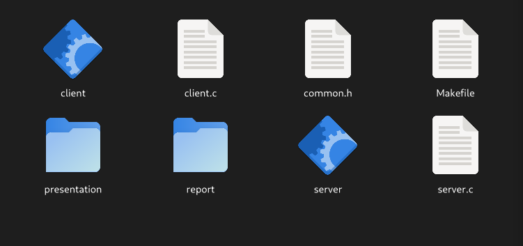
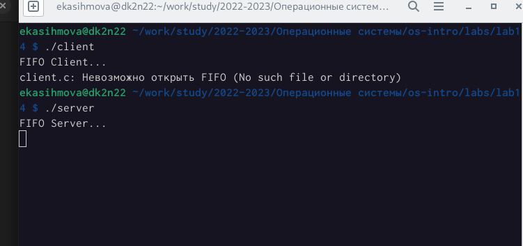

---
## Front matter
lang: ru-RU
title: Лабораторная работа №13
subtitle: Операционные системы
author:
  - Касымова Эллина
institute:
  - Российский университет дружбы народов, Москва, Россия
date: 3 мая 2023

## i18n babel
babel-lang: russian
babel-otherlangs: english

## Formatting pdf
toc: false
toc-title: Содержание
slide_level: 2
aspectratio: 169
section-titles: true
theme: metropolis
header-includes:
 - \metroset{progressbar=frametitle,sectionpage=progressbar,numbering=fraction}
 - '\makeatletter'
 - '\beamer@ignorenonframefalse'
 - '\makeatother'
---

## Докладчик

  * Касымова Эллина Руслановна
  * студентка направления НБИбд-01-22

## Актуальность

Актуальность этой темы в том, что мы работаем с именованными каналами.

## Изучите приведённые в тексте программы server.c и client.c. Взяв данные примеры
за образец, напишите аналогичные программы.

{#fig:001 width=90%}

## Сервер работает не бесконечно, а прекращает работу через некоторое время.

{#fig:002 width=90%}

## Выводы

Проделав лаборатную работу мы приобрели навыки работы с именованными каналами.
