---
## Front matter
title: "Индивидуальный проект 1 этап"
subtitle: "Операционные системы"
author: "Касымова Эллина Руслановна"

## Generic otions
lang: ru-RU
toc-title: "Содержание"

## Bibliography
bibliography: bib/cite.bib
csl: pandoc/csl/gost-r-7-0-5-2008-numeric.csl

## Pdf output format
toc: true # Table of contents
toc-depth: 2
lof: true # List of figures
lot: true # List of tables
fontsize: 12pt
linestretch: 1.5
papersize: a4
documentclass: scrreprt
## I18n polyglossia
polyglossia-lang:
  name: russian
  options:
	- spelling=modern
	- babelshorthands=true
polyglossia-otherlangs:
  name: english
## I18n babel
babel-lang: russian
babel-otherlangs: english
## Fonts
mainfont: PT Serif
romanfont: PT Serif
sansfont: PT Sans
monofont: PT Mono
mainfontoptions: Ligatures=TeX
romanfontoptions: Ligatures=TeX
sansfontoptions: Ligatures=TeX,Scale=MatchLowercase
monofontoptions: Scale=MatchLowercase,Scale=0.9
## Biblatex
biblatex: true
biblio-style: "gost-numeric"
biblatexoptions:
  - parentracker=true
  - backend=biber
  - hyperref=auto
  - language=auto
  - autolang=other*
  - citestyle=gost-numeric
## Pandoc-crossref LaTeX customization
figureTitle: "Рис."
tableTitle: "Таблица"
listingTitle: "Листинг"
lofTitle: "Список иллюстраций"
lotTitle: "Список таблиц"
lolTitle: "Листинги"
## Misc options
indent: true
header-includes:
  - \usepackage{indentfirst}
  - \usepackage{float} # keep figures where there are in the text
  - \floatplacement{figure}{H} # keep figures where there are in the text
---

# Цель работы

Создание своего личного сайта. Размещение на Github pages заготовки для персонального сайта.

Цель данного шаблона --- максимально упростить подготовку отчётов по
лабораторным работам.  Модифицируя данный шаблон, студенты смогут без
труда подготовить отчёт по лабораторным работам, а также познакомиться
с основными возможностями разметки Markdown.

# Выполнение лабораторной работы

1)Скачиваем сайт hugo для генерирования страниц сайта.

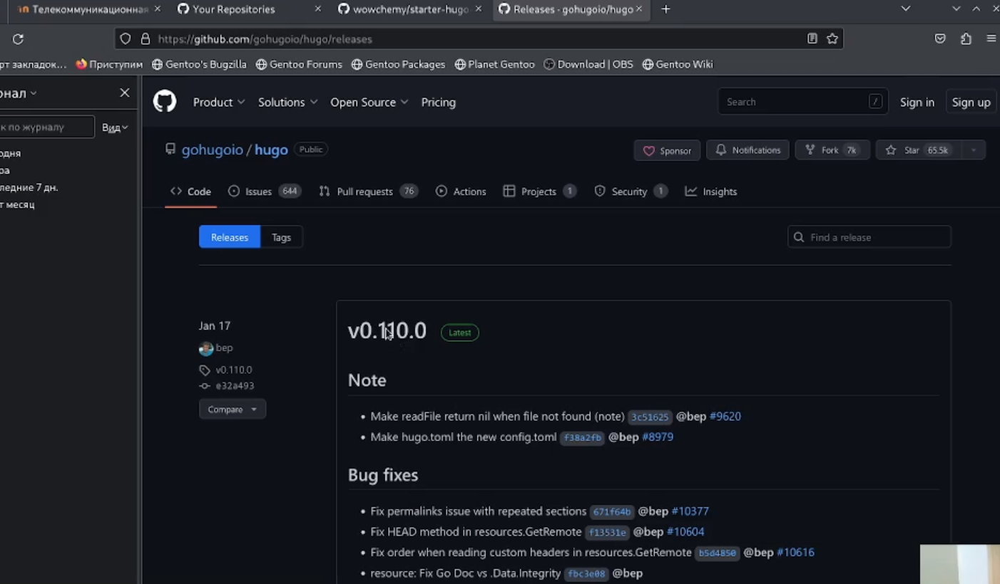{#fig:001 width=90%}

2) Скачиваем последнюю версию.

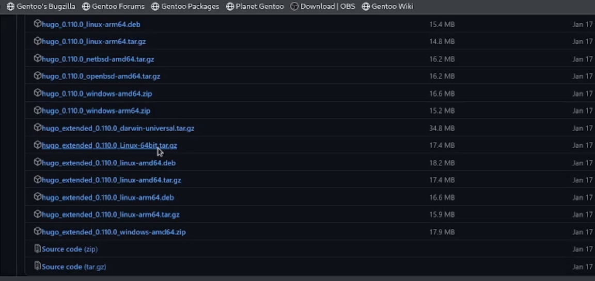{#fig:002 width=90%}

3)Разархивируем скаченный файл и извлекаем его. 

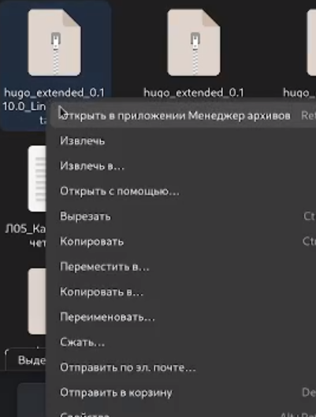{#fig:003 width=90%}

4)Копируем извлеченный файл в папку на домашнем столе bin.

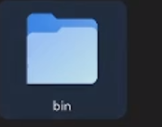{#fig:004 width=90%}

5)Создаем новый репозиторий, называем его blog и клонируем его через терминал.

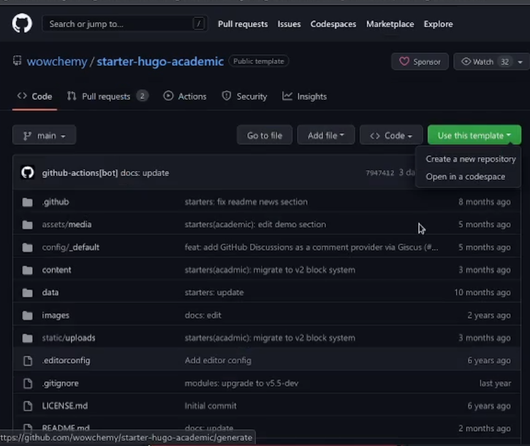{#fig:005 width=90%}

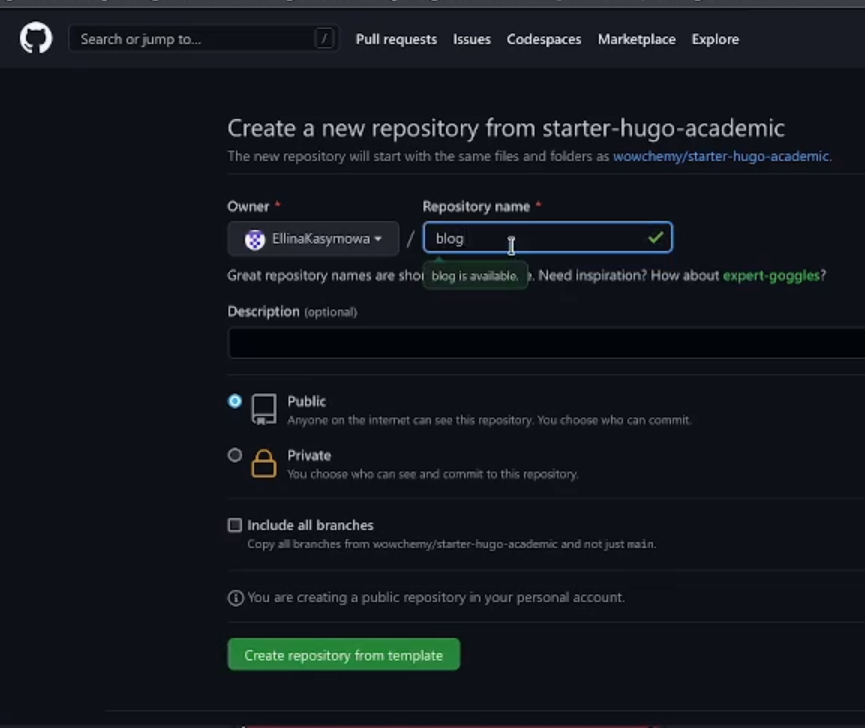{#fig:006 width=90%} 

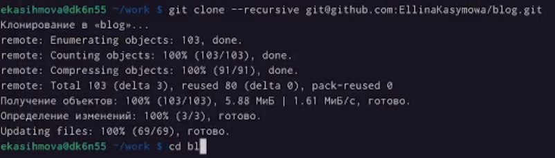{#fig:007 width=90%}

6) переходим в это репозиторий через терминал.

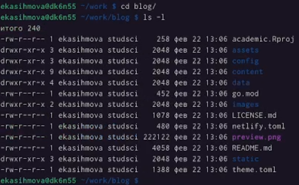{#fig:008 width=90%}

7)Располагаем его в каталоге пользователя и открывается сайт.

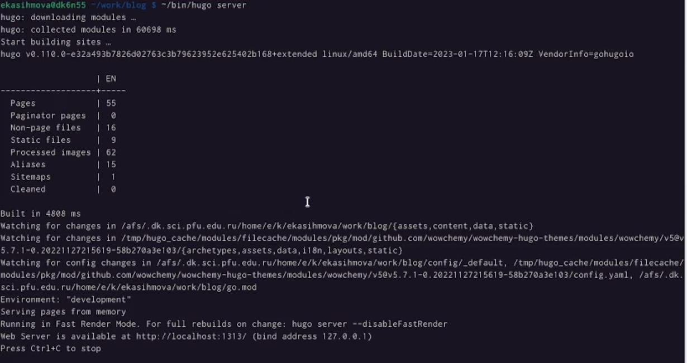{#fig:009 width=90%}

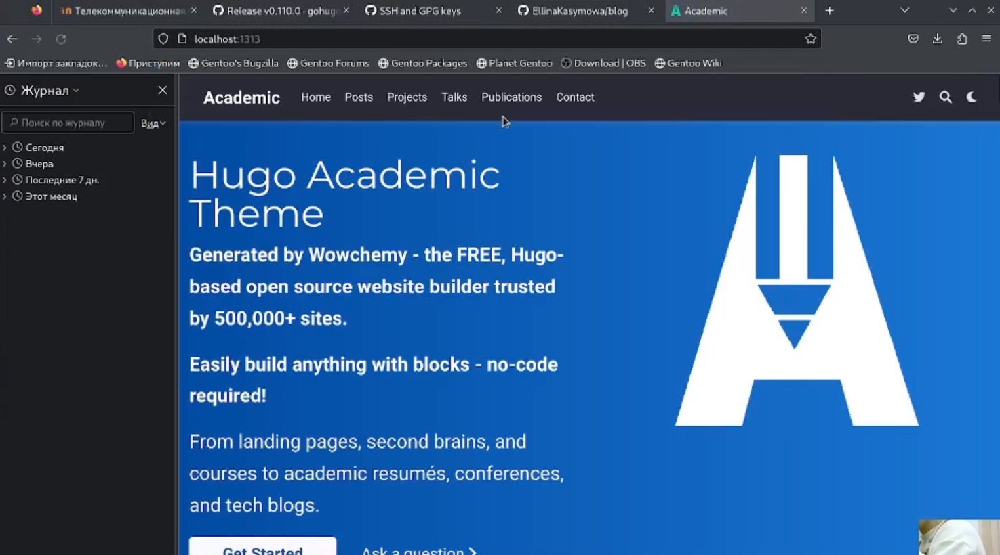{#fig:010 width=90%}

8)Чтобы избавиться от голубой вывески мы заходим в папку content и в файле индекс вырезаем часть текста с 8 строки до 38.И мы видим что эта вывеска исчезла.

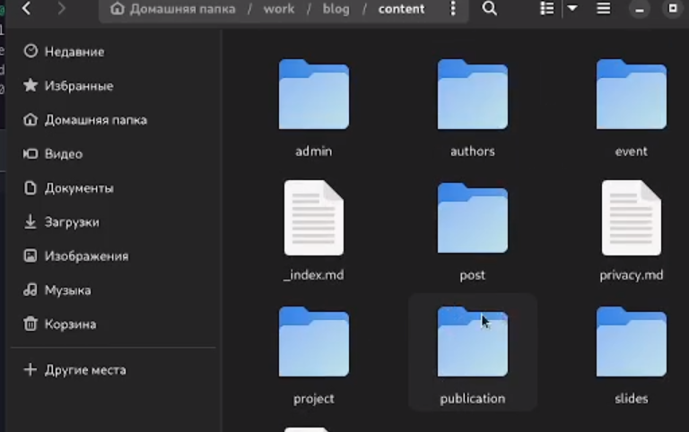{#fig:011 width=90%}

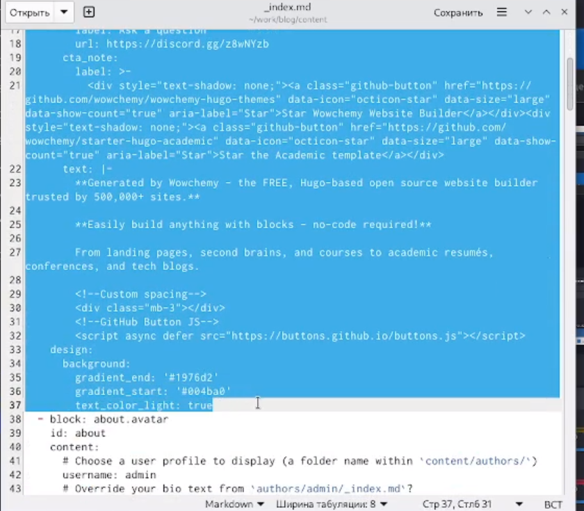{#fig:012 width=90%}

{#fig:013 width=90%}

9) Создаем еще один репозиторий  и в терминале переходим на блог выше.

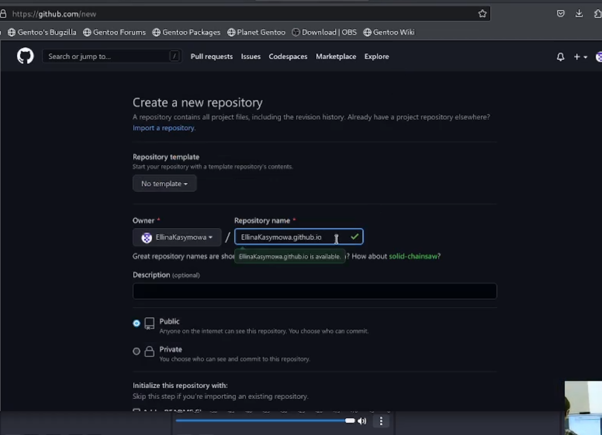{#fig:0014 width=90%}

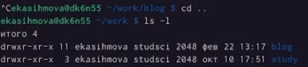{#fig:015 width=90%}

10)Клонируем новый репозиторий. И переходим в него через терминал.

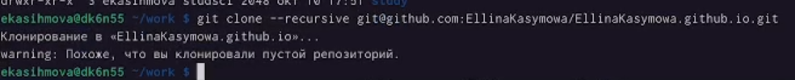{#fig:016 width=90%}

{#fig:017 width=90%}

11)Так как репозиторий новый  создаем ветку которая будет называтьяс main.

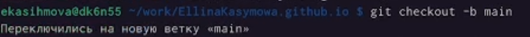{#fig:018 width=90%}

12)Создаем пустой файл и добавляем это в репозиторий.

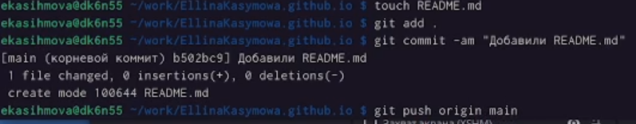{#fig:019 width=90%}

13)Копируем репозиторий и добавляем папку public.Но в гитигноре есть команда public которая игнориуется и мы ее исправляем в mc.

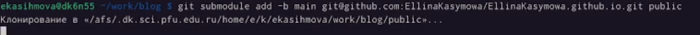{#fig:020 width=90%}

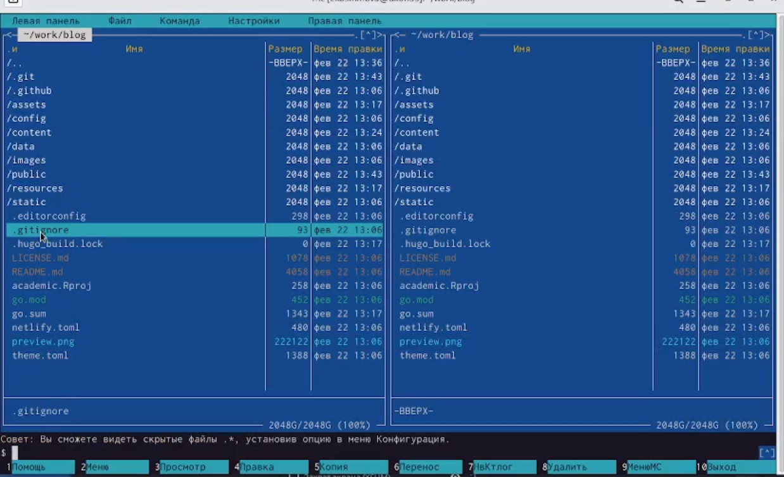{#fig:021 width=90%}

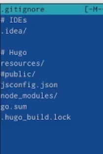{#fig:022 width=90%}

14)Убеждаемся что мы закомментировали public.И повторяем команду с копированием репозитория.

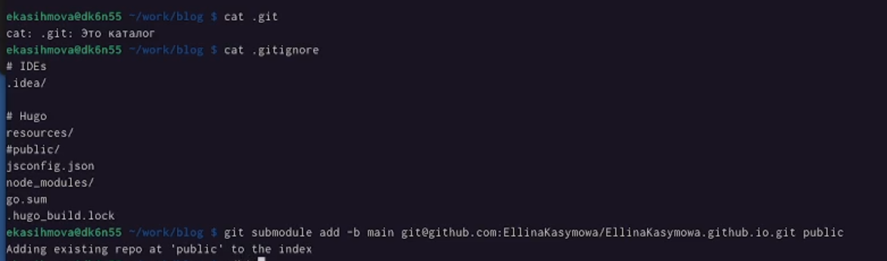{#fig:023 width=90%}

15)Выполняю команду bin/hugo

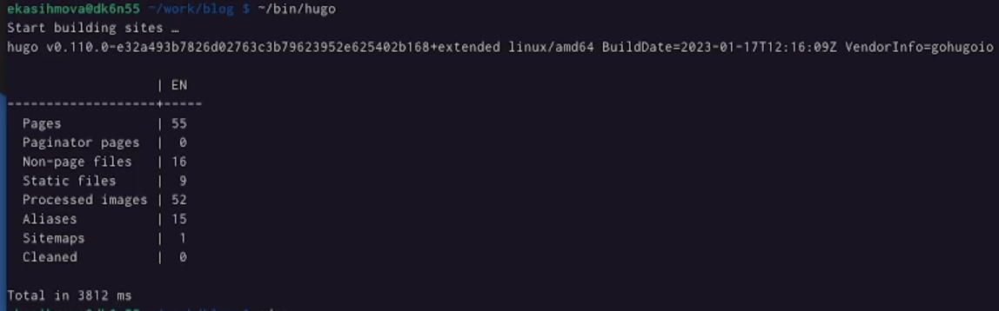{#fig:024 width=90%}

16)Переходим в папку public и проверяем что он подключен.Затем добавляе все в репозитрорий.

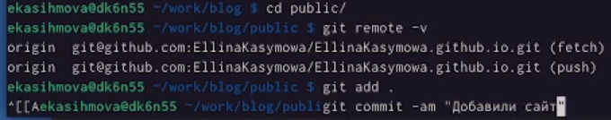{#fig:025 width=90%}

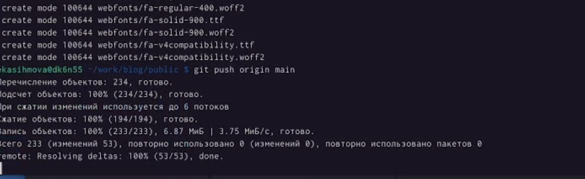{#fig:026 width=90%}

17)Копируем ссылку нашего личного сайти и вставляем ее в браузер.

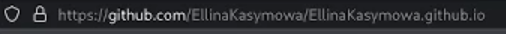{#fig:027 width=90%}

{#fig:028 width=90%}

# Выводы

Проделав данный проект мы создали свой индивидуальный сайт и загрузили на Github pages.

# Список литературы{.unnumbered}

::: {#refs}
:::
