---
## Front matter
lang: ru-RU
title: Индивидуальный прокект - 2 этап
subtitle: Операционные системы
author:
  - Касымова Эллина
institute:
  - Российский университет дружбы народов, Москва, Россия
date: 15 марта 2023

## i18n babel
babel-lang: russian
babel-otherlangs: english

## Formatting pdf
toc: false
toc-title: Содержание
slide_level: 2
aspectratio: 169
section-titles: true
theme: metropolis
header-includes:
 - \metroset{progressbar=frametitle,sectionpage=progressbar,numbering=fraction}
 - '\makeatletter'
 - '\beamer@ignorenonframefalse'
 - '\makeatother'
---


## Докладчик

  * Касымова Эллина Руслановна
  * студентка направления НБИбд-01-22
  * Российский университет дружбы народов

## Актуальность

Актуальность этой работы состоит в том, что мы учимся работать с сайтом добавлять в него информацию и редактировать.


## Материалы и методы

- Процессор `pandoc` для входного формата Markdown
- Результирующие форматы
	- `pdf`
	- `html`
- Автоматизация процесса создания: `Makefile`

## Процессор `pandoc`

- Pandoc: преобразователь текстовых файлов
- Сайт: <https://pandoc.org/>
- Репозиторий: <https://github.com/jgm/pandoc>

## Формат `pdf`

- Использование LaTeX
- Пакет для презентации: [beamer](https://ctan.org/pkg/beamer)
- Тема оформления: `metropolis`

## Код для формата `pdf`

```yaml
slide_level: 2
aspectratio: 169
section-titles: true
theme: metropolis
```

## Формат `html`

- Используется фреймворк [reveal.js](https://revealjs.com/)
- Используется [тема](https://revealjs.com/themes/) `beige`

## Код для формата `html`

- Тема задаётся в файле `Makefile`

```make
REVEALJS_THEME = beige 
```

## Получающиеся форматы

- Полученный `pdf`-файл можно демонстрировать в любой программе просмотра `pdf`
- Полученный `html`-файл содержит в себе все ресурсы: изображения, css, скрипты


## Добавляем свою фотографию на сайт.

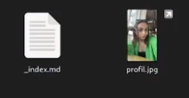{#fig:001 width=90%}

## Пишу информацию о себе: имя и фамилия, кем я являюсь, университет, личные интересы, на кого учусь и краткую биографию.

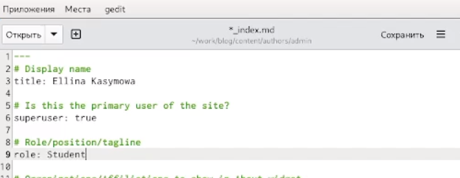{#fig:002 width=90%}

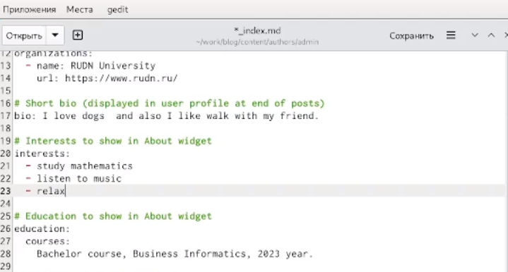{#fig:003 width=90%}

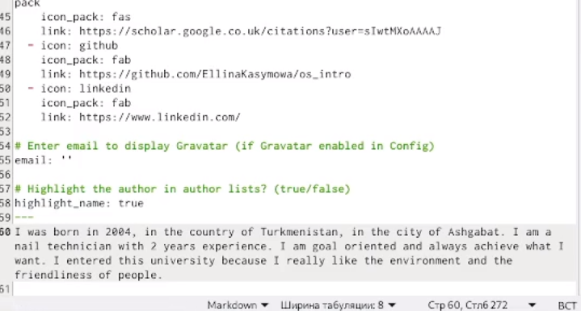{#fig:004 width=90%}

## Захожу на свой сайт и вижу, что он сформировался.

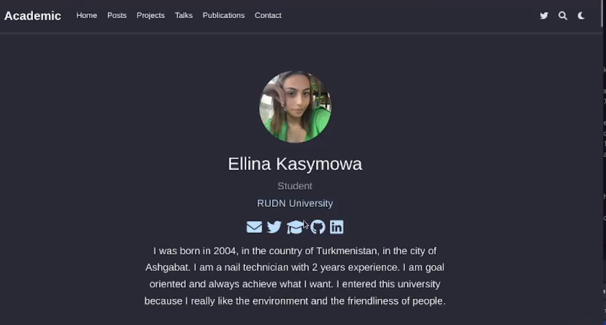{#fig:005 width=90%}

## Делаю пост по прошедшей неделе. Пишу маленький рассказ о своей неделе.

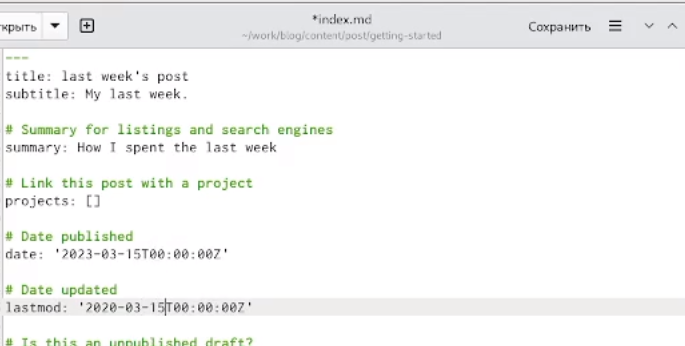{#fig:006 width=90%}

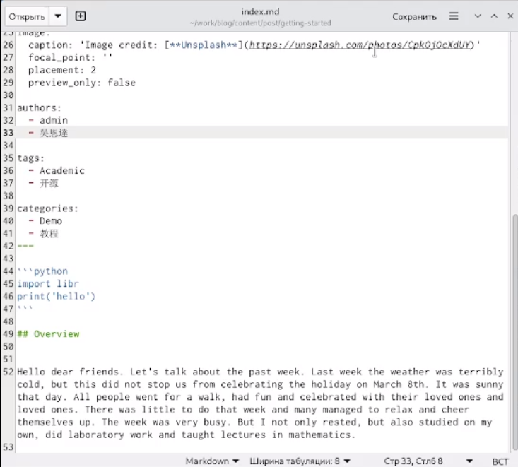{#fig:007 width=90%}

## Перехожу на сайт и вижу в разделе posts появился мой редактированный пост о прошлой неделе

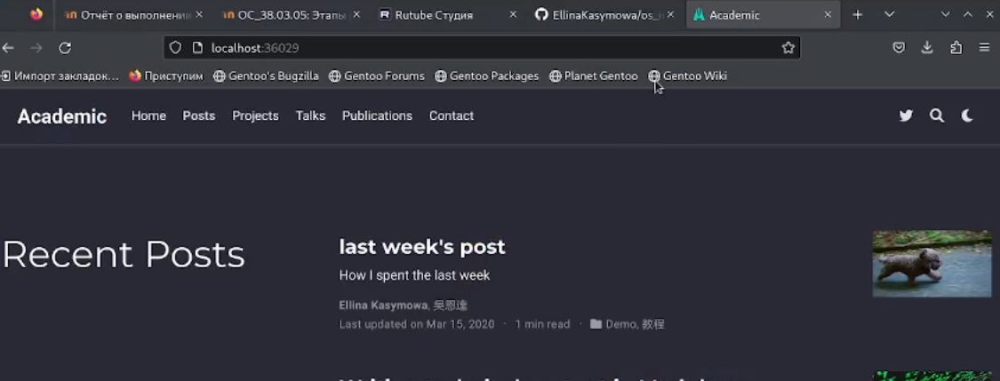{#fig:008 width=90%}

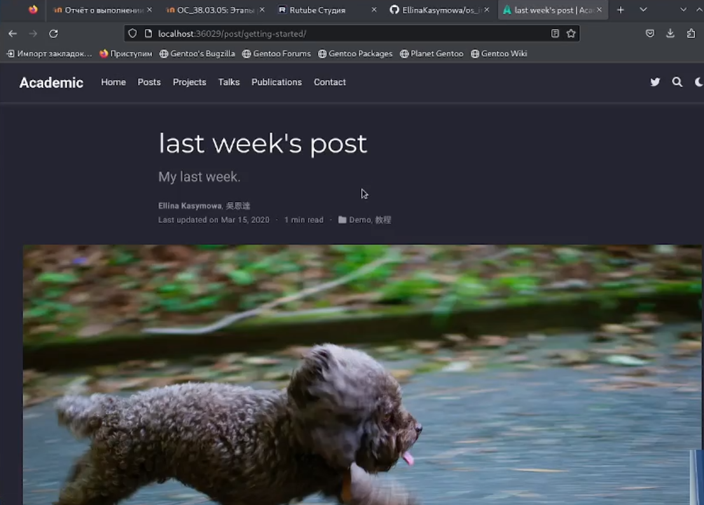{#fig:009 width=90%}

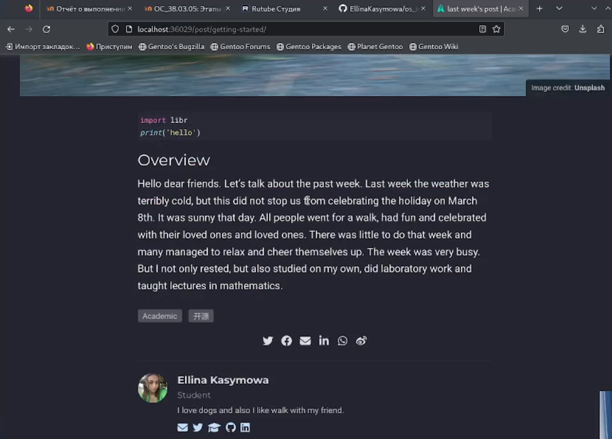{#fig:010 width=90%}

## Затем таким же методом я создаю еще один пост на тему "Управление версиями. Git."

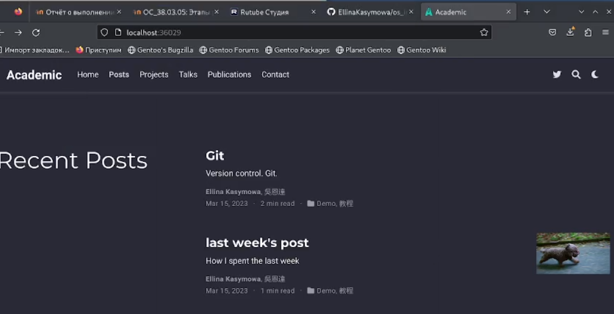{#fig:011 width=90%}

## Итоговый слайд

Проделав этот этап проекта мы научились добавлять на сайт информацию о себе и выставлять посты.

