---
## Front matter
title: "Индивидуальный проект - 2 этап"
subtitle: "Операционные системы"
author: "Касымова Эллина"

## Generic otions
lang: ru-RU
toc-title: "Содержание"

## Bibliography
bibliography: bib/cite.bib
csl: pandoc/csl/gost-r-7-0-5-2008-numeric.csl

## Pdf output format
toc: true # Table of contents
toc-depth: 2
lof: true # List of figures
lot: true # List of tables
fontsize: 12pt
linestretch: 1.5
papersize: a4
documentclass: scrreprt
## I18n polyglossia
polyglossia-lang:
  name: russian
  options:
	- spelling=modern
	- babelshorthands=true
polyglossia-otherlangs:
  name: english
## I18n babel
babel-lang: russian
babel-otherlangs: english
## Fonts
mainfont: PT Serif
romanfont: PT Serif
sansfont: PT Sans
monofont: PT Mono
mainfontoptions: Ligatures=TeX
romanfontoptions: Ligatures=TeX
sansfontoptions: Ligatures=TeX,Scale=MatchLowercase
monofontoptions: Scale=MatchLowercase,Scale=0.9
## Biblatex
biblatex: true
biblio-style: "gost-numeric"
biblatexoptions:
  - parentracker=true
  - backend=biber
  - hyperref=auto
  - language=auto
  - autolang=other*
  - citestyle=gost-numeric
## Pandoc-crossref LaTeX customization
figureTitle: "Рис."
tableTitle: "Таблица"
listingTitle: "Листинг"
lofTitle: "Список иллюстраций"
lotTitle: "Список таблиц"
lolTitle: "Листинги"
## Misc options
indent: true
header-includes:
  - \usepackage{indentfirst}
  - \usepackage{float} # keep figures where there are in the text
  - \floatplacement{figure}{H} # keep figures where there are in the text
---

# Цель работы

Добавить к сайту данные о себе.

Цель данного шаблона --- максимально упростить подготовку отчётов по
лабораторным работам.  Модифицируя данный шаблон, студенты смогут без
труда подготовить отчёт по лабораторным работам, а также познакомиться
с основными возможностями разметки Markdown.

# Выполнение индивидуальног проекта

1) Добавляем свою фотографию на сайт.

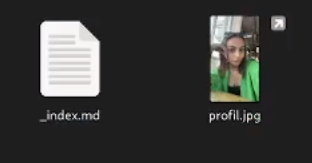{#fig:001 width=90%}

2) Пишу информацию о себе: имя и фамилия, кем я являюсь, университет, личные интересы, на кого учусь и краткую биографию.

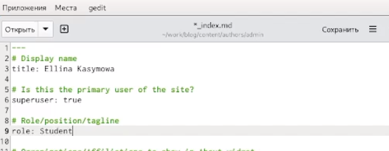{#fig:002 width=90%}

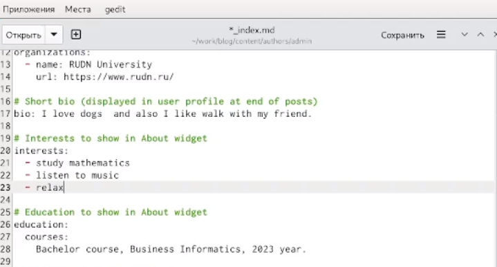{#fig:003 width=90%}

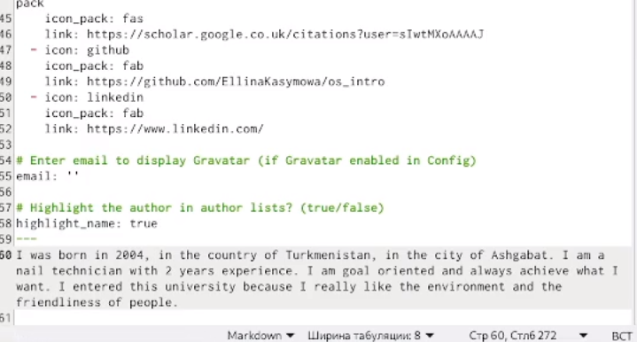{#fig:004 width=90%}

3) Захожу на свой сайт и вижу, что он сформировался.

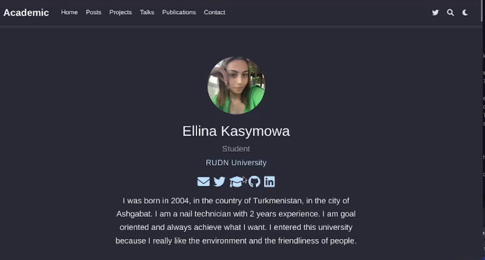{#fig:005 width=90%}

4) Делаю пост по прошедшей неделе. Пишу маленький рассказ о своей неделе.

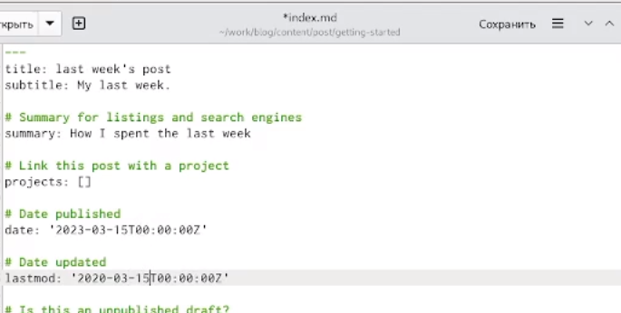{#fig:006 width=90%}

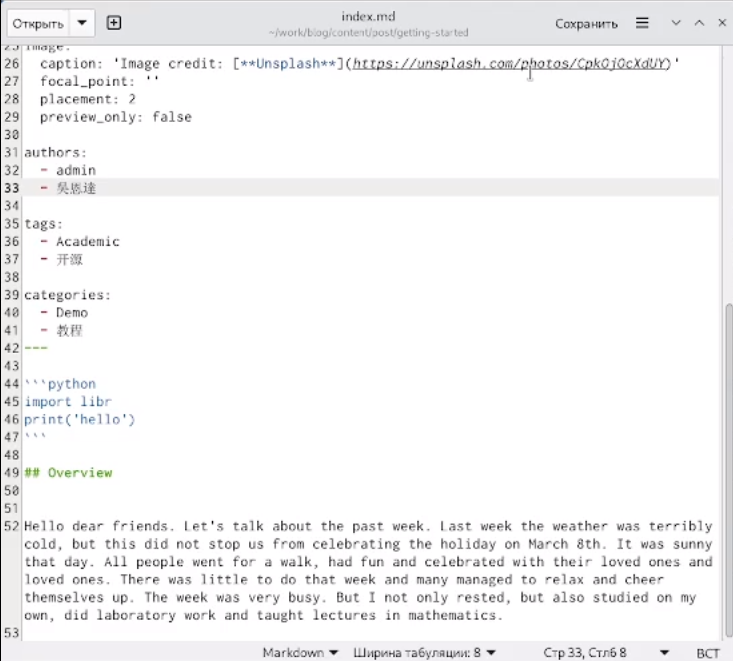{#fig:007 width=90%}

5) Перехожу на сайт и вижу в разделе posts появился мой редактированный пост о прошлой неделе

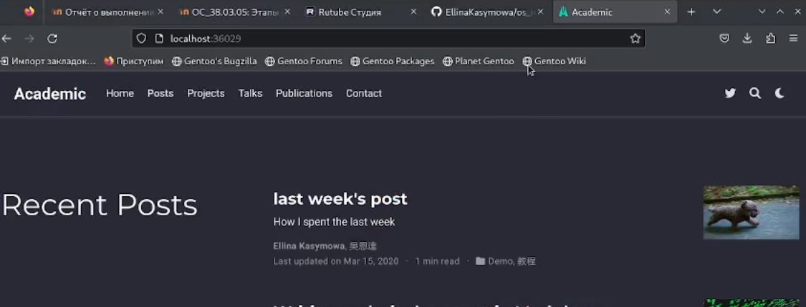{#fig:008 width=90%}

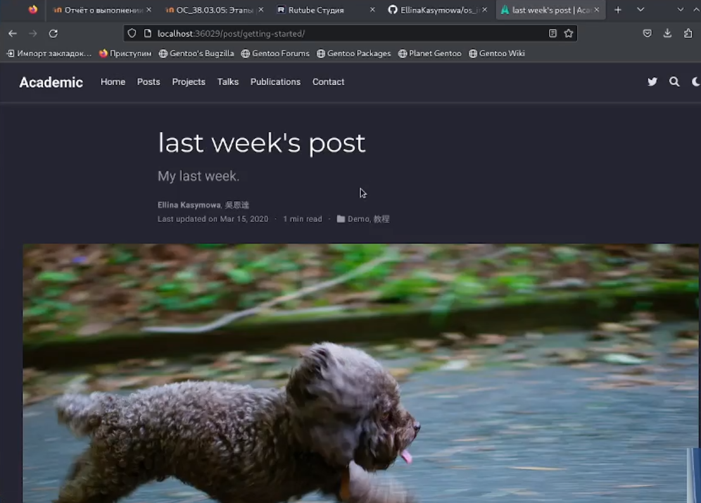{#fig:009 width=90%}

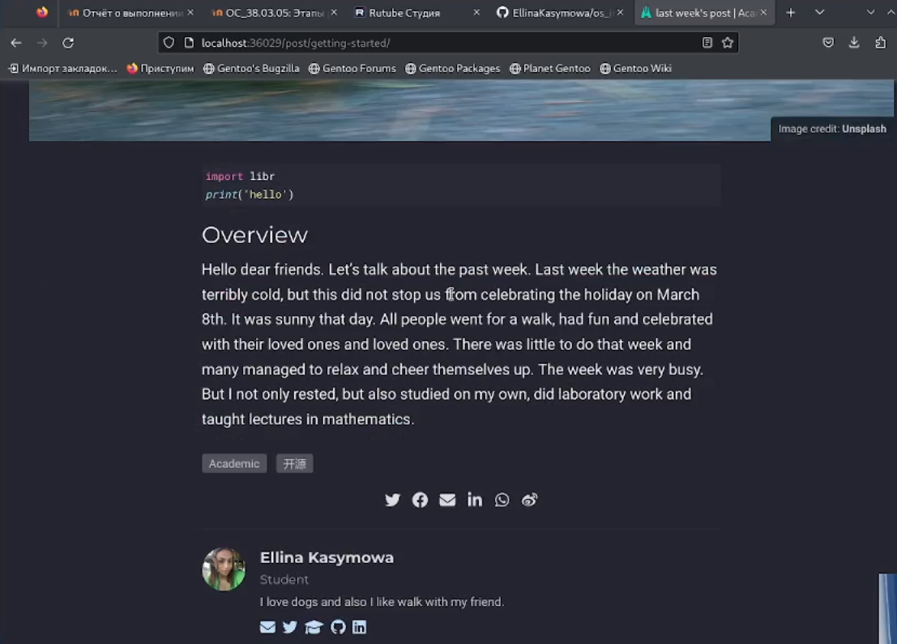{#fig:010 width=90%}

6) Затем таким же методом я создаю еще один пост на тему "Управление версиями. Git."

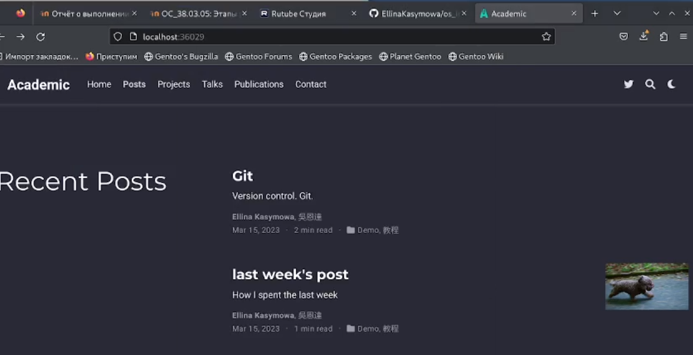{#fig:011 width=90%}

# Выводы

Проделав этот этап проекта мы научились добавлять на сайт информацию о себе и выставлять посты.

# Список литературы{.unnumbered}

::: {#refs}
:::
