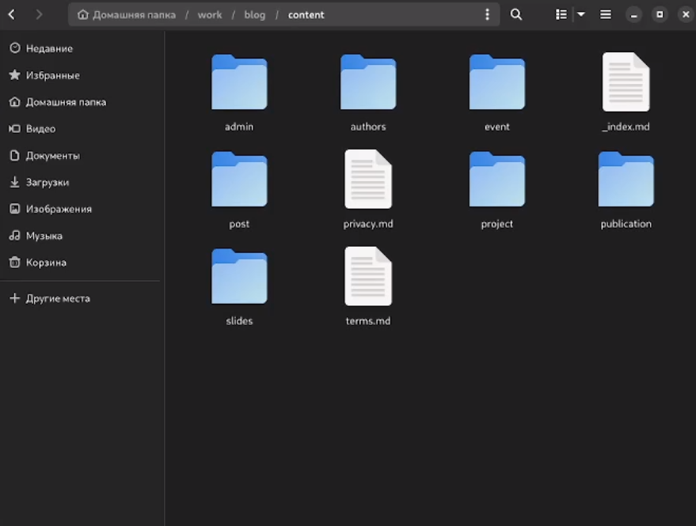
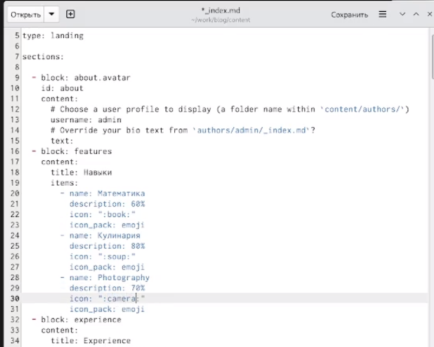
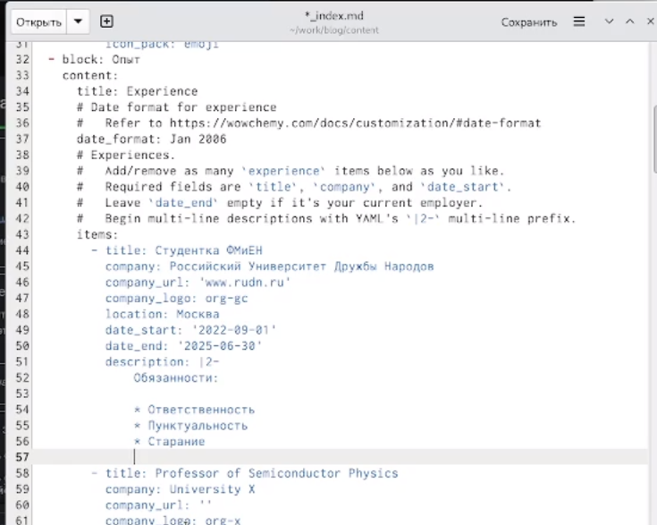
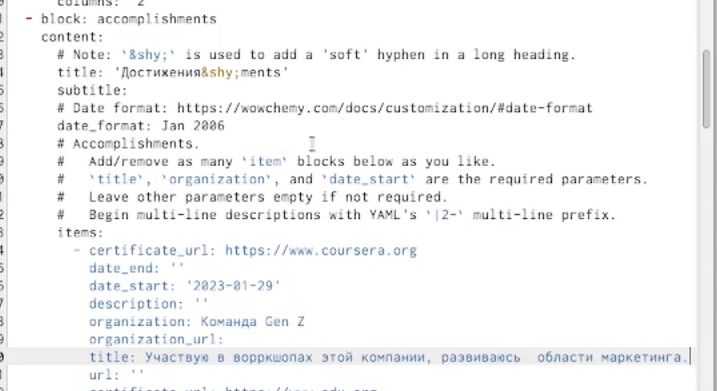
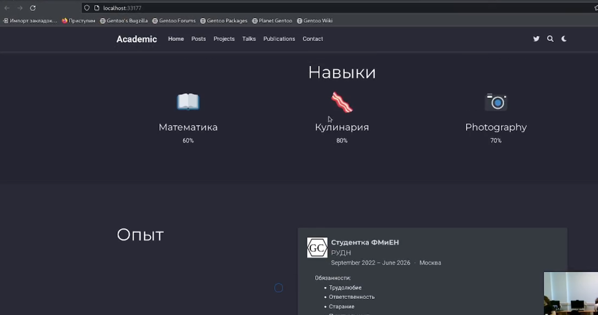
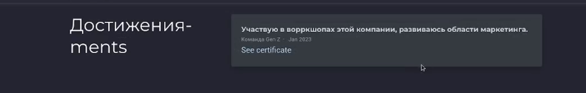
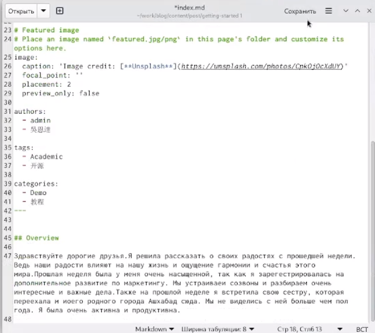
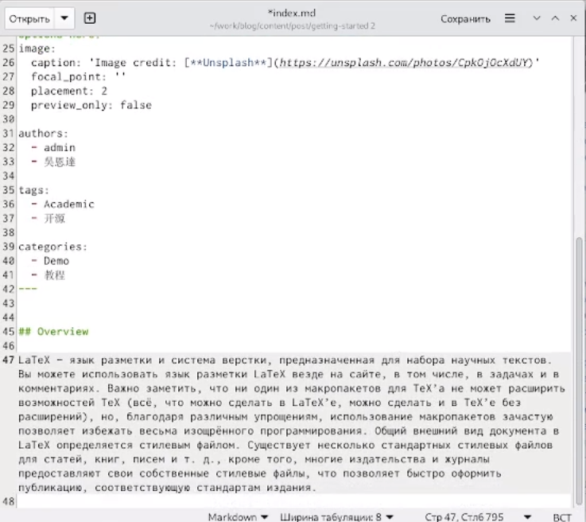
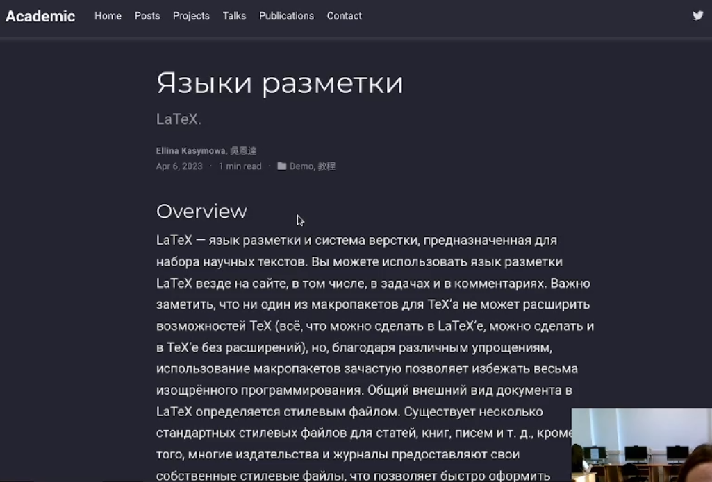
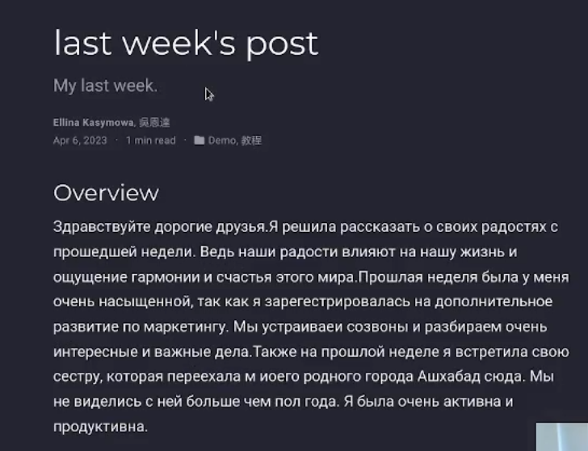

---
## Front matter
lang: ru-RU
title: Индивидуальный проект 3 этап
subtitle: Операционные системы
author:
  - Касымова Э.Р.
institute:
  - Российский университет дружбы народов, Москва, Россия
date: 07 АПРЕЛЬ 2023

## i18n babel
babel-lang: russian
babel-otherlangs: english

## Formatting pdf
toc: false
toc-title: Содержание
slide_level: 2
aspectratio: 169
section-titles: true
theme: metropolis
header-includes:
 - \metroset{progressbar=frametitle,sectionpage=progressbar,numbering=fraction}
 - '\makeatletter'
 - '\beamer@ignorenonframefalse'
 - '\makeatother'
---

## Докладчик

  * Касымова Эллина Руслановна
  * студентка направления НБИбд-01-22
  * Российский университет дружбы народов

## Актуальность

Актуальность этой работы в том, что она поможет нам освоить работу с сайтом.

## Материалы и методы

- Процессор `pandoc` для входного формата Markdown
- Результирующие форматы
	- `pdf`
	- `html`
- Автоматизация процесса создания: `Makefile`


## Процессор `pandoc`

- Pandoc: преобразователь текстовых файлов
- Сайт: <https://pandoc.org/>
- Репозиторий: <https://github.com/jgm/pandoc>

## Формат `pdf`

- Использование LaTeX
- Пакет для презентации: [beamer](https://ctan.org/pkg/beamer)
- Тема оформления: `metropolis`

## Код для формата `pdf`

```yaml
slide_level: 2
aspectratio: 169
section-titles: true
theme: metropolis
```

- Используется фреймворк [reveal.js](https://revealjs.com/)
- Используется [тема](https://revealjs.com/themes/) `beige`

## Код для формата `html`

- Тема задаётся в файле `Makefile`

```make
REVEALJS_THEME = beige 
```


## Получающиеся форматы

- Полученный `pdf`-файл можно демонстрировать в любой программе просмотра `pdf`
- Полученный `html`-файл содержит в себе все ресурсы: изображения, css, скрипты


## В папке контент открыла файл индекс и ввела информацию о навыках.

{#fig:001 width=90%}

##

{#fig:002 width=90%}

## В папке контент открыла файл индекс и ввела информацию об опыте.

{#fig:003 width=90%}

## В папке контент открыла файл индекс и ввела информацию о достижениях.

{#fig:004 width=90%}

## Проверяем на сайте.

{#fig:005 width=90%}

##

{#fig:006 width=90%}

## Делаю Пост по прошедшей недели.

{#fig:007 width=90%}

## Делаю пост на тему языки разметки. LaTeX.

{#fig:008 width=90%}

## Проверяю на сайте.

{#fig:009 width=90%}

## Захожу в кадый пост и уточняю сохранилась ли оинформация в посте.

{#fig:010 width=90%}

##

{#fig:011 width=90%}


## Итоговый слайд

Поделав данный этап мы научились редактировать сайт.

:::

