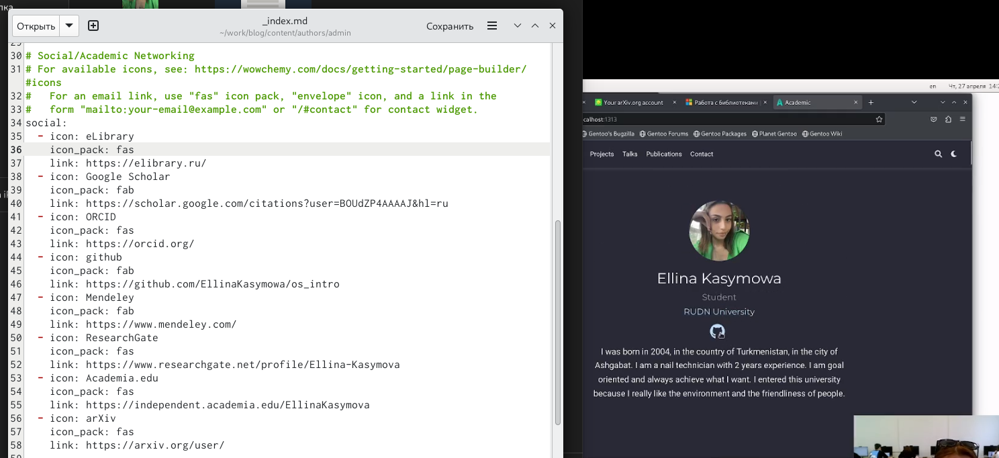
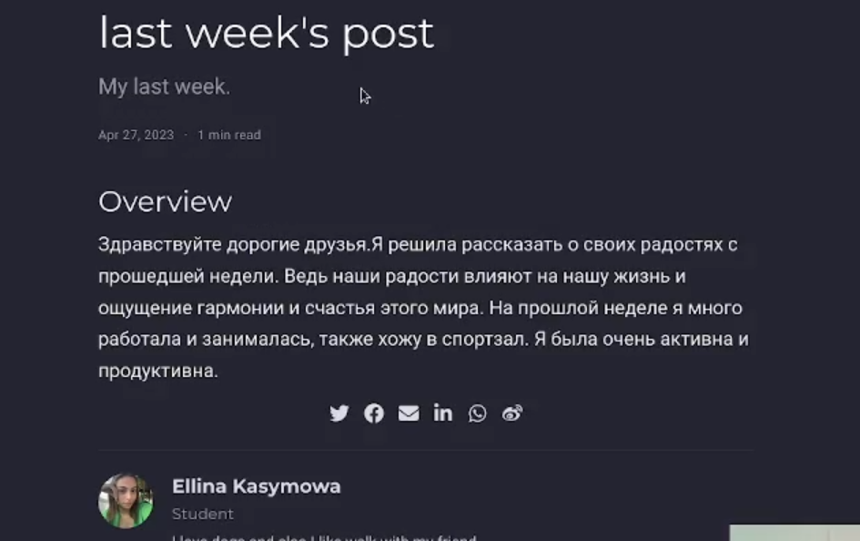
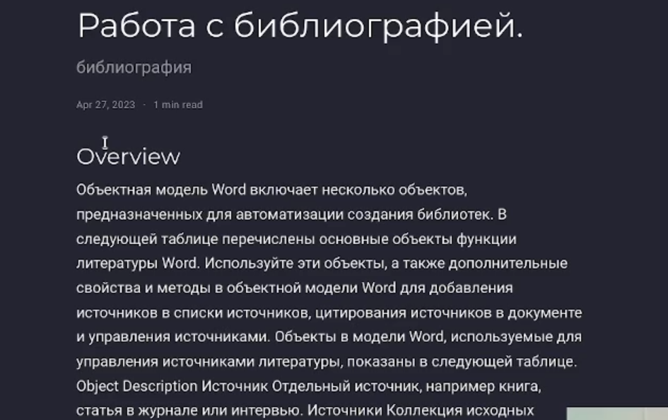

---
## Front matter
lang: ru-RU
title: Проект 4 этап
subtitle: Операционные системы
author:
  - Касымова Эллина
institute:
  - Российский университет дружбы народов, Москва, Россия
date: 27 апреля 2023

## i18n babel
babel-lang: russian
babel-otherlangs: english

## Formatting pdf
toc: false
toc-title: Содержание
slide_level: 2
aspectratio: 169
section-titles: true
theme: metropolis
header-includes:
 - \metroset{progressbar=frametitle,sectionpage=progressbar,numbering=fraction}
 - '\makeatletter'
 - '\beamer@ignorenonframefalse'
 - '\makeatother'
---

## Докладчик

  * Касымова Эллина Руслановна
  * студентка направления НБИбд-01-22

## Зарегистрировалась на соответствующих ресурсах и разместить на них ссылки на сайте:eLibrary : https://elibrary.ru/; Google Scholar : https://scholar.google.com/; ORCID : https://orcid.org/; Mendeley : https://www.mendeley.com/; ResearchGate : https://www.researchgate.net/; Academia.edu : https://www.academia.edu/; arXiv : https://arxiv.org/; github : https://github.com/.
    
{#fig:001 width=90%}
    
    
## Сделала пост по прошедшей неделе.

{#fig:002 width=90%}

## Добавила пост на тему Работа с библиографией.

{#fig:003 width=90%}

## Выводы

Проделав данный этап проекта мы научились регестрироваться на сайтай и размещать на сайте.

