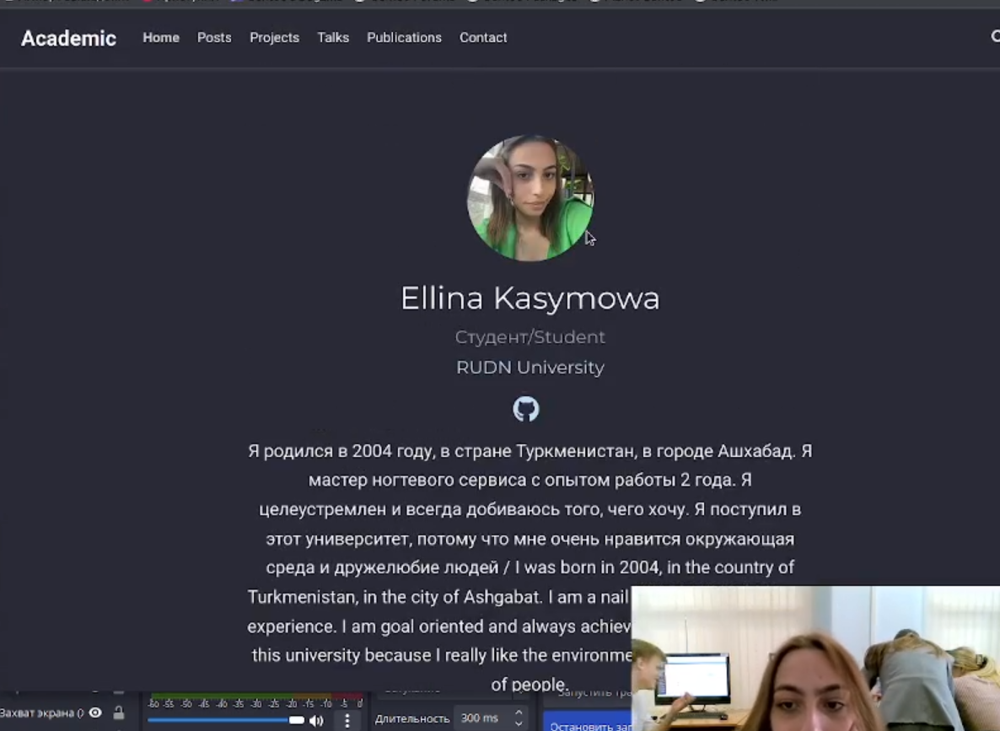
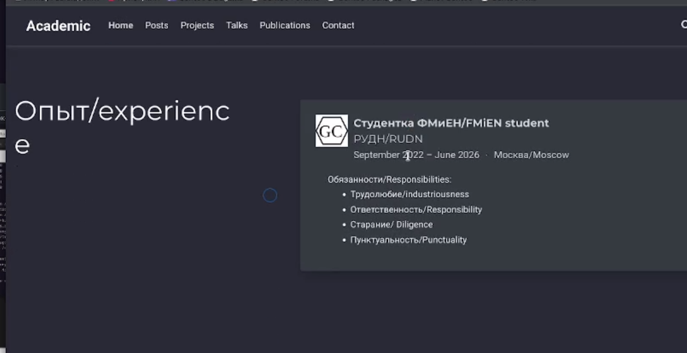
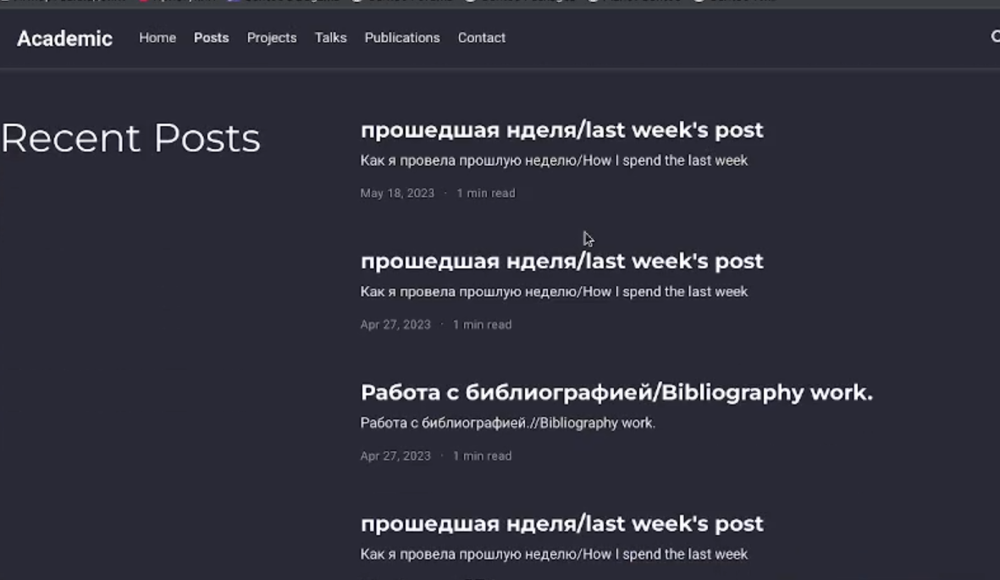
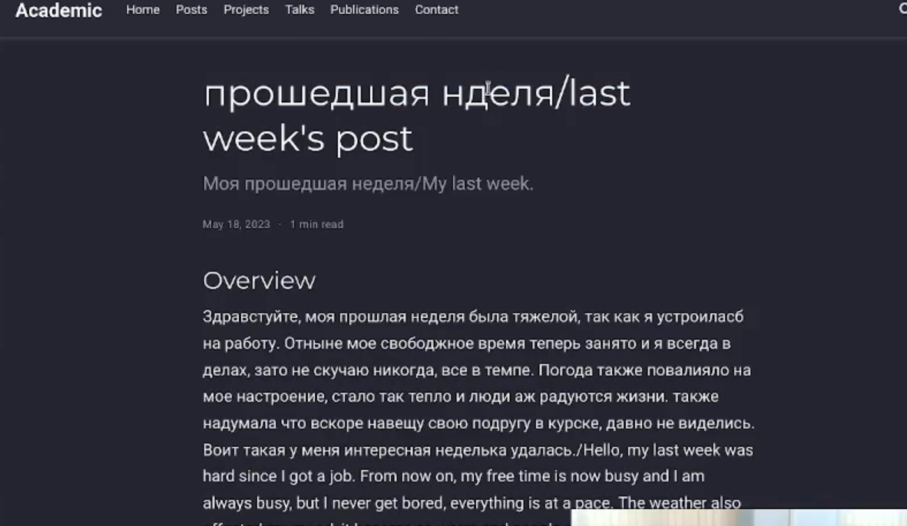
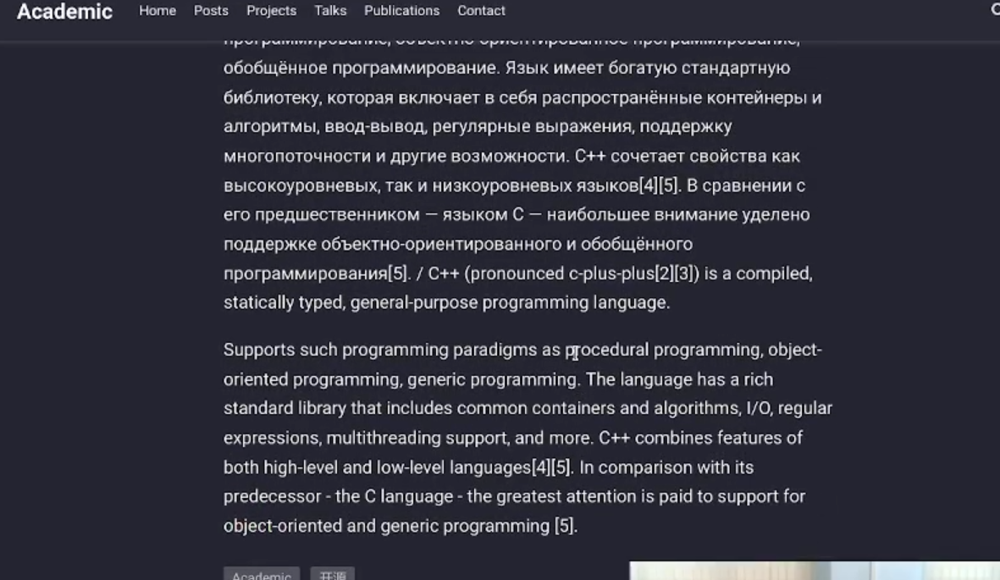

---
## Front matter
lang: ru-RU
title: Проект 6 этап
subtitle: Операционные системы
author:
  - Касымова Эллина
institute:
  - Российский университет дружбы народов, Москва, Россия
date: 18 мая 2023

## i18n babel
babel-lang: russian
babel-otherlangs: english

## Formatting pdf
toc: false
toc-title: Содержание
slide_level: 2
aspectratio: 169
section-titles: true
theme: metropolis
header-includes:
 - \metroset{progressbar=frametitle,sectionpage=progressbar,numbering=fraction}
 - '\makeatletter'
 - '\beamer@ignorenonframefalse'
 - '\makeatother'
---

## Докладчик

  * Касымова Эллина Руслановна
  * студентка направления НБИбд-01-22

## Сделать поддержку английского и русского языков.

{#fig:001 width=90%}

## Разместить элементы сайта на обоих языках.

{#fig:002 width=90%}

## Разместить контент на обоих языках.

{#fig:003 width=90%}

## Сделать пост по прошедшей неделе.

{#fig:004 width=90%}

## Добавить пост на тему по выбору (на двух языках).

{#fig:005 width=90%}

## Выводы

Проделав данный этап проекта мы разместили двуязычный сайн на гитхаб.

